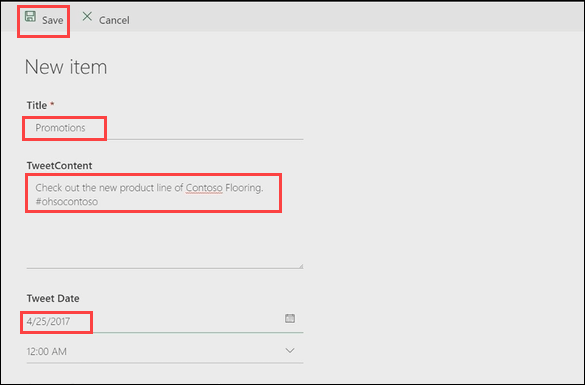
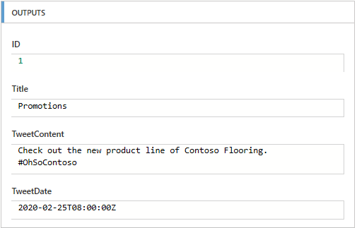
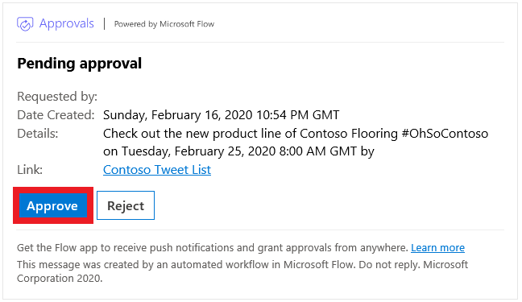
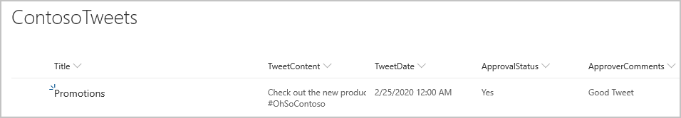

In the previous unit, you learned how to build an approval process for tweets that are stored in a Microsoft SharePoint list. In this unit, you'll see what the experience looks like when an approver receives a new approval request. 

## Step one: Change the SharePoint list

First, we need to add an item to our SharePoint list. We can then process an approval request for that item.

1. In SharePoint, open the **ContosoTweets** list that you set up in the previous unit, and then select **New** to create a list item (tweet).

2. Enter the following values, and then select **Save**:

    - **Title**: Promotions
    - **TweetContent**: Check out the new product line of Contoso Flooring #OhSoContoso
    - **Tweet Date**: Today's date.

    

## Step two: Change the flow

1. In Power Automate, select **My flows**.

2. Select the **Post list items to Twitter after approval** flow that you set up in the previous unit, and then, under **Run history**, select the flow that's running.

3. Select the **When a new item is created** trigger. Make sure that the information for the list item that you just created is shown.

    

4. In Microsoft Outlook, open the automated approval mail in the inbox, and then select **Approve**. Add a comment and press **Submit**.

    

5. In Power Automate, click on **Approvals** under **Actions**. You can see the approval you just submitted in your history.

6. In SharePoint, refresh the **ContosoTweets** list. Make sure that the **ApprovalStatus** field is set to *Yes*, and that the comment that you just entered is shown.

    

In this unit, you saw the experience from the approver's point of view, from receiving an approval request email to processing the request in the Approval Center.
