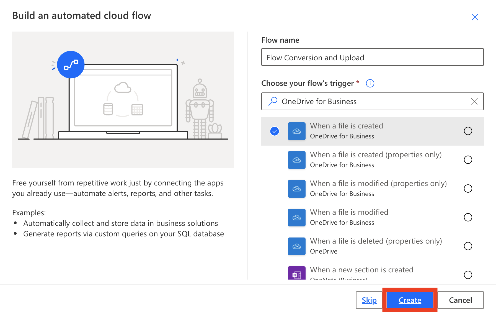
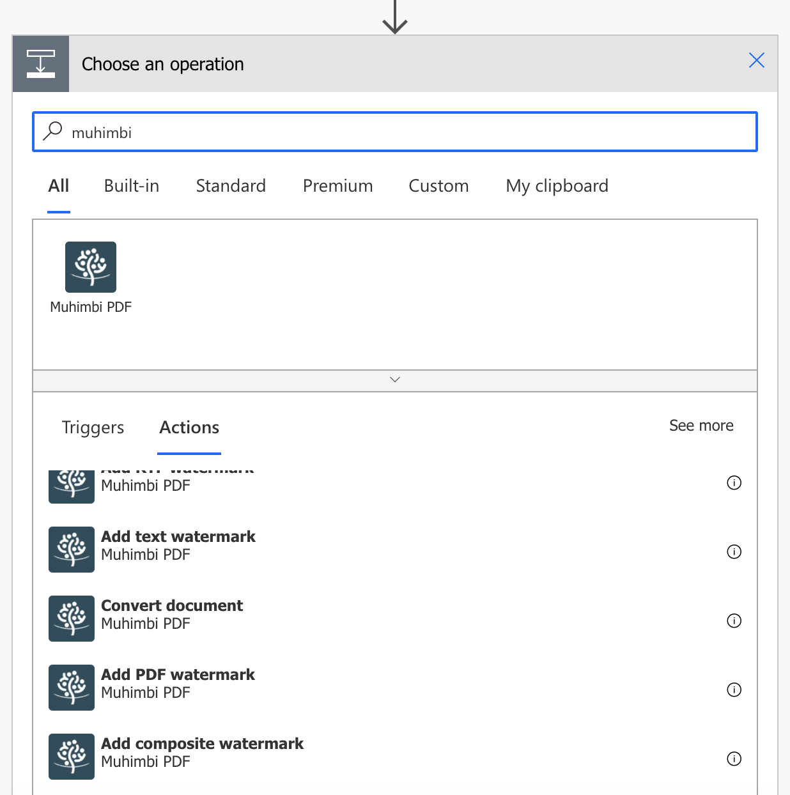
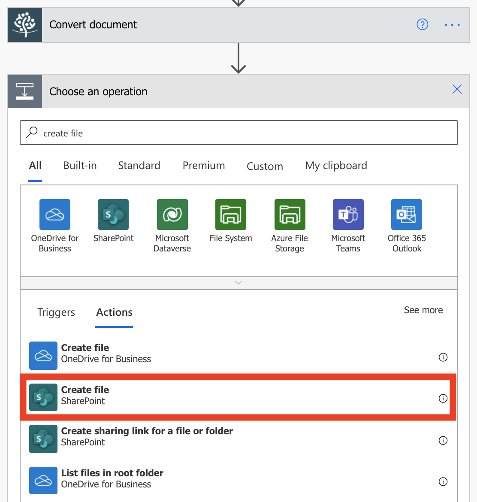

In this unit, you'll see how Contoso Flooring uses Power Automate to automatically convert documents to a standard format and then store them in Microsoft SharePoint Online. You'll create a flow that detects when a new file has been added to a Microsoft OneDrive for Business folder. The flow then converts that file to a PDF and stores it in a SharePoint Online folder.

## Prerequisites

For this scenario, you need an account with Muhimbi, a PDF conversion service. If you don't already have a Muhimbi account, you can sign up for a [free 30-day trial](http://www.muhimbi.com/Products/PDF-Converter-for-SharePoint/Products-PDF-Converter-for-SharePoint-Free-Trial.aspx).

## Create the source and target folders

First, you must create the source and target folders in OneDrive for Business and SharePoint Online.

1. In OneDrive for Business, under **Files**, create a folder named **Finished Documents**.
2. In SharePoint Online, in **Shared Documents**, create a folder named **PDF – Finished files**.

## Create the flow

1. In Power Automate, select **My Flows**, and then select **Automated--from blank**.

1. In the **Choose your flow's trigger** search field, enter *OneDrive*, and select the **OneDrive for Business - When a file is created** trigger. Name your flow and press create.

    

1. In the **Folder** field, select the folder button, and then select the **Finished Documents** folder that you created in the previous step.

1. Select **New step**. 

1. In the search box, enter *muhimbi*, select the **Muhimbi PDF** connector, and then select the **Muhimbi PDF – Convert document** action.

    

1. If Power Automate prompts you to sign in to Muhimbi, sign in. If you don't have a subscription to Muhimbi, you can use a [free 30-day trial](http://www.muhimbi.com/Products/PDF-Converter-for-SharePoint/Products-PDF-Converter-for-SharePoint-Free-Trial.aspx).

1. In the **Convert document** action, set the following values:

    * **Source file name**: In the dynamic content list, select **File name**.
    * **Source file content**: In the dynamic content list, select **File content**.
    * **Output format**: Select *PDF*.

    

    So far, you've set up these steps for your flow:

    1. The flow is triggered whenever a new file is added to a specific OneDrive for Business folder.
    2. The Muhimbi service converts that file to PDF.

    For the final step, you'll add an action that moves the PDF document to a SharePoint Online folder where the team can access it.

1. Select **New step**.

1. In the search field, enter *sharepoint*, and then select the **SharePoint – Create file** action.

    

1. In the **Create file** action, set the following values:

    * **Site address**: Enter the URL of your SharePoint site.
    * **Folder path**: Select the folder button, and browse to the **PDF - Finished files** folder.
    * **File name**: In the dynamic content list, under **Convert document**, select **Base file name**. Then enter *.pdf* so that the file will be saved with the .pdf file name extension in SharePoint.
    * **File content**: In the dynamic content list, under **Convert document**, select **Processed file content**.

    

1. Select **Save** at the top of the page to save your work.

## Test the flow

1. To test the flow, add a new file to your **Finished Documents** folder in OneDrive for Business.
2. In Power Automate, select **My flows**, and then select the new flow to view the run history.
3. After the flow runs, make sure that the file was converted to a PDF and saved to the **PDF – Finished files** folder in SharePoint.
