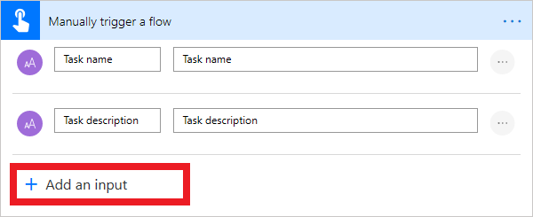
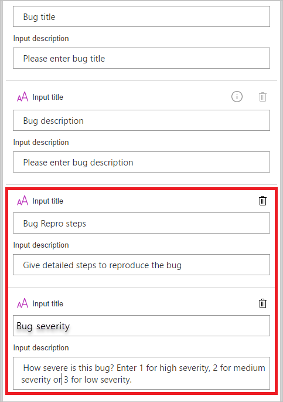
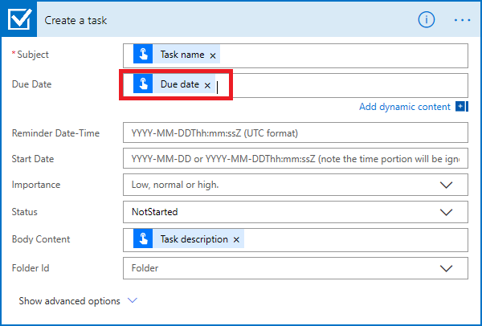
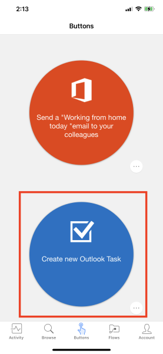
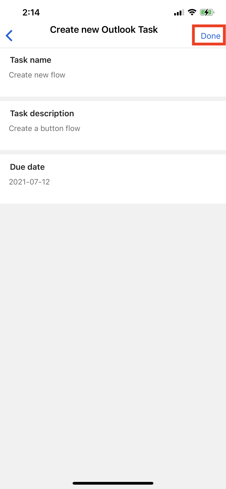
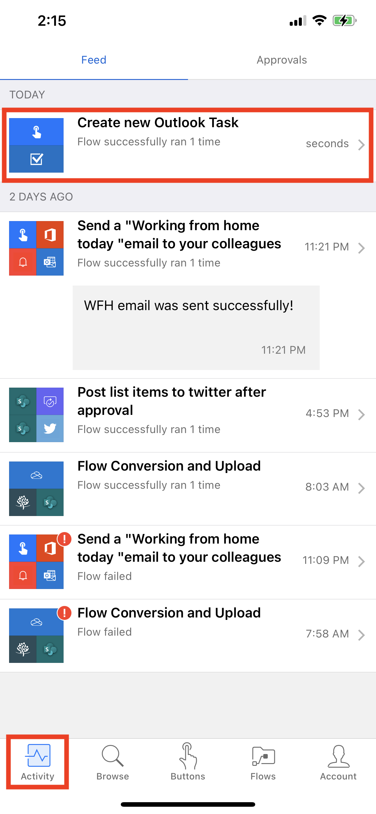
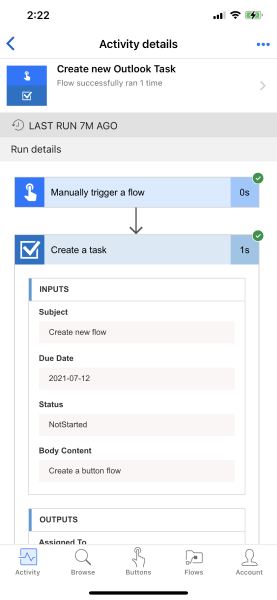

You can customize button flows by letting the user provide specific details that will be used when the flow runs.

You can create a button flow either on the Power Automate website or in the mobile app for Power Automate. For this unit, you'll use the website.

## Prerequisites

You must have an account on the Power Automate website.

## Open the template

1. Launch Power Automate and sign in using your organizational account.

1. Select **Templates** and search *Create a New Outlook Task*.

    

1. Sign in if you are prompted to do so and select **Create Flow**.

## Customize the user input

You'll notice that this flow already requests additional input, but let's add another field.

1. On the trigger card, select **Add an input**.

    

1. For each custom field that should be available when someone runs your flow, enter values in the **Input title** and **Input description** field.

    In this example, you'll create one custom input field, **Due Date**.

    

## Customize the task

1. On the **Create a task** card, select the title bar to expand the card.

1. In the Due Date field, select **Due Date** from the dynamic content.

    

1. Select **Save**.

## Run the flow

You'll now use the mobile app for Power Automate to run the button flow that you just created. You'll provide all the user input that's needed to create a task with a name, description, and due date.

1. In the mobile app for Power Automate, select the **Buttons** tab at the bottom of the window, and then select the **Create new Outlook Task** button.

    

1. Enter the requested inputs and select **Done**.

    

    The flow runs.

1. Select the **Activity** tab at the bottom of the window to view the results.

    

1. To view the detailed results of the flow run, select the **Create a task** step.

    

Now you can not only run button flows with the already available information, but also request inputs from the user.
