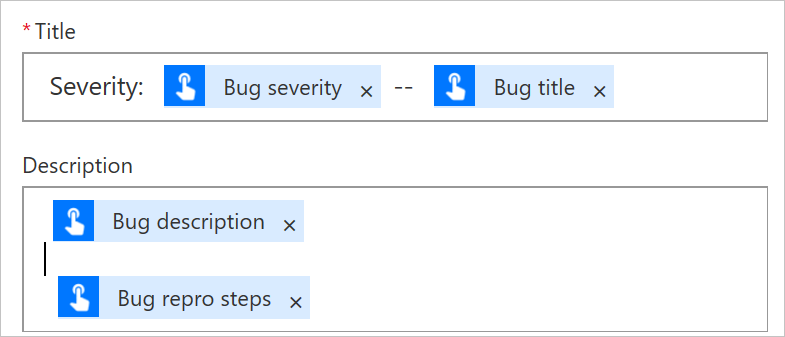
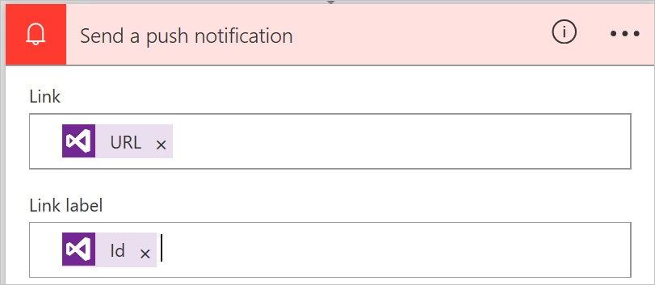

You can customize button flows by letting the user provide specific details that will be used when the flow runs.

You can create a button flow either on the Microsoft Flow website or in the mobile app for Microsoft Flow. For this unit, you'll use the website.

## Prerequisites

You must have an account on the Microsoft Flow website.

## Open the template

1. Launch Microsoft Flow and sign in using your organizational account.
2. In the template search box, enter *Visual Studio*.
3. Select the **Open a Priority 2 Bug in Visual Studio** template.

    

3. Select **Use this template**.

    The **Open a Priority 2 Bug in Visual Studio** template uses the Visual Studio Team Services (VSTS) and the Push notification services. If you don't have a connection to those services, you must sign in to them. The **Sign in** button appears only if you must sign into a service.

4. After you've signed in to all the required services, select **Continue**.

    

## Customize the user input

Next, we'll change the flow by adding fields that users can use to specify changes to the VSTS bug.

1. On the trigger card, select **Edit**.

    

2. Select the plus sign (**+**) to expand the page so that you can add custom input fields.

    

3. For each custom field that should be available when someone runs your flow, enter values in the **Input title** and **Input description** field.

    In this example, you'll create two custom input fields (**Bug repro steps** and **Bug severity**). Then, anyone who uses the flow can enter the steps to reproduce the bug, and they can also rate the severity of the bug.

    

## Customize the bug

Next, we'll customize the VSTS bug.

1. On the **Create a new work item** card, select the title bar to expand the card.

    

2. Make the selections that are appropriate for your VSTS environment, and then select **Edit**.

    For example, to connect to myinstance.visualstudio.com, enter *myinstance*.

    

3. Select **Show advanced options** to show the other fields for this card.

    

4. In the **Title** field, put the cursor before the **Bug title** token, enter *Severity:* followed by a space, and then select the **Bug severity** token. Then, between the two tokens, enter a space, two hyphens (*--*), and another space.
5. In the **Description** field, put the cursor after the **Bug description** token, press Enter to start a new line, and then select the **Bug repro steps** token.

    

## Customize the push notification

Next, we'll change the push notification that you'll get on your phone.

1. On the **Send a push notification** card, select the title bar to expand the card.
2. In the list of dynamic content tokens, select **See more**, and then add the **URL** token to the **Link** field.
3. In the **Link label** field, add the **Id** token.

    

4. Select **Create flow** to create the flow.

## Run the flow

You'll now use the mobile app for Microsoft Flow to run the button flow that you just created. You'll provide all the user input that's needed to create a bug that has a title, a description, repro steps, and a severity level.

1. In the mobile app for Microsoft Flow, select the **Buttons** tab at the bottom of the window, and then select the **Create a bug report with steps** button.

    

2. Enter a title for the bug that you're reporting, and then select **Next**.

    

3. Enter a description of the bug that you're reporting, and then select **Next**.

    

4. Enter the steps to reproduce the bug that you're reporting, and then select **Next**.

    

5. Enter the severity of the bug that you're reporting, and then select **Done**.

    

    The flow runs.

6. Select the **Activity** tab at the bottom of the window to view the results.

    

7. To view the detailed results of the flow run, select the **Create a new work item** step.

    
