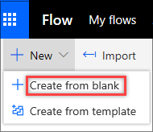
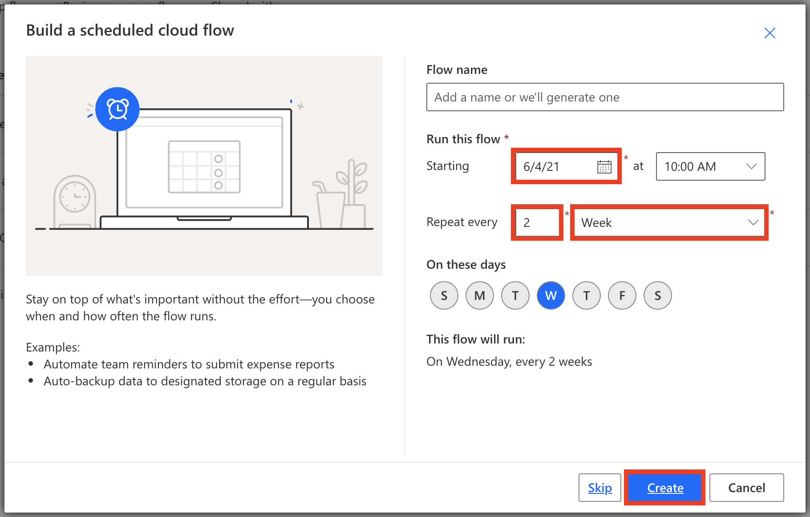
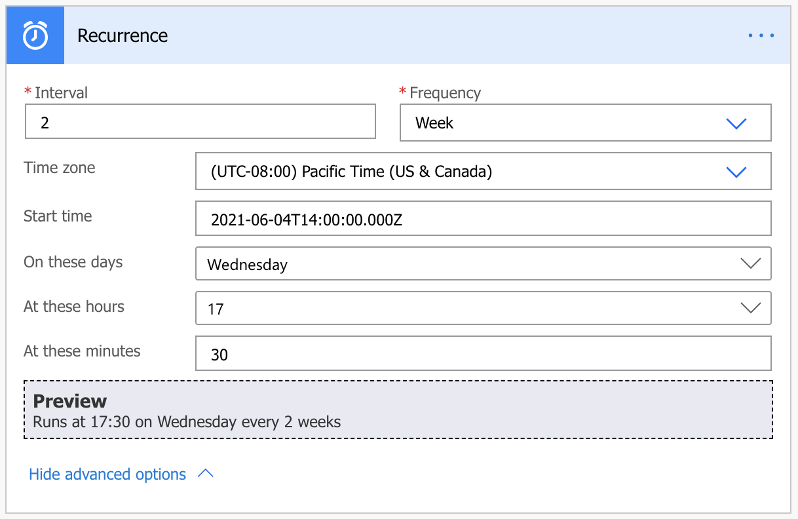
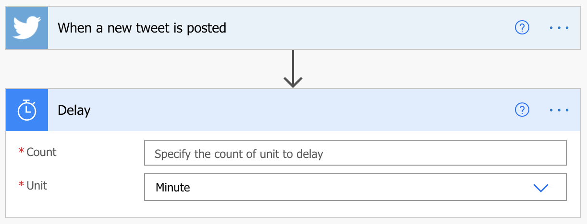
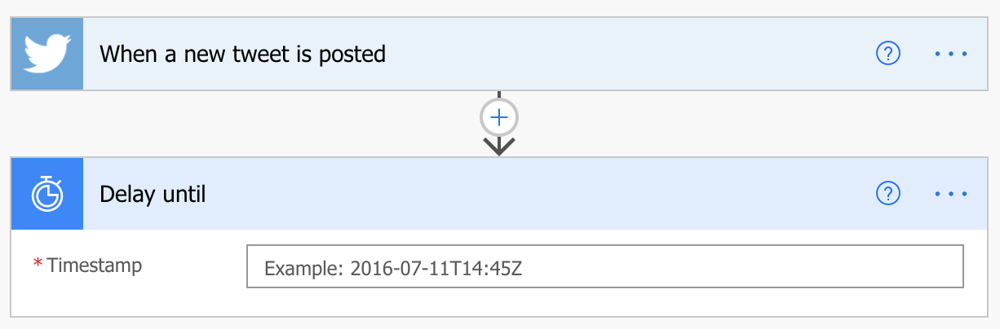

You can create a flow that performs one or more tasks (for example, sending a report by email) on a specific schedule:

* Once a day, an hour, or a minute
* On a date that you specify
* After a number of days, hours, or minutes that you specify

## Create the flow

1. Launch Power Automate and sign in using your organizational account.
1. In the left pane, select **My flows**.
1. Select **New**, and then select **Create from blank**.

    

1. In the **Search all connectors and triggers** field, enter *Recurrence*, and then select the **Schedule - Recurrence** trigger.

    

1. In the **Recurrence** dialog box, specify how often the flow should run.

    For example, if you want the flow to run every two weeks, enter *2* in the **Interval** field, and select *Week* in the **Frequency** field.

    

## Specify advanced options

1. Follow the steps in the previous section, and then select **Show advanced options**.

    > [!NOTE]
    > The advanced options vary, depending on the value of the **Interval** and **Frequency** fields. If the dialog box that you see doesn't match the graphic that follows, make sure that the **Interval** and **Frequency** fields are set to the same values that are shown in the graphic.

2. Select a time zone to specify whether the value of the **Start time** field reflects a local time zone, Universal Coordinated Time (UTC), or another time zone.
3. Specify a start time in this format: *YYYY-MM-DDTHH:MM:SSZ*
4. If you selected *Day* in the **Frequency** field, specify the time of day when the flow should run.

    If you selected *Week*, specify the day or days of the week when the flow should run, and the time or times of day when the flow should run.

    For example, set up the flow as shown in the following graphic to start it no earlier than noon (Pacific time) on Monday, January 1, 2018, and to run it every two weeks, at 5:30 PM (Pacific time) on Tuesday.

    

6. Add the action or actions that the flow should take.

## Delay the flow

Next, you'll learn how to delay the flow.

1. On the top navigation bar, select **My flows**, and then select **Create from blank**.
1. In the **Search all connectors and triggers** field, enter *Twitter*, and then select **Twitter - When a new tweet is posted**. Finish the steps in the flow.
1. Select **New step**.
1. In the list of actions, select either **Delay** or **Delay until**.

    

1. Follow one of these steps, depending on the action that you just selected:

    * If you selected **Delay**, specify a count and a unit of time, like second, minute, or hour.

        

    * If you selected **Delay until**, specify a date in this format: *YYYY-MM-DDTHH:MM:SSZ*

        
