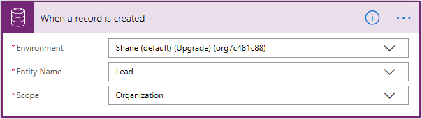
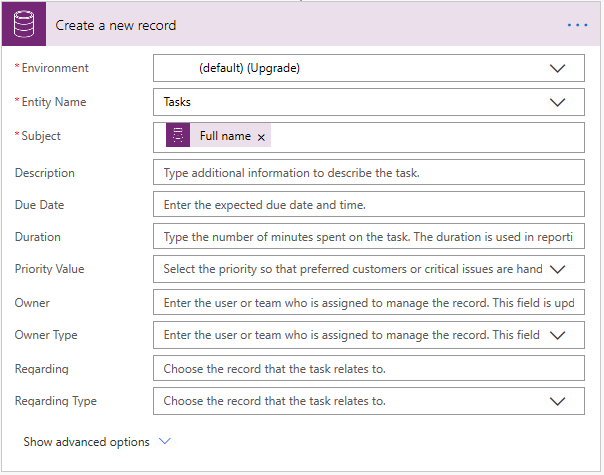
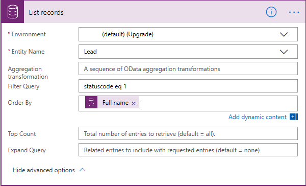

You can create flows that start when an event occurs in Microsoft Dynamics 365 or some other service. These flows then perform an action in Dynamics 365 or some other service.

In Power Automate, you can set up automated workflows between your favorite apps and services to sync files, get notifications, collect data, and more.

In this unit, we'll look to build two flows:

- The first flow creates a task in Dynamics 365 when a lead is created in another instance of Dynamics 365.
- The second flow copies a list item to the Wunderlist website when a task is created in Dynamics 365.

Here are some other examples of flows that you can create by using Dynamics 365:

* Create a list item in Microsoft SharePoint when an object is created in Dynamics 365.
* Create Dynamics 365 lead records from a Microsoft Excel table.
* Copy Dynamics 365 accounts to customers in Microsoft Dynamics 365 for Finance and Operations.

> [!IMPORTANT]
> To invoke a flow trigger, the Dynamics 365 customer engagement entity that's used with the flow must have change tracking turned on. For more about how to turn on change tracking, see [Enable change tracking to control data synchronization](https://docs.microsoft.com/dynamics365/customer-engagement/admin/enable-change-tracking-control-data-synchronization).

## Example one: Create a task from a lead

This example shows how to create a task in Dynamics 365 whenever a lead is created in another instance of Dynamics 365.

1. Sign in to [Power Automate](https://ms.flow.microsoft.com) by using your organizational account.
1. In the left pane, select **My flows**.
1. Select **New**, and then select **Create from blank**.

    

1. In the list of flow triggers, select **Dynamics 365 - When a record is created**.
1. If you're prompted to sign in to Dynamics 365, sign in.
1. In the **Organization Name** field, select the Dynamics 365 instance where the flow should listen.
1. In the **Entity Name** field, select the entity to listen to. This entity will act as a trigger that starts the flow.

    For this unit, select the **Leads** entity.

    

    > [!IMPORTANT]
    > For the flow to be triggered on the Dynamics 365 entity, the entity definition must have change tracking turned on. See [Enable change tracking to control data synchronization](https://docs.microsoft.com/dynamics365/customer-engagement/admin/enable-change-tracking-control-data-synchronization).

1. Select **New step**, and then select **Add an action**.
1. Select **Dynamics 365 – Create a new record**.
1. In the **Organization Name** field, select the Dynamics 365 instance where the flow should create the record. Note that this instance doesn't have to be the same instance that the event is triggered from.
1. In the **Entity Name** field, select the entity that will create a record when the event occurs.

    For this unit, select the **Tasks** entity.

1. A **Subject** field appears. When you select it, a dynamic content pane appears, where you can select the following fields:

    * **Last Name**: If you select this field, the last name of the lead will be inserted into the **Subject** field of the task when it's created.
    * **Topic**: If you select this field, the **Topic** field for the lead will be inserted into the **Subject** field of the task when it's created.

    For this unit, select **Topic**.

    

    > [!TIP]
    > In the dynamic content pane, select **See more** to see more fields that are associated with the entity. For example, you can also insert the **Company Name**, **Customer**, **Description**, or **Email** field for the lead into the **Subject** field for the task.

1. Select **Save**.

## Example two: Create a Wunderlist task from a Dynamics 365 task

This example shows how to create a task in [Wunderlist](https://www.wunderlist.com) whenever a task is created in Dynamics 365. Wunderlist is an internet-based service that you can use to create to-do lists, add reminders, and track errands.

1. Sign in to [Power Automate](https://ms.flow.microsoft.com) by using your organizational account.
1. In the left pane, select **My flows**.
1. Select **New**, and then select **Create from blank**.

    

1. In the list of flow triggers, select **Dynamics 365 - When a record is created**.
1. In the **Organization Name** field, select the Dynamics 365 instance where the flow should listen.
1. In the **Entity Name** field, select the entity to listen to. This entity will act as a trigger that starts the flow.

    For this unit, select the **Tasks** entity.

1. Select **New step**.
1. In the search field, enter *create a task*, and then select **Wunderlist – Create a task**.
1. In the **List ID** field, select *inbox*.
1. In the **Title** field, add **Subject** from the dynamic content pane.
1. Select **Save**.

## Limitations of trigger-based logic

Triggers like **When a record is created**, **When a record is updated**, and **When a record is deleted** will start your flow within a few minutes after the event occurs. But in rare cases, it might take up to two hours for your flow to be triggered.

When the trigger occurs, the flow receives a notification, but the flow runs on the data that exists when the action runs. For example, if your flow is triggered when a new record is created, and you update the record twice before the flow runs, your flow runs only once with the latest data.

## Specify advanced options

When you add a step to a flow, you can select **Show advanced options** to add a filter or order-by query that controls how the data is filtered in the flow.

For example, you can use a filter query to retrieve only active contacts, and you can order them by last name. Enter the `statuscode eq 1` Open Data Protocol (OData) filter query, and select **Last Name** in the dynamic content pane. For more about filter and order by queries, see [MSDN: $filter](https://msdn.microsoft.com/library/gg309461.aspx#Anchor_1) and [MSDN: $orderby](https://msdn.microsoft.com/library/gg309461.aspx#Anchor_2).

### Best practices for advanced options

When you add a value to a field, you must match the field type, regardless of whether you enter a value or select a value in the dynamic content pane.

| Field type | How to use | Where to find | Name | Data type |
| --- | --- | --- | --- | --- |
| Text fields | Text fields require a single line of text or dynamic content that's a text-type field. Examples include the **Category** and **Sub-Category** fields. | **Settings** \> **Customizations** \> **Customize the System** \> **Entities** \> **Task** > **Fields** | category | Single Line of Text |
| Integer fields | Some fields require an integer or dynamic content that's an integer-type field. Examples include the **Percent Complete** and **Duration** fields. | **Settings** \> **Customizations** \> **Customize the System** \> **Entities** \> **Task** \> **Fields** | percentcomplete | Whole Number |
| Date fields | Some fields require a date that's entered in *mm/dd/yyyy* format or dynamic content that's a date-type field. Examples include the **Created On**, **Start Date**, **Actual Start**, **Last on Hold Time**, **Actual End**, and **Due Date** fields. | **Settings** \> **Customizations** \> **Customize the System** \> **Entities** \> **Task** \> **Fields** | createdon | Date and Time |
| Fields that require both a record ID and a lookup type | Some fields that reference another entity record require both the record ID and the lookup type. | **Settings** \> **Customizations** \> **Customize the System** \> **Entities** \> **Account** \> **Fields** | accountid | Primary Key |
