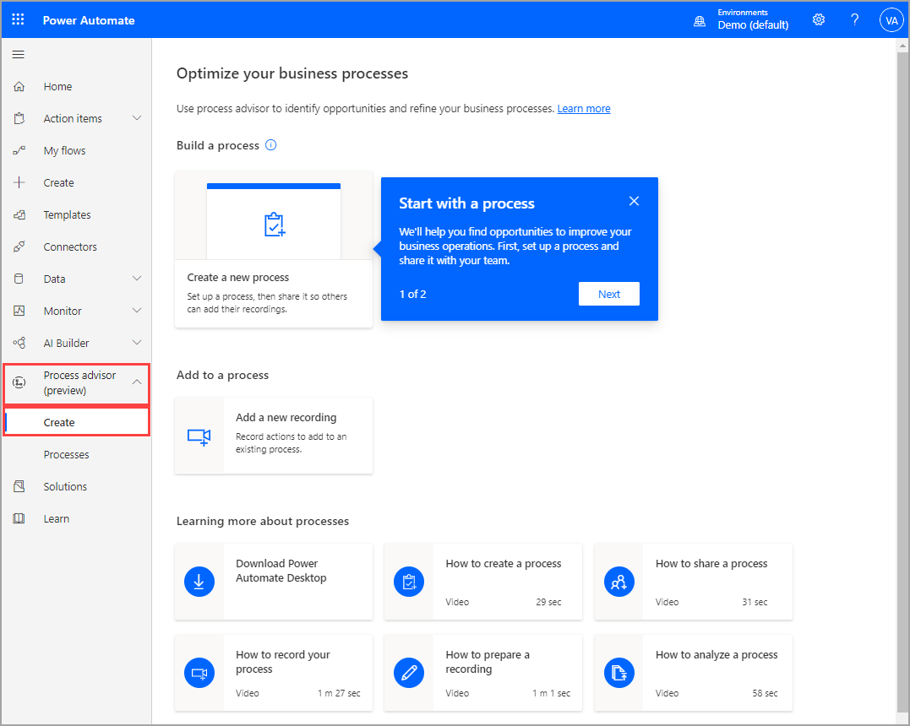
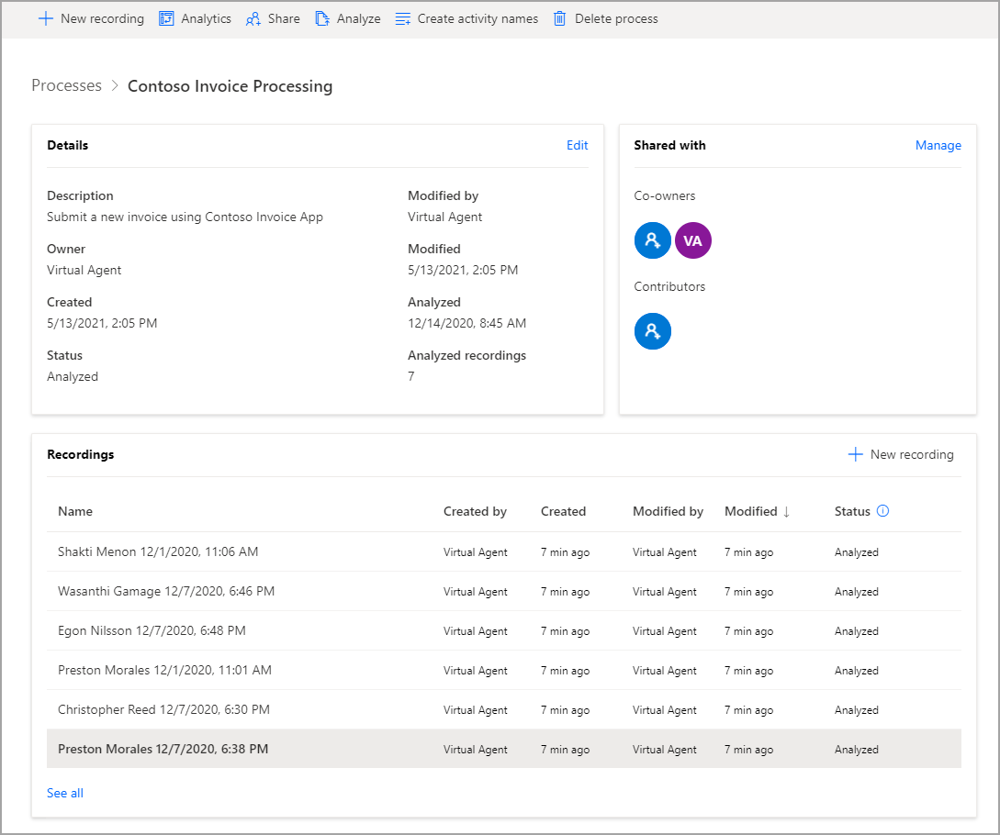

Process advisor is built on the features and capabilities of Microsoft Power Platform to help generate insights. Microsoft Power Automate Desktop allows you to record actions that you perform on your computer, while Microsoft Dataverse stores the information from your processes. As a result, you will need to have access to these technologies, from a licensing and security perspective, to take advantage of process advisor. If process advisor isn't listed when you go to Power Automate, talk to your administrator about your permissions. 

You can access process advisor through [Power Automate](https://flow.microsoft.com/?azure-portal=true) by selecting **Process advisor > Create** on the left navigation pane.

> [!div class="mx-imgBorder"]
> 

On the **Optimize your business processes** screen, you can create a new process or add recordings to an existing process. Additionally, you can select a link to download Power Automate Desktop and view short instructional videos that describe various tasks in process advisor. Recordings are conducted through Power Automate Desktop, so make sure that you have downloaded this program.

Select **Processes** to view the details of existing processes that you own or co-own. If you don't have any processes, you can begin a new one.

Selecting a process will allow you to see the details that are involved, including the various recordings, who created them, at what time, and their status.

> [!div class="mx-imgBorder"]
> 

The possible statuses for recordings are as follows:

-   **In progress** - Recording is in progress, but it is also possible that the recording has not yet started. Because recording happens in the desktop client, the web portal will not know about its status until it has been saved. You can also view this status after the recording has been saved because some processing is required after recording to make it ready to view.

-   **Failed** - An error occurred during recording processing. Create a new recording.

-   **Not analyzed** - The recording has been processed and is available to view and edit, but it has not been marked as ready to analyze.

-   **Ready to analyze** - The recording has been marked as ready to analyze and will be considered the next time you analyze the process.

-   **Analyzed** - The recording has been analyzed and is part of the analyzed output that can be viewed through the **Analytics** screen.

In addition to the recording information, you can view and manage the users who have access to your process.

> [!NOTE]
> Contributors have access to add recordings and manage recordings that they created, while co-owners have access to create recordings and manage the recordings of others, including their own.

Analytics and recommendations will be discussed later in the module; however, the next task is to learn how to add a recording.
