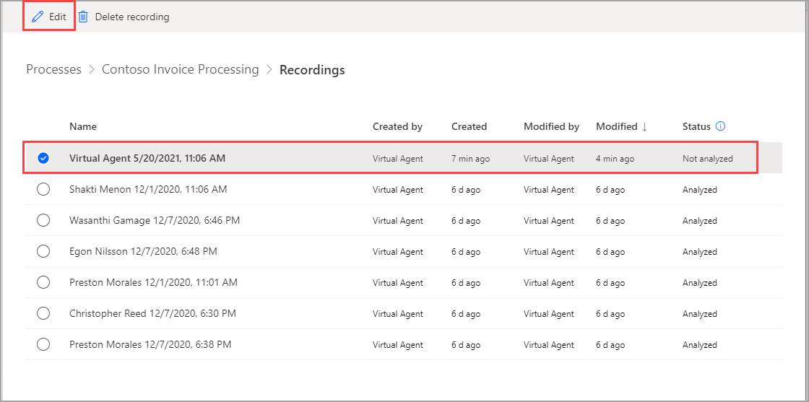
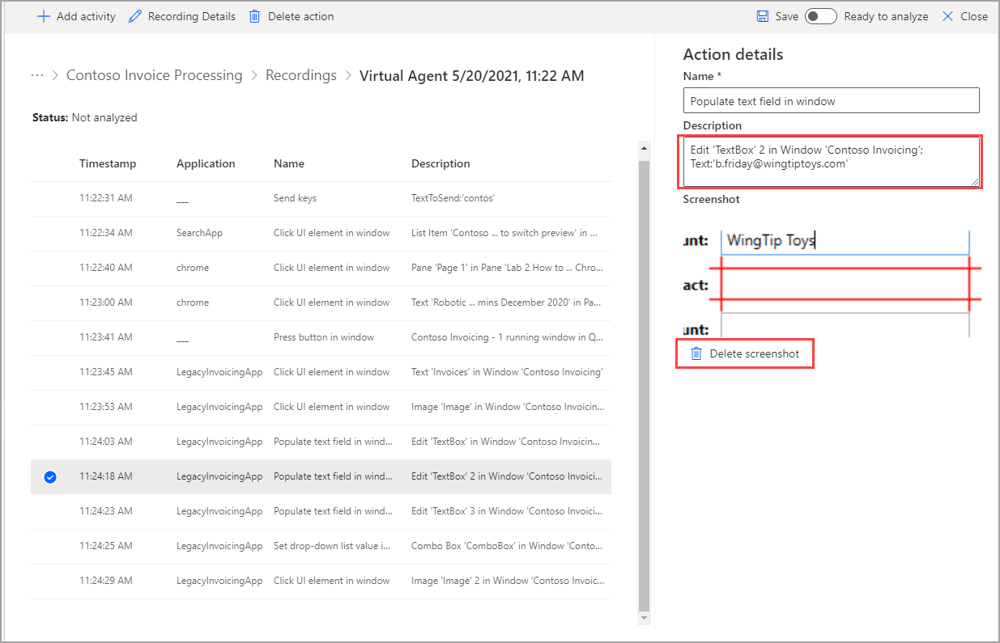
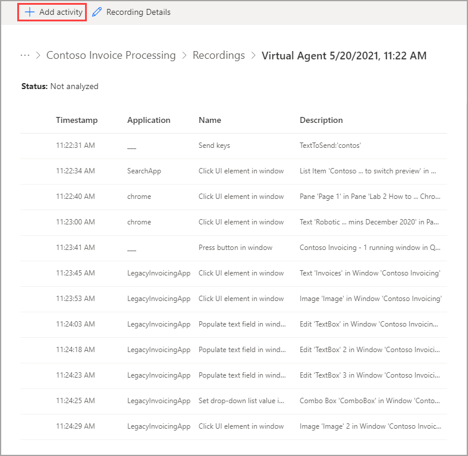
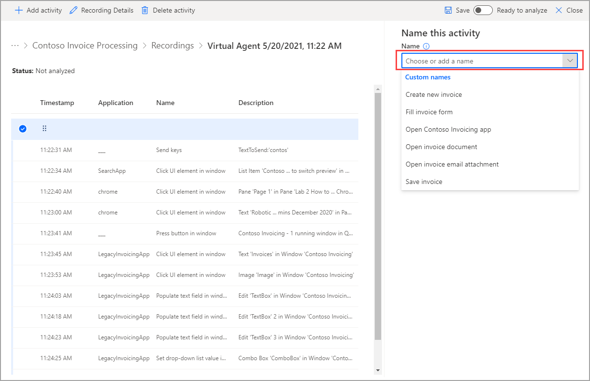
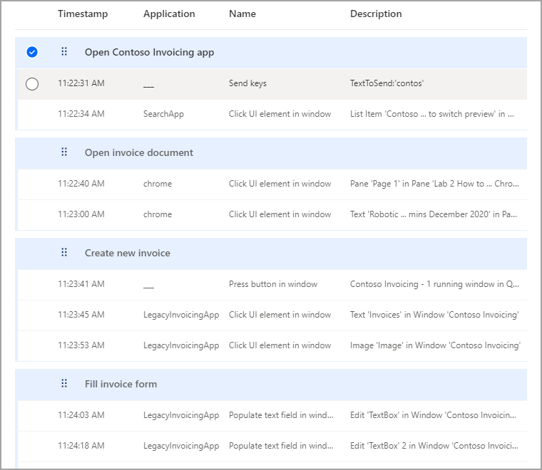
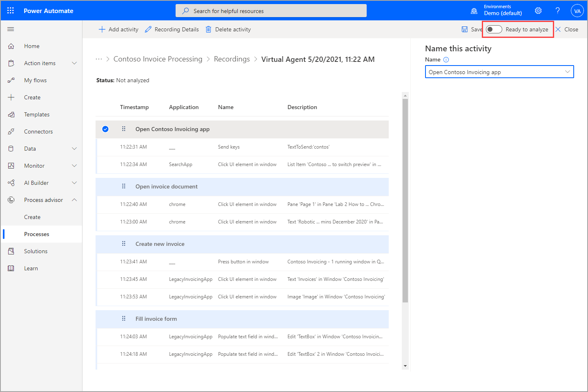

When you are in a process and can see the list of recordings, select **Edit** for a recording so that you can explore other options. On the **Edit** page, you can alter or delete actions and then group actions together to make an activity. Activities are groups of actions that will be the basis of the process map and the analysis. Activities will also allow Power Automate to understand variations in the process between users and recordings.

Recordings have several available statuses. When a recording is being uploaded, it will have a status of **In progress**. When it's ready for grouping and editing, it will have a status of **Not analyzed**. Choose a recording with this status to prepare it for analysis by grouping and editing actions.

> [!div class="mx-imgBorder"]
> 

> [!NOTE]
> You can edit recordings that have already been analyzed, but you need to prepare every recording for analysis by grouping actions and changing the status to **Ready to analyze**.

By selecting individual actions, you can edit the action text or description to eliminate private data or personal information and then delete the screenshot. Screenshots help users or owners of the process understand what is taking place in the action, but deleting the screenshot will not affect the analysis in any way. Editing personal information and deleting screenshots can be important for keeping anonymous data anonymous because it's shared with any owners of the process. You can also delete sensitive steps or modify data input while recording, and you can pause the recording, perform actions regarding sensitive data, and then resume recording.

> [!div class="mx-imgBorder"]
> 

To prepare a recording for analysis, you must first group the individual actions into activities. These activities will allow recordings by different users to be analyzed together and will help Power Automate understand which actions go together to estimate average times and other analytics.

The first step in the grouping process is to select the **Add activity** button.

> [!div class="mx-imgBorder"]
> 

You can choose a new name for your activity, or if other recordings in the process have already been grouped, you can choose from a list of activity names.

> [!div class="mx-imgBorder"]
> 

After you have named the activity, it will appear at the top of your actions. You can move the activity header around to position it above the first activity in the group. You don't need to do anything about the last action yet. At this point, Power Automate is ensuring that every action will fit in a group. Soon, you will add more activities to split up the actions. If you select a specific action before adding a new activity, the header will automatically be placed above it. If you add an extra activity at any point in the process, you can delete the activity without affecting the actions by selecting **Delete activity**. You can also rename activities on the right pane. You need to have at least two activities to analyze a recording. At the end of the process, your recording will look similar to the following image.

> [!div class="mx-imgBorder"]
> 

After you have finished with your grouping, you will have one step left to complete. Select the **Ready to analyze** toggle to change the status.

> [!div class="mx-imgBorder"]
> 

If you own a process, you can create activity names to act as guides for contributing users. To do so, go to your process details screen and select **Create activity names**.

Now that you have learned how to record a process and action on your recording, you can learn about the analysis process.
