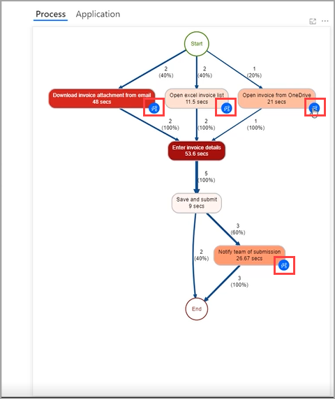
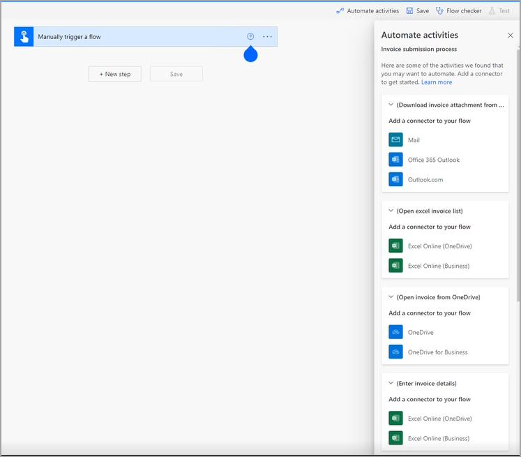
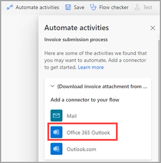
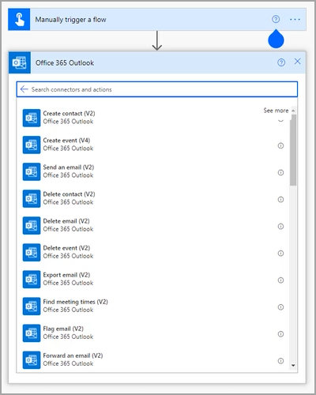

Within your process map, you might see blue icons on various activities, as shown in the following screenshot. These blue icons are recommendations for automation. Power Automate assessed the information, such as time and applications that are involved in this activity, and has recommended further action.

> [!div class="mx-imgBorder"]
> 

Selecting a blue icon will begin a new cloud flow with suggestions for connectors that are grouped by activities based on your process.

> [!div class="mx-imgBorder"]
> 

Selecting a recommended connector will add the selection to your flow.

> [!div class="mx-imgBorder"]
> 

> [!div class="mx-imgBorder"]
> 

You can reach these recommendations anytime by selecting **Automate activities**. If you want to connect to legacy applications, Power Automate for desktop is also available as a connector.

Automation recommendations can guide non-developers on how to create a solution on their analyzed process the right way.
