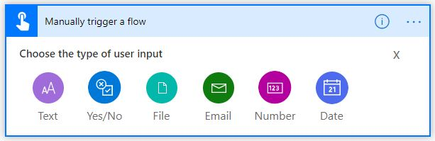

Building a Power Automate flow is the same as building any other
workflow where you have a start and an end. A flow always starts with a
trigger action, and this module focuses on manually triggering
a flow by using buttons with user input. After you have added the trigger, you will add steps.
Each step can be an action, a condition, or a combination of actions
and conditions. The flow always ends with an action.

Two ways to design the process for a button flow are by using 
an existing template with a button trigger and by building a template from blank.

### Six types of user inputs

Currently, Power Automate flows can have six different types of user inputs:

- Text

- Yes/No
 
- File
 
- Email
 
- Number
 
- Date

### Text

**Text** input is best used for adding text. When you select the ellipsis (...) 
at the upper-right of the screen, you will see the **Delete** option and three 
other options:

- Add a drop-down list of options

- Add a multi-select list of options

- Make the field optional

### Yes/No

The **Yes/No** input type is best used to select yes or no options.

### File

The **File** content input type can be used to upload files and images.

### Email

The **Email** input type is where you would enter an email address. The other inputs
complement the use of email input.

### Number

The **Number** input type is best used to add a numerical value.

### Date

For the trigger **Date** input type, you can either enter or select a date.

The **Yes/No**, **File**, **Email**, **Number**, and **Date** input types have the same
options, for example, to **Make the field optional** and **Delete**.
