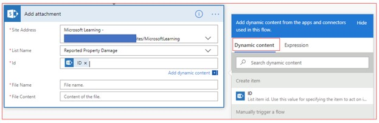

Let's create a flow button that will allow a user to report damage
noticed on the company property. The data will be saved on a SharePoint
list.

1.  Go to the SharePoint Online site of your choice.

1.  On the top left, you will see **+ New**. Click on it and select
    **List**.

    

1.  On the right, you will see **Create list**. Give the list a name,
    such as Reported Property Damage. Click **Create**. You will be redirected
    automatically to the new list. The list will automatically have the
    **Title**.

1.  Click on settings, which is available on the top-right of the screen
    and looks like a gear icon. Hovering your mouse over it will show
    **Settings**. Next, click on **List settings**, which will take you
    to the Reported property damage settings page. In the middle of the
    screen, you will see **Columns**, which already has the **Title**.

    

1.  Click on **Title** and change the column name from Title to
    Location. Scroll down and click **Ok**, which is available on the
    bottom right.

1.  Below the columns, look for **Create column** and click on it.

1.  Add the column name as **Was anyone hurt?**. Confirm **Single line of
    text** is the type of column. Scroll down and click **Ok**, which
    is available on the bottom right.

1.  Follow the previous two steps to add **Email** and 
    **How many damaged items** columns.

1.  Again, click on **Create column**. Add **Date submitted** as the column
    name and this time, select **Date and Time** as the type of column. 
    Scroll down and click **Ok**, which is available on the bottom right.

    

1. Here's a screenshot of all the columns.

    

1. Next, [sign in to Power Automate](https://flow.microsoft.com/?azure-portal=true). 

1. On the left vertical menu click **+ Create**.

1. On the top of the page you will see **Three ways to make a flow**. The first way
    is **Start from blank**. Select this option, and then you will see **Instant flow**
    as an option. Select it.

1. Enter **Report Property Damage** as your **Flow Name** and select the 
    **Manually trigger a flow** option.

1. Select **Create** to start building the button flow.

1. You are now in the flow studio with the flow title and the **Manually trigger a flow** 
trigger already added.

    

1. Click on **Manually trigger a flow** trigger and click on **+ Add an input**.

1. Select **Text**. Replace the **Input text** with **Location**.

1. Click on **+ Add an input** and select **Yes/No.** Replace **Yes/No** with **Was anyone hurt?**

1. Click on **+ Add an input** and select **File**. Replace **File Content** with **Take a picture of the damage**.

1. Click on **+ Add an input** and select **Email**. Replace **Email** with
    **Anyone you'd like to be CC'd?**

1. Click on **+ Add an input** and select **Number**. Replace Number with **How many damaged items?**

1. Click on **+ Add an input** and select **Date**. Replace **Trigger date** with **Add today's date**.

1. Click on **+ New step** and search for SharePoint. Under **Actions** click on **Create item**.

1. In the **Create item** action, for **Site Address** click on the
    drop-down arrow, which is available to the right and select the 
    site where your list is available. If the site doesn't appear, 
    then click on **Enter custom value** and paste the site URL.

1. In the List Name field, select the Reported Property Damage list we created above. 
    After the list is selected the column names will appear below it.

1. Click in the Location field on the right, then in the Dynamic
    Content section, select **Location**.

    

1. Do the same for the other fields after which it should look like this.

    

1. Click on **+ New step** and search for SharePoint. Under **Actions**
    click on **Add attachment**.

1. For **Site Address**, click on the drop-down arrow, which is to the
    right, and select the site where your list is available. If the site
    doesn't appear, click on **Enter custom value** and paste the site URL.

1. In the **List Name** field, select the Reported Property Damage list we 
    created above. After the list is selected, the column names will appear 
    below it.

1. Click in the **Id** field and select **ID** dynamic content.

    

1. Click in **File name** and type in ```DamageReportImage.jpeg```.

1. Click in **File Content**, in the dynamic content click on 
    **Take a picture of the damage**.

    

1. Click on **Flow checker,** which is available on the top right. If
    you have 0 errors and warnings, then click on the **X**. Next, click
    on **Save**.

1. You can now test the button using your smartphone. Open the Power Automate 
    app and click on the **Buttons** option on the bottom horizontal menu. You
    will now see the **Report Property Damage** button. Click on this button.

1. Populate all the items in the user input fields and then click on **Done**.

    

1. You can go back to your SharePoint list and confirm the new item, including the image has been added.

    

You have successfully created the app using all the six inputs!
