In this unit, you'll create a flow button that will allow a user to report damage
that was noticed on the company's property. The data will be saved on a SharePoint
list.

1. Go to the SharePoint online site where you would like to store damage report information.

1. On the upper left of the SharePoint site, select the **+ New** drop-down menu and then select **List**.

    > [!div class="mx-imgBorder"]
    > [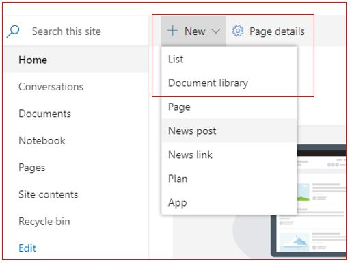](../media/sharepoint-new-list.jpg#lightbox)

1. Select **+ Blank list**.

    > [!div class="mx-imgBorder"]
    > [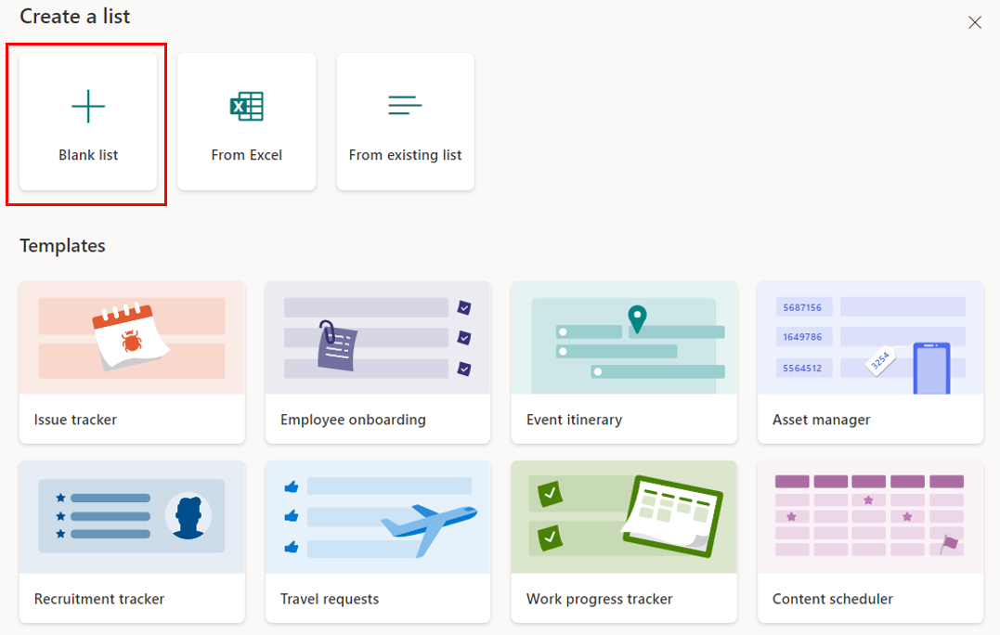](../media/blank-list.png#lightbox)

1. Give the list a name,
    such as **Reported Property Damage**. Select **Create**. you'll be automatically redirected
    to the new list. The list will automatically have the **Title** field option available.

    > [!div class="mx-imgBorder"]
    > [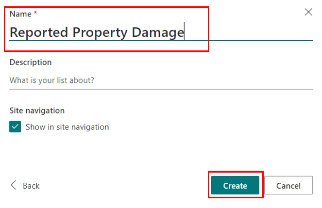](../media/list-name.png#lightbox)

1. Select **Settings**, which is available on the upper-right edge of the screen
    and looks like a gear icon. Hovering your mouse over the icon will show the
    **Settings** option. Next, select **List settings**, which will take you
    to the **Reported property damage settings** page. In the middle of the
    screen, you'll see the **Columns** section, which already has the **Title** option available.

    > [!div class="mx-imgBorder"]
    > [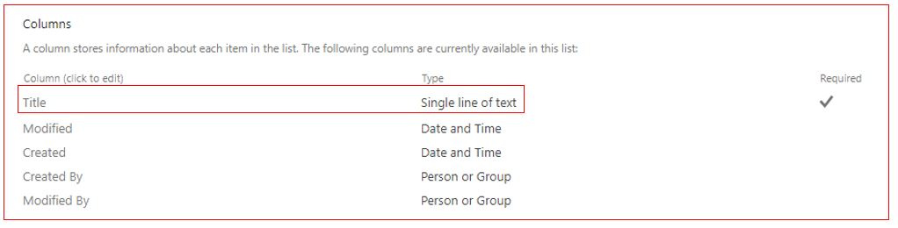](../media/sharepoint-columns-title.jpg#lightbox)

1. Select **Title** and change the column name from **Title** to
    **Location**. Scroll down and select **OK**, which is available on the
    lower right of the screen.

1. Below the columns, select **Create column**.

1. Enter **Was anyone hurt?** as the column name. Confirm **Single line of
    text** as the type of column. Scroll down and select **OK** on the lower right of the screen.

1. Follow the previous two steps to add the **Email** and **How many damaged items** columns.

1. Select **Create column**. Add **Date submitted** as the column
    name and, this time, select **Date and Time** as the type of column.
    Scroll down and select **OK** on the lower right of the screen.

    > [!div class="mx-imgBorder"]
    > [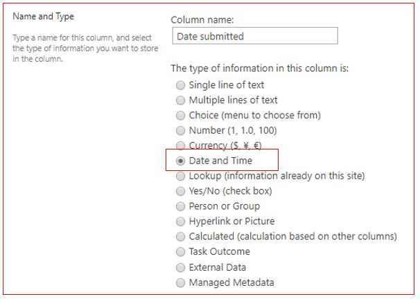](../media/date-submitted-column.jpg#lightbox)

    The following screenshot shows an example of all the columns.

    > [!div class="mx-imgBorder"]
    > [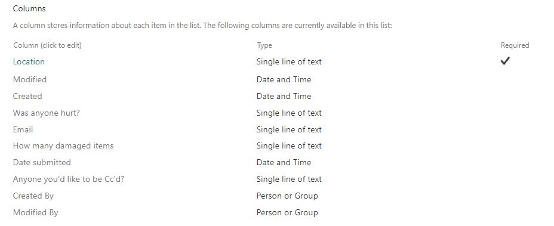](../media/all-sharepoint-columns.jpg#lightbox)

1. [Go to Power Automate](https://flow.microsoft.com/?azure-portal=true) and sign in.

1. On the left vertical menu, select **+ Create**.

1. On the top of the page is the **Three ways to make a flow** heading. Select the
    **Instant cloud flow** option from the **Start from blank** menu.

1. Enter **Report Property Damage** as your **Flow name** and select the
    **Manually trigger a flow** option.

1. Select **Create** to start building the button flow.

1. You're now in the Power Automate flow studio with the flow title and the **Manually trigger a flow**
   trigger already added.

    > [!div class="mx-imgBorder"]
    > [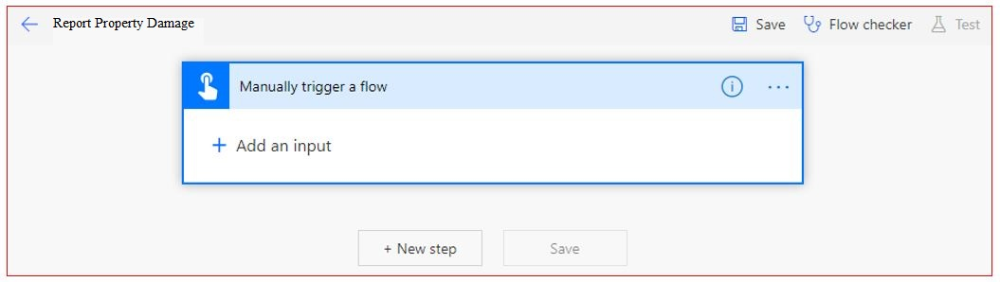](../media/report-damage-trigger.jpg#lightbox)

1. Select the **Manually trigger a flow** trigger and then select **+ Add an input**.

1. Select **Text**. Replace the **Input text** with **Location**.

1. Select **+ Add an input** and select **Yes/No**. Replace **Yes/No** with **Was anyone hurt?**

1. Select **+ Add an input** and select **File**. Replace **File Content** with **Take a picture of the damage**.

1. Select **+ Add an input** and select **Email**. Replace **Email** with
    **Anyone you'd like to be Cc'd?**

1. Select **+ Add an input** and select **Number**. Replace **Number** with **How many damaged items?**

1. Select **+ Add an input** and select **Date**. Replace **Trigger date** with **Add today's date**.

1. Select **+ New step** and search for **SharePoint**. Under **Actions**, select **Create item**.

1. In the **Create item** action, for **Site Address**, select the
    drop-down arrow, which is available to the right and then select the
    site where your list is available. If the site doesn't appear,
    then select **Enter custom value** and paste the site URL.

1. In the **List Name** field, select the **Reported Property Damage** list that you previously created.
    After you've selected the list, the column names will appear below it.

1. In the **Location** field on the right, and then in the **Dynamic Content** section, select **Location**.

    > [!div class="mx-imgBorder"]
    > [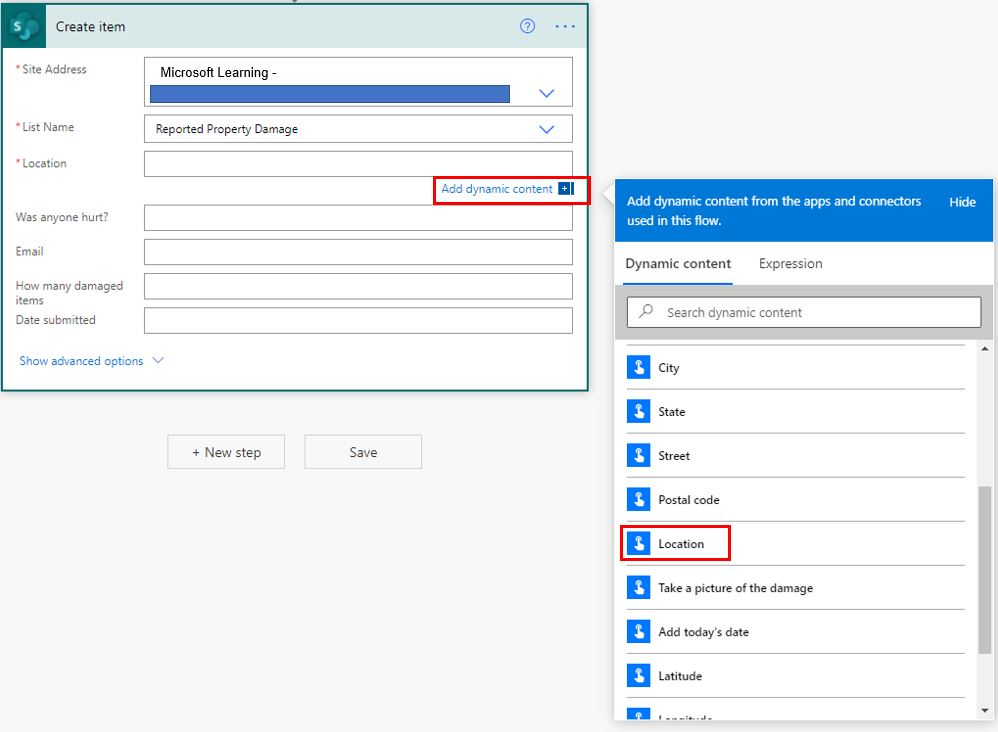](../media/add-location-dynamic-content.jpg#lightbox)

1. Add Dynamic content for the other fields. After you've completed the steps, the result should look like the following image.

    > [!div class="mx-imgBorder"]
    > [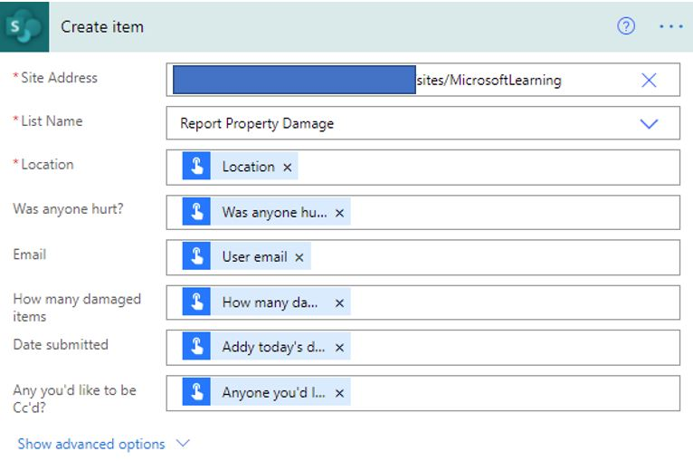](../media/all-fields-create-item-action.jpg#lightbox)

1. Select **+ New step** and search for SharePoint. Under **Actions**,
    select **Add attachment**.

1. For **Site Address**, select the drop-down arrow, which is to the
    right, and then select the site where your list is available. If the site
    doesn't appear, select **Enter custom value** and paste the site URL.

1. In the **List Name** field, select the **Reported Property Damage** list that you previously  
    created. After the list is selected, the column names will appear
    below it.

1. In the **Id** field, select **ID** dynamic content.

1. In the **File name** field, enter ```DamageReportImage.jpeg```.

1. In the **File Content** field, in the **Dynamic Content** section, select
    **Take a picture of the damage**.

    > [!div class="mx-imgBorder"]
    > [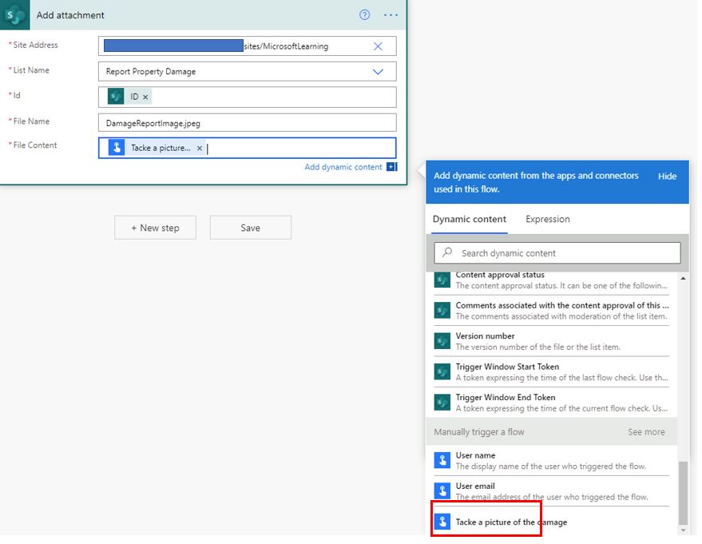](../media/take-picture-damage.jpg#lightbox)

1. Select **Flow checker**, which is available on the upper right of the screen. If
    you've zero errors and warnings, select the **X** and then select **Save**.

1. You can now test the button by using your smartphone. Open the Power Automate
    app and select the **Buttons** option on the lower horizontal menu. You'll now see the **Report Property Damage** button. Select this button.

1. Populate all the items in the user input fields and then select **Done**.

    > [!div class="mx-imgBorder"]
    > [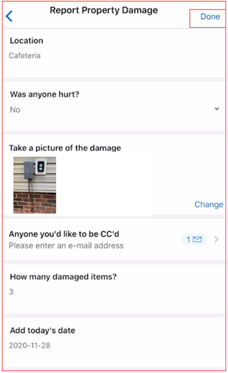](../media/sample-report-using-mobile-app.jpg#lightbox)

1. You can return to your list and confirm the new item, including the image that has been added.

    > [!div class="mx-imgBorder"]
    > [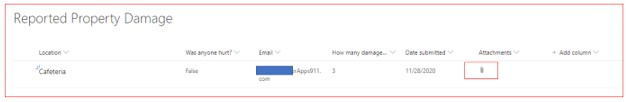](../media/report-image.jpg#lightbox)

Now you've successfully created the app using all six user inputs.
