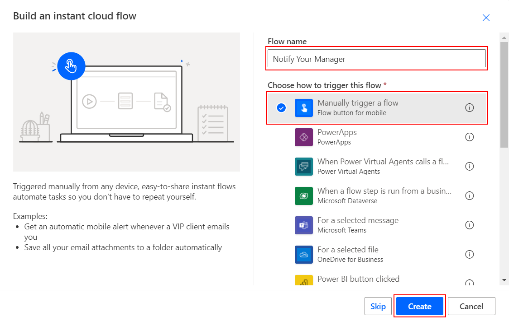
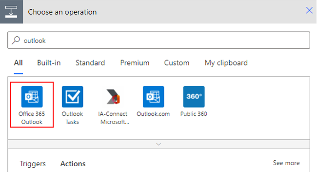

In this unit, you'll build a button containing a flow. The flow sends an email to your manager with your current location and a photo of the vehicle that you're using.

1. Sign in to [Go to Power Automate](https://flow.microsoft.com/?azure-portal=true).

1. Select **+ Create** on the left menu and then select **Instant cloud flow**.

1. Enter **Notify Your Manager** as your **Flow name**. Select the
   **Manually trigger a flow** trigger, and then select **Create** to start building the flow.

   > [!div class="mx-imgBorder"]
   > [](../media/create-name-manager-flow.png#lightbox)

1. Select the **Manually trigger a flow** trigger and then select **+ Add an input**.

1. Select **File** and rename **File Content** to **Image**.

    > [!div class="mx-imgBorder"]
    > [](../media/notify-manager-trigger.jpg#lightbox)

1. Select **+ New step** and search for **Office 365 Users**. Under **Actions**, select the **Get manager (V2)** option.

1. In the **User (UPN)** field, select **User email** from the **Dynamic content** window.

    > [!div class="mx-imgBorder"]
    > [](../media/get-manager-v2.jpg#lightbox)

1. Select **+ New step** and search for Outlook and select **Office 365 Outlook**.

    > [!div class="mx-imgBorder"]
    > [](../media/office-365-outlook.png#lightbox)

1. Under **Actions**, select the **Send an email (V2)** option.

1. In the **To** field, in the **Dynamic content** section, under **Get manager (V2)**, select **Mail**. You might have to select **See more** to find **Mail**.

    > [!div class="mx-imgBorder"]
    > [](../media/mail.jpg#lightbox)

1. Set the **Subject** field to ```My current location and vehicle I am using```.

1. Set the **Body** field to the following text:

    ```r
    Hi

    I have arrived at my current location and attached is a picture of the vehicle I am currently using.

    Address:
    ```

1. In the **Body** field, after the word **Hi**, select **Display Name** from the **Dynamic content** window under **Get manager (V2)**.

1. In the **Body** field, below **Address:**, select **Full address**, from the **Dynamic content** window under **Manually trigger a flow**. You might have to scroll down a bit to find it.

1. Select **Show advanced options** to add the photo as an attachment.

1. Set the **Attachments Name - 1** field to any name you would like to use followed by the **.jpg** extension. Then set the **Attachments Content - 1** field to the following expression:

    ```base64ToBinary(triggerBody()?['file']?['contentBytes'])```

    The following screenshot shows what the **Send an email (V2)** action looks like.

    > [!div class="mx-imgBorder"]
    > [](../media/send-email-body.jpg#lightbox)

1. **Save** the flow.

1. You can now test the button by using your smartphone. Open the app and select the **Buttons** option on the lower horizontal menu. Select the **Notify Your Manager** button. To add an image, select the **paper clip icon** and add an image by taking a new picture with your camera or by using an existing image from your photo library.

    Your manager will get an email with an image attached.
