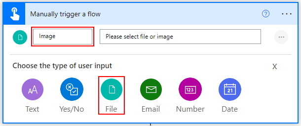
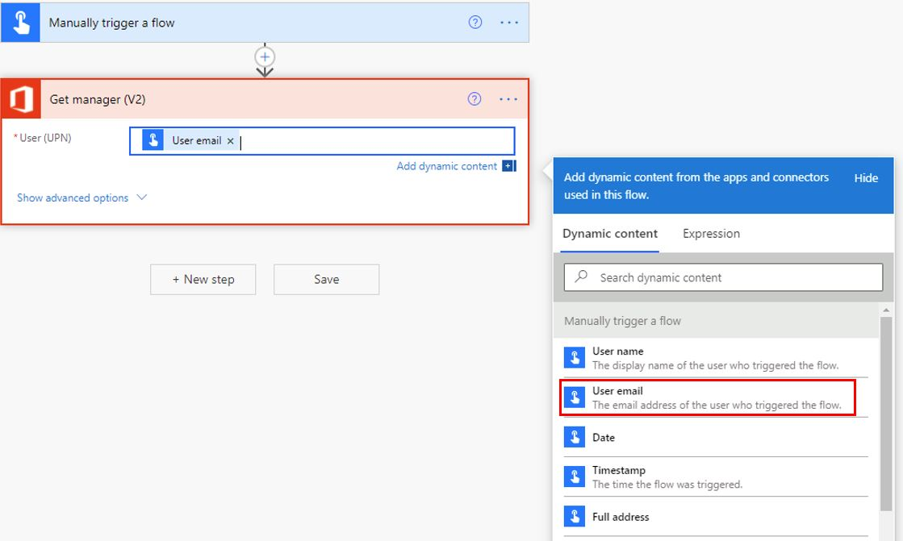
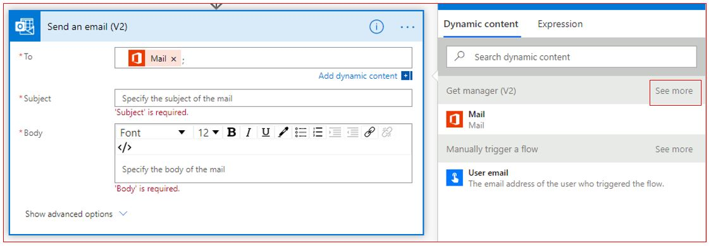
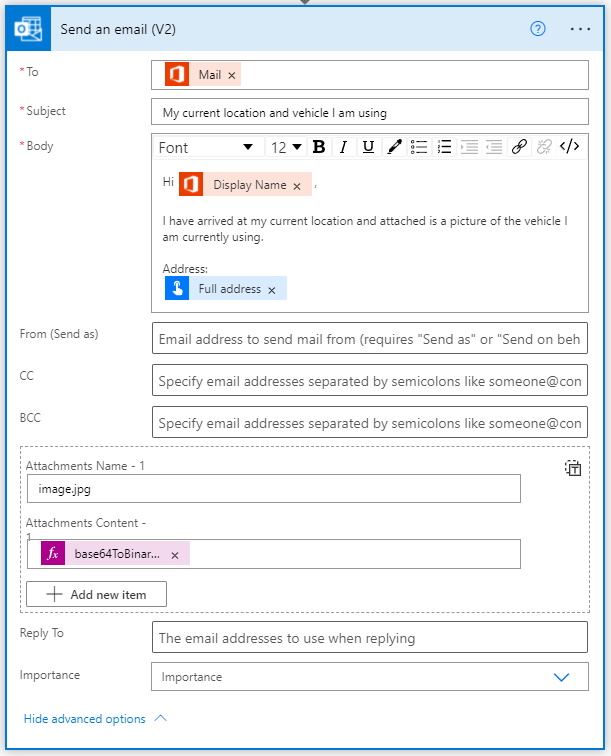

Let's build a flow triggered by a button that will email your manager
your current location along with a photo of the vehicle you are using.

1.  [Sign in to Power Automate](https://flow.microsoft.com/?azure-portal=true). 

1.  On the left vertical menu click on **+ Create**.

1.  On the top, you will see **Three ways to make a flow**. Select **Start from blank**, 
	and then select **Instant flow**.

1.  Enter **Notify Your Manager** as your flow **Name** and select the 
	**Manually trigger a flow** option.

1.  Click **Create** to start building the flow.

1.  You are now in the flow studio with the flow name and the **Manually trigger a flow** 
	trigger already added.

    

1.  Click on the **Manually trigger a flow** trigger and click on **+ Add an input**.

1.  Select **File** and rename **File Content** to **Image**.

1.  Click on **+ New step** and search for **Office 365 Users**. Under **Actions,** you should see **Get manager (V2)**, select it.

1. Click in **User (UPN)** and from **Dynamic content** select **User email**.

    

1. Click on **+ New step** and search for Outlook. Under **Actions** you should see **Send an email (V2)**, select it.

1. Click in **To** and in **Dynamic content** under **Get manager (V2)** select **Mail**. You may have to click on **See more** to find **Mail**.

	

1. Click in **Subject** and type in ```My current location and vehicle I am using```.

1. In **Body** type in the below:

	```Hi
	
	I have arrived at my current location and attached is a picture of the vehicle I am currently using.
	
	Address:
	```

1. In the **Body**, after Hi, select **Display Name** which is available in the **Dynamic content** under **Get manager (V2)**.

1. In the **Body**, below Address: select **Full address** which is available in the **Dynamic content** under **Manually trigger a flow**. You might have to scroll down a bit to find it. Here is a screenshot of what the Send an email (V2) action looks like.

    

1. Click on **Flow checker,** which is available on the top right. If you have 0 errors and warnings, then click on the **X**. Next, click on **Save**.

1. You can now test the button using your smartphone. Open the app and click on the **Buttons** option on the bottom horizontal menu. You will now see the **Notify Your Manager** button. Click on it. To add an image, click on the **paper clip icon** and add an image by either taking a new picture with your camera or using an existing image from your photo library.

1. Your manager will get an email with an image attached.
