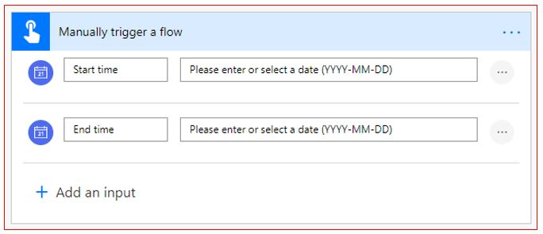
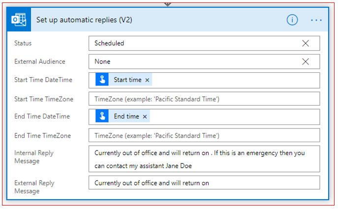
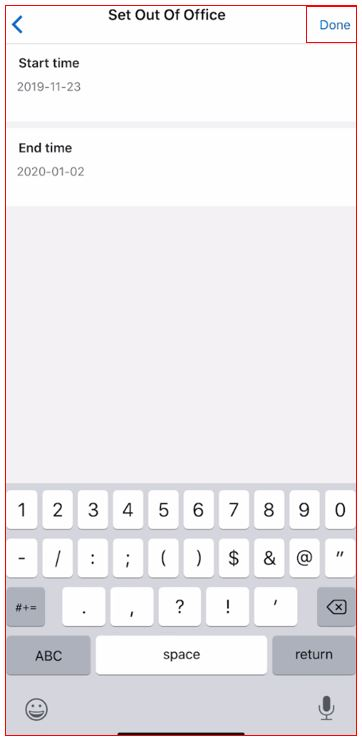
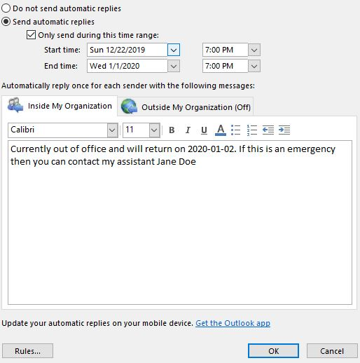

In this exercise, you will build a flow that is triggered by a button that will set up automatic
replies to your Office 365 Outlook, which will add separate reply
messages for internal and external emails.

1.  [Sign in to Power Automate](https://flow.microsoft.com/?azure-portal=true). 

1.  On the left vertical menu, select **+ Create**.

1.  On the top of the page, from the **Three ways to make a flow** drop-down menu, select **Start from blank** 
    and then select **Instant flow**.

1.  Add **Set Out Of Office** as your flow **Name** and select the **Manually trigger a flow** option.

1.  Select **Create** to start building the flow.

    You are now in the flow studio with the title **Set Out of Office** and the 
    **Manually trigger a flow** trigger already added.

1.  Select **+ Add an input** and select **Date**. Rename **Trigger date** to **Start time**. 

1.  Select **+ Add an input** again and select **Date**. Rename **Trigger date** to **End time**. 
    The following image shows what the trigger action should look like.

    

1. Select **+ New step** and search for automatic replies. 

1. Select **Set up automatic replies (V2)**.

1. In the **Start Time DateTime** field, and from the **Dynamic Content** section, select **Start time**.

1. In the **End Time DateTime** field, and from the **Dynamic Content** section, select **End time**.

1. For the **Internal Reply Message** field, follow these steps:

    1.  Enter **```Currently out of office and will return on. If this is an emergency, then you can contact my assistant Jane Doe.```**

    1.  Set your cursor after the word **on** in your text, and then select **End time** 
    from the **Dynamic Content** section.

1. For the **External Reply Message** field, follow these steps:

    1.  Enter **```Currently out of office and will return on```.**

    1.  Set your cursor after the word **on** in your text, and then select 
    **End time** from the **Dynamic Content** section.

   The following screenshot shows what the **Set up automatic replies (V2)** screen looks like.

    

1. Select the **Flow checker**, which is available on the upper right if the screen. If you have zero errors and warnings, select the **X** and then select **Save**.

1. You can now test the button by using your smart phone. Open the app and select the **Buttons** option on the lower horizontal menu. Select the **Set Out Of Office** button.

1. Add the **Start time** and **End time**, as shown in the following screenshot, and then select **Done**, which is available 
on the upper right of the screen.

    

1. To confirm that the flow has run successfully, go to Outlook on your local machine, select **File**, which is on the upper left of the top horizontal menu. On the **Info** screen, select **Automatic Replies**.

You should now see the setting that you added by using the flow.

    
