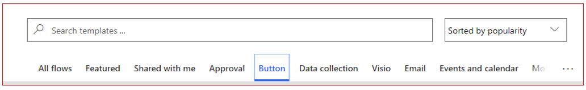
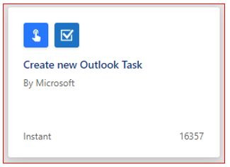
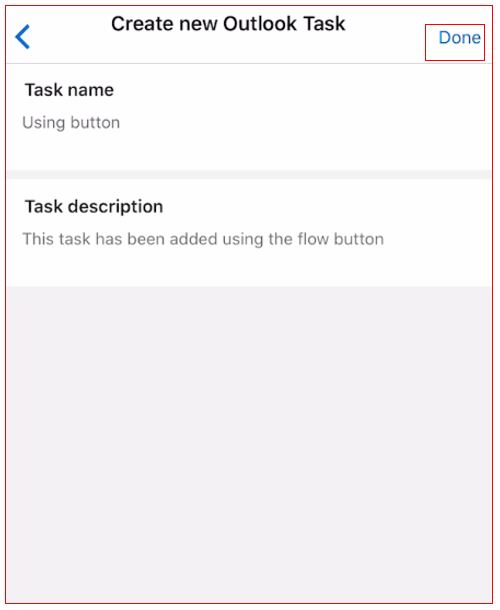
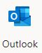
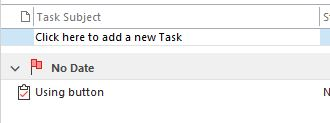

This exercise will walk you through using an existing button template to
add a new Outlook task.

We are going to use the **Create a new Outlook Task** template.

Here are the steps.

1.  [Sign in](https://flow.microsoft.com/?azure-portal=true). 

1.  On the left vertical menu click on **Templates**.

1.  Right below the **Search templates...** you will see a several options such as **All flows**, **Featured**, **Shared with me**... find and click the **Button** option.

    

1.  Find the Create a new Outlook Task template and click on it.

    

1.  Click on **sign in**.

1.  A temporary authentication pop-up window may appear and may require you to add your username and password.

1.  Click on Create Flow.

1.  Your new flow will automatically be created.

1.  You can now test the button using your smart phone. Open the app and click on the **Buttons** option on the bottom horizontal menu. You will now see the **Create new Outlook Task** button. Click on it.

1. Add a task name and task description and click on Done which is available on the top right-hand side of the app.

    

11. To confirm the flow has run successfully, go to your Outlook  on your local machine, and select the Task  icon available on the bottom left.

12. You will now see the new task,

	

