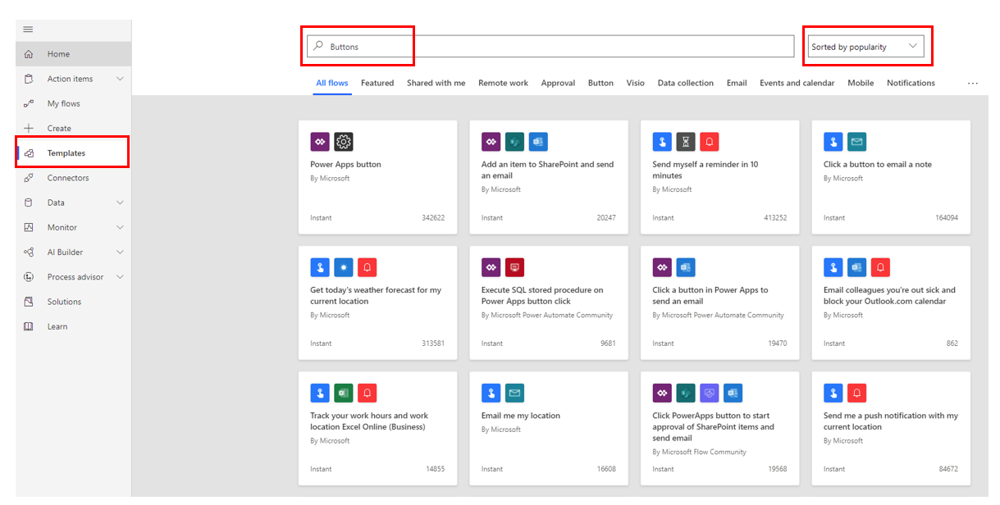

Building a button flow is the same as building any other flow; it has
a start and an end. A flow always starts with a trigger action. 
This module focuses on how to manually trigger a flow by using buttons
without user input. After creating the trigger action, you can add flow steps. Each step can be an
action, a condition, or a combination of actions and conditions. The
flow always ends with an action.

Two ways to design the process for a button flow are by using
an existing template with a button trigger or by building a new one from blank.

### Use an existing template

Using an existing template is a great way to observe the basic
principles of designing a successful flow.

To build a flow by using an existing template, follow these steps:

1.  [Sign in to Power Automate](https://flow.microsoft.com/?azure-portal=true). 

1.  On the left navigation pane, select **Templates**.

1.  In the search bar on the top of the page, enter **Buttons**. 

1.  Select a template that matches your
    requirements, add your connectors, and then fill in the
    required parameters.

The following screenshot shows an example of the button templates.

### Build a flow from blank

Building a flow from blank allows you the flexibility to design a
workflow that matches your customized logic that meets your
requirements.

To build a flow from blank, follow these steps:

1.  [Sign in to Power Automate](https://flow.microsoft.com/?azure-portal=true). 

1.  On the left navigation pane, select **+ Create**.

1.  The top of the page shows ways for you to make a flow. The first way
    is **Start from blank**, where you will select **Instant flow**.    

1.  Give your flow a name. In the **Build an instant flow** section, select 
    an option from **Manually trigger a flow** and then select **Create to build your flows from blank**.

1.  Select **Create** to start building the flow.
