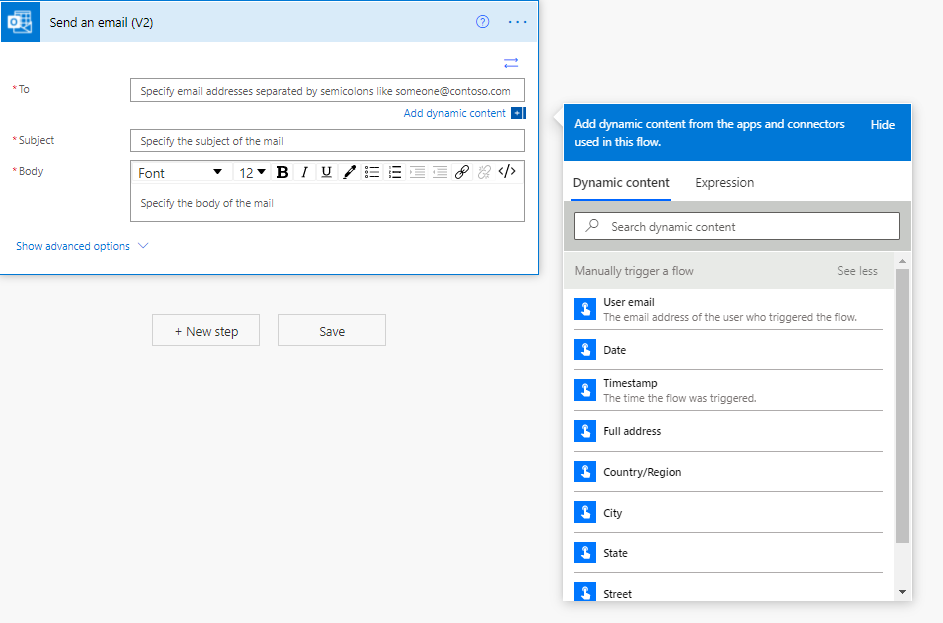
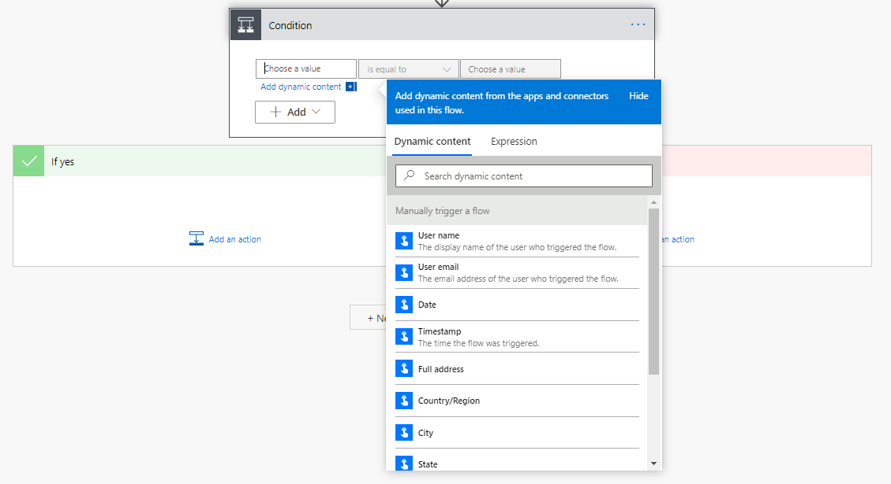
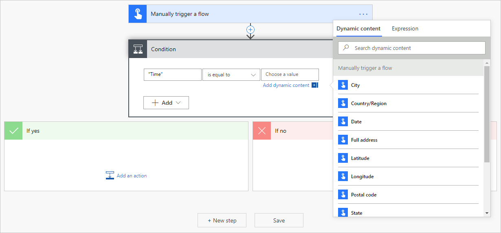

Trigger tokens are data points that are known and available to the
device on which the button flow is running. These tokens are dependent
on factors such as time and the geographic location of the device at a
given moment.

When you run a flow from a virtual button on a smart phone the date,
time and the current address where the phone is located are
automatically available for use. You can use these trigger tokens to
build useful flows that will minimize repetitive tasks such as providing
your location to someone or tracking how much time you spent on a
particular job/service call.

Here are the list of the button trigger tokens that are available for
you to use when creating your button flows.

| Parameter        | Description                                                                     |
|------------------|---------------------------------------------------------------------------------|
| City             | The city in which the device that's running the flow is located.                |
| Country / Region | The country/region in which the device that's running the flow is located.      |
| Full address     | The full address where the device that's running the flow is located.           |
| Latitude         | The latitude in which the device that's running the flow is located.            |
| Longitude        | The longitude in which the device that's running the flow is located.           |
| Postal Code      | The postal code in which the device that's running the flow is located.         |
| State            | The state in which the device that's running the flow is located.               |
| Street           | The street on which the device that's running the flow is located.              |
| Timestamp        | The time in the area where the device that's running the flow is located.       |
| Date             | The date in the area where the device that's running the flow is located.       |
| Username         | The username of the person signed into the device that's running the flow.      |
| User email       | The email address of the person signed into the device that's running the flow. |

Triggers can be added to both actions and conditions.

Consider a **Send an email (V2)** action where you have the options to
apply any of the above paraments in the body.

You can also apply the trigger in a condition both on the left and right
side.

