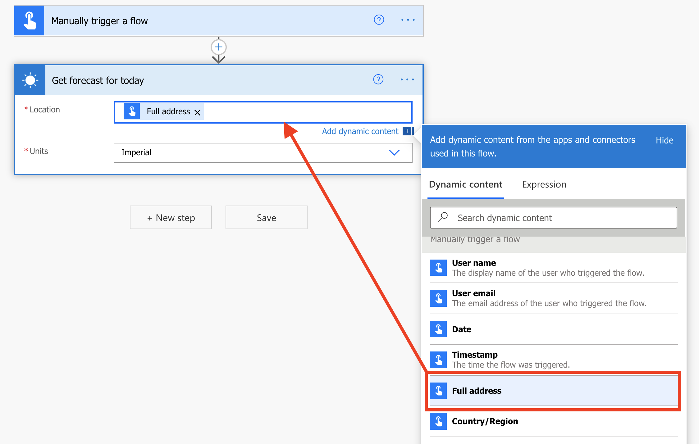
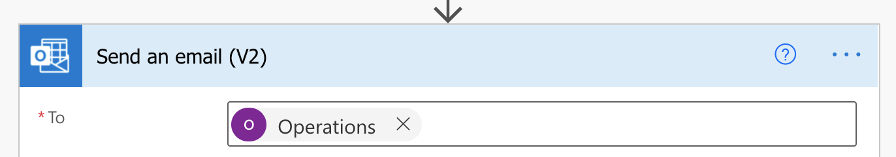
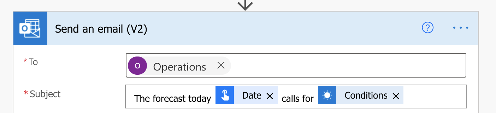
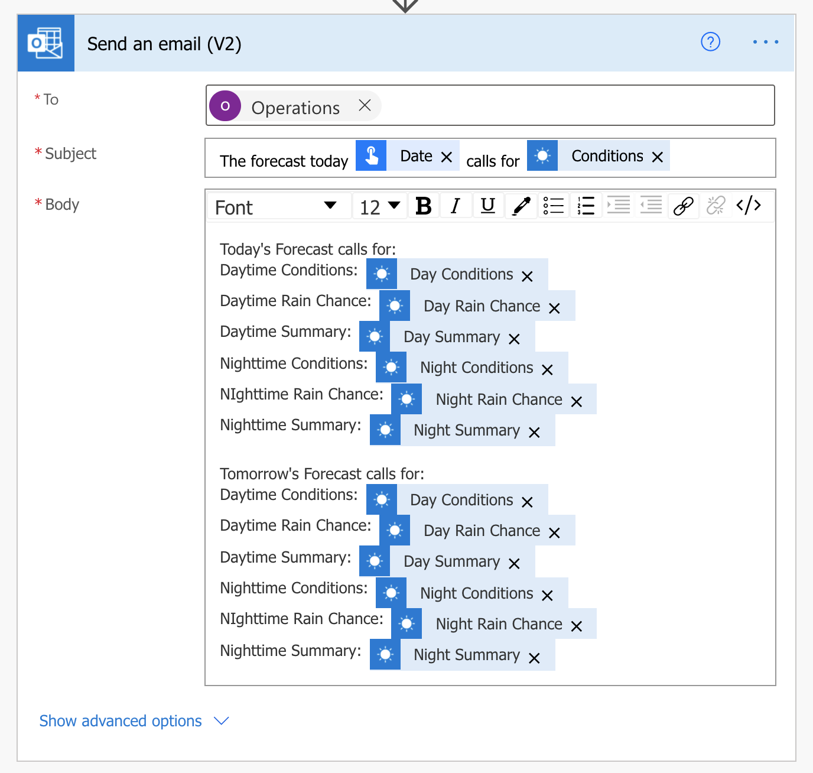

This lesson shows how to build a flow that is triggered by a button that
will notify you of the weather forecast for today and tomorrow. In this lesson, you will also see how to edit a button flow and add another step to send an email notification with the weather forecast. This example uses the **MSN Weather** connector.

Before we begin, you may be wondering, when should I create a Power Automate button? There are many examples, such as the example you will see in this module, but another common scenario is creating a button to send an email to your manager if you're sick or going to be late to work. These scenarios require no user input, you can create a button, which will allow you too quickly and easily notify your manager or send an email with the single push of a button.

As stated previously though, in this example you will see how to create a button and get a notification with today and tomorrow's weather forecast.   

1. [Sign in to Power Automate](https://flow.microsoft.com/?azure-portal=true).

1. On the left navigation pane, select **+ Create**.

1. This page shows the ways that you can make a flow. Select **Instant cloud flow**.

1. Add **Weather Information** as the flow name and select the **Manually trigger a flow** option
    to trigger this flow.

1. Select **Create** to start building the flow.

    The **Manually trigger a flow** trigger should already be added.
    On the upper left of the page, **Weather Information** will be shown as your
    flow name.

1. Select the **+ New step** button.

1. In **Choose an action**, if you don't already see the **MSN Weather** connector, then search for **MSN** and select **MSN Weather**.

   :::image type="icon" source="../media/msn-weather-connector-icon.png":::

1. Select **Get forecast for today**. Wait until it creates its connection.

1. Select the **Location** field, and then select the **Full address** option from the **Dynamic content** dialog box.

    

1. Leave the **Units** field as **Imperial** or you can change it to **Metric**.

1. Select the **+ New step** button again.

1. In **Choose an action**, if you don't already see the **MSN Weather** connector, then search for **MSN** and select **MSN Weather**.

    :::image type="icon" source="../media/msn-weather-connector-icon.png":::

1. Select **Get the forecast for tomorrow**.

1. Select the **Location field**, and then select **Full address** from the **Dynamic content** dialog box. This time, you might need to scroll to the bottom of the dialog box to find **City**.

1. Leave the **Units** field as **Imperial** or change it to **Metric**.

1. Select the **+ New step** button again.

1. In **Choose an action**, select the **Notifications** option. If you don't already see the **Notifications**        option, search for **Notifications** and then select it.

    :::image type="icon" source="../media/notifications-connector-icon.png":::

1. Select **Send me a mobile notification**.

1. In the **Text** field, enter **Today's forecast calls for:** and then,
    by using a combination of manually entered text and option selections, you can create a personalized list of actions. You can select options such as:

    - Day Conditions,
    - Day Rain Chance,
    - Day Summary,
    - Night Conditions,
    - Night Rain Chance,
    - Night Summary,
    - and so on.

    Make sure that
    the dynamic content comes from **Get forecast for today**.

    > [!div class="mx-imgBorder"]
    > 

1. In the same **Text** field, enter **Tomorrow's forecast calls for:** and then, by
    using a combination of manually entered text and option selections, you can create a personalized list of actions. You can select options such as:

    - Day Conditions,
    - Day Rain Chance,
    - Day Summary,
    - Night Conditions,
    - Night Rain Chance,
    - Night Summary,
    - and so on.

    Make sure that the
    dynamic content comes from **Get the forecast for tomorrow**.

    > [!div class="mx-imgBorder"]
    > 

1. Select **Flow check**, which is available on the upper right of the page, and confirm that you have zero errors and warnings. Select **Save**.

    The following screenshot shows an example of the flow.

    > [!div class="mx-imgBorder"]
    > 

    The following screenshot shows what the Microsoft Power Automate app
    notification looks like.

    If the location service hasn’t already been allowed for the app, then you will be
    prompted to accept that when this button flow is run. If you don’t allow it, then
    the flow will fail. You will have to go into your browser settings (which vary between
    browsers) and grant Power Automate flow access to your location if you’ve denied it once before.

    > [!div class="mx-imgBorder"]
    > 

Now, let's take this example one step further and send an email notification to the Operations Group with the days forecast.

1. Edit the flow and after the Send me a mobile notification action select **+ New step**.
1. In the Search connectors and actions box, type **send an email**.
1. Under Actions, select **Send an email (V2) - Office 365 Outlook**.
1. In the **To** field, I am going to send this to the Operations group.

1. In the **Subject**, enter a combination of free text and dynamic content to create a brief Subject for the email.

1. In the **Body**, you can use a combination or free text and dynamic content to create a different message than the Mobile notification. Or you can copy the details and use them in the email today as well, that's what we will do in this example.

1. Save the flow and now the Operations Group will receive an email each time you press the button.
  
 