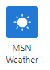
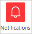
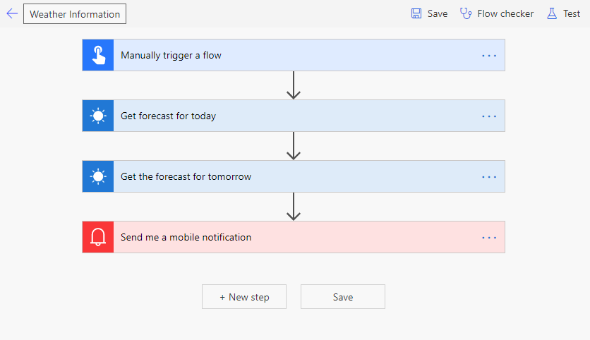
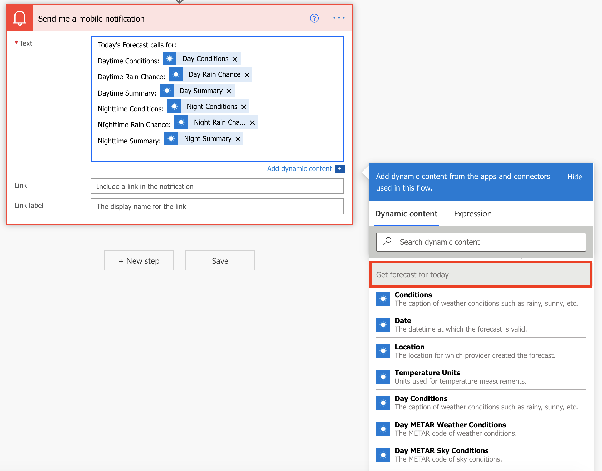
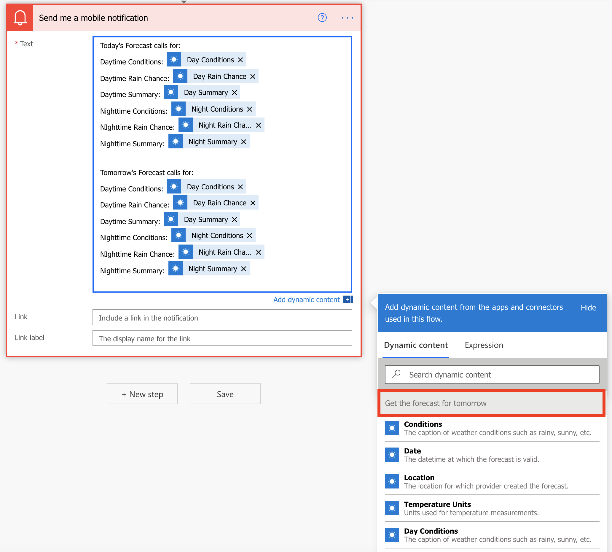
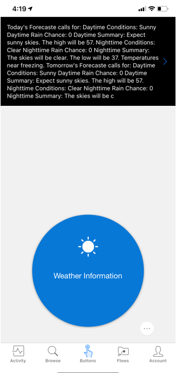

In this section we are going to build a flow triggered by a button that
will notify us the weather forecast for today and tomorrow. We are going
to use the **MSN Weather** connector for this.

1.  [Sign in](https://flow.microsoft.com/?azure-portal=true). 

1.  On the left vertical menu click on **+ Create**.

1.  On the top you will see **Three ways to make a flow**. The first way
    is **Start from blank**. In that you will see **Instant flow**.
    Click on it.

1.  Add **Weather Information** as your Flow Name and select **Manually
    trigger a flow** option to choose from.

1.  You then click **Create** to start building the flow.

1.  The **Manually trigger a flow** trigger should already be added.
    You'll also see **Weather Information** (on the top left) as your
    flow name.

1.  Click on the **+ New step** button.

1.  In the **Choose an action**, if you don't already see **MSN Weather** connector then search for MSN and click on **MSN Weather**.

	

1.  Click on **Get forecast for today**. Wait till it creates it's connection.

1. Click in the **Location** field and select the **Full address** option from **Dynamic Content**.

1. You can leave the **Units** to **Imperial** or change it to **Metric**.

1. Click on the **+ New** step button again.

1. In the **Choose an action**, if you don't already see **MSN Weather** connector then search for **MSN** and click on **MSN Weather**.
	
	

1. Click on **Get the forecast for tomorrow**.

1. Click in the **Location field** and select **Full address** from **Dynamic Content**. This time you might have to scroll to the bottom of the Dynamic Content to find **City**.

1. You can leave the **Units** to **Imperial** or change it to **Metric**.

1. Click on the **+ New step** button again.

1. In the **Choose an action**, if you don't already see **Notifications** then search for **Notifications** and    then click on it.

	

1. Click on **Send me a mobile notification**.

1. In the **Text** type in **Today's forecast calls for:**. Then
    add a combination of you typing some text and selecting. You can
    select options such as Day Conditions, Day Rain Chance, Day Summary,
    Night Conditions, Night Rain Chance, Night Summary etc. Make sure
    the dynamic content comes from **Get forecast for today**

1. In the same **Text**, type 'Tomorrow's forecaste is:. Then add
    a combination of you typing some text and selecting. You can select
    options such as Day Conditions, Day Rain Chance, Day Summary, Night
    Conditions, Night Rain Chance, Night Summary, etc. Make sure the
    dynamic content comes from **Get forecaste for tomorrow**.

1. Click on Flow check available on the top right and confirm you have
    zero Errors and Warnings. Then click on **Save**.

    Here is a screenshot of the flow.

    

    Here are screenshots of the flow actions.
    
    

    

    Here's a screenshot of what the Microsoft Power Automate app
    notification looks like.

	