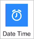
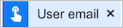
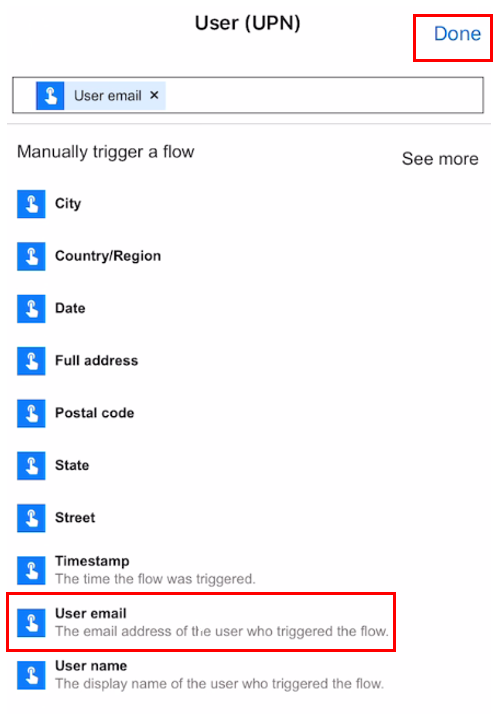
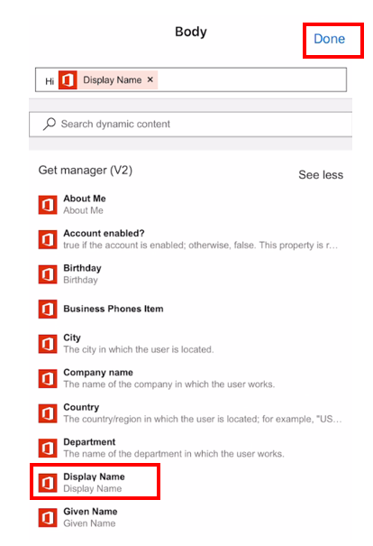
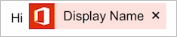
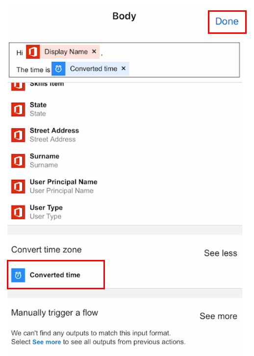
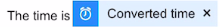
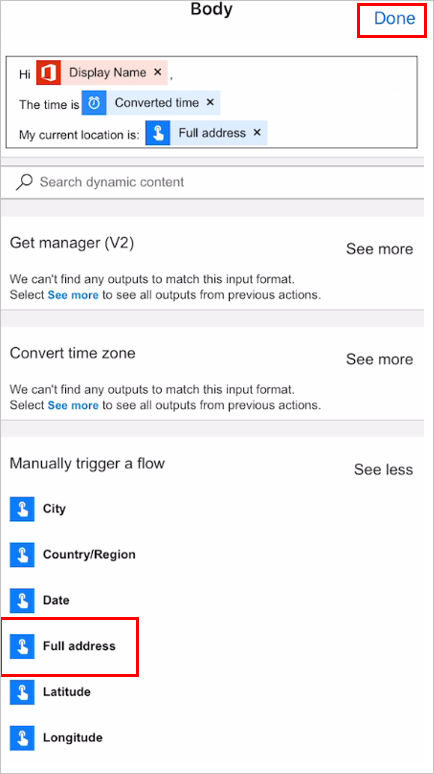
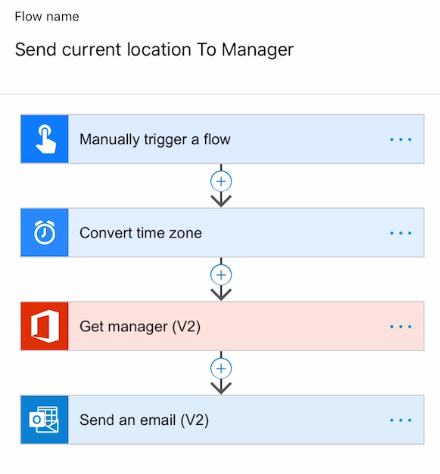
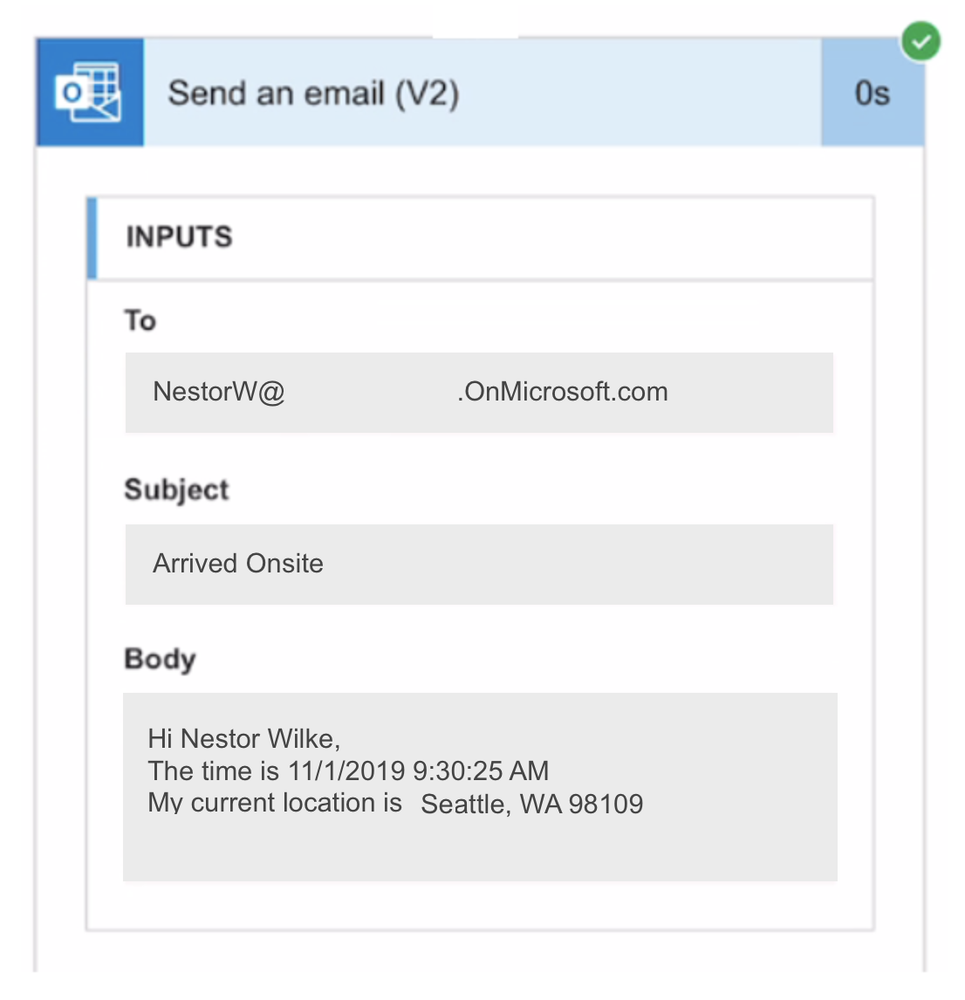

In this section we are going to build a flow triggered by a button that
will email our manager our current location. The flow will be built
entirely from the flow app on your smart phone.

1.  In your Microsoft Power Automate app click on **Flows** icon, which
    is available at the bottom of the app, then click on the **+** icon
    which is available on the top right.

1.  You should see a menu option slide up from the bottom, select the
    **Create from blank** option.

1.  In the **Connectors** option click on **Flow button for mobile.** If
    you don't see it then search for it in the **Search all connectors
    and triggers** and then click on it.

1.  Select **Flow button for mobile**.

1.  In the **Manually trigger a flow** trigger click on **+** **Add an
    input** and select **Text**. Then click on **Input**, delete
    **Input** and type in **Reason**. Click on Done which is available
    on the top-right.

1.  Click on **+** **New step**.

1.  Click on **Add an action**.

1.  Search for **Time**. You should now see **Date Time**. Click on it and then select **Date Time Convert time zone**.

	

1.  Click on **Base time** and select the **Timestamp** option from **Manually trigger a flow**.
   
	

1. For both **Source time zone** and **Destination time zone** select the exact same time zone that works for your geographic location. In this example we are using **(UTC-05:00) Eastern Time (US & Canada)**. Once the time zone is selected you will have to click on **Done** available on the top-right.

1. For **Format String** select **General date/time pattern (short time) - Monday, June 15, 2009 1:45 PM (g)**.

1. In the **Connectors** option click on **Office 365 Users**. If you
    don't see it then search for it in the **Search all connectors and
    triggers** and then click on it.

1. Click on **Office 365 Users Get Manager (V2)**.

1. Select **User email** from **Manually trigger a flow**. Then click **Done**.

	

    

1. Click on **+ New step**.

1. Click on **Add an action**.

1. In the **Connectors** option click on **Office 365 Outlook**. If you
    don't see it then search for it in the **Search all connectors and
    triggers** and then click on it.

1. Select **Office 365 Outlook Send an email (V2)**.

1. Click on **To**. In the **Get manager (V2)** click on **See
    more** and select **Mail**. Then click on **Done**.

1. Click on **Subject** and type in **Arrived Onsite**. Then click
    on **Done**.

1. Click on **Body** and type in the following:

    ```Hi.```

    Then next to **Get Manager (V2)** click on **See more**. Next, click
    on **Display Name** and then **Done**.

    

1. Click on **Body** again and this time below type in: 

```
I have arrived at the location.

The time is
```

	

    Next to **Convert time zone** , click on **See more**, select
    **Converted time** and then click **Done**. 

    

1. Click on **Body** again and this time
    below type

    'My current location is:'.

	

    Click on **Manually trigger a flow**, **See more**, select **Full
    Address** and click on **Done**.

    

1. Give your flow a name such as **Send current location To Manager**
    and click on **Create** which is available on the top-right.

    

1. In the next screen click on **Done** available on the top-right.

1. On the bottom horizontal menu, click on **Buttons**. Then click on
    your new **Send** current location to **Manager**.

1. Your manager will get an email.

    
