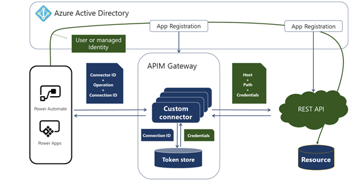
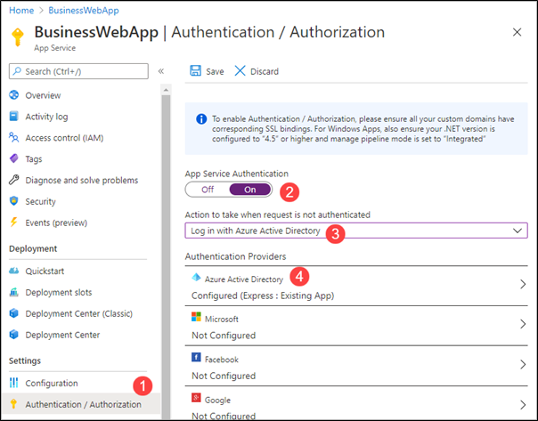
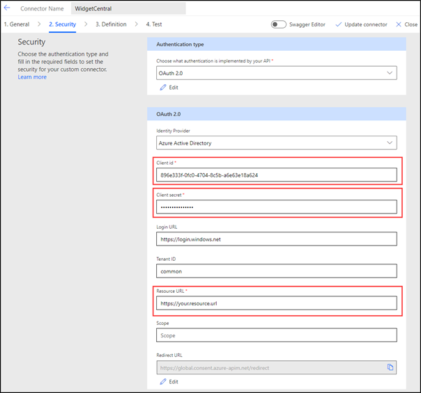

Azure Active Directory (Azure AD) authentication is a recommended authentication scheme. Unlike other approaches, it has the following unique attributes:

-   It allows authentication on behalf of the user who is consuming the connection, meaning that users can't get access to the resources that they do not already have access to. The target service maintains responsibility for enforcing what is permitted for the authenticated user.

-   The target service knows the identity of the user who is performing the connection, thus allowing more checks by using Azure AD information without explicitly asking a user for further details.

-   It supports [managed identities](https://docs.microsoft.com/azure/active-directory/managed-identities-azure-resources/overview/?azure-portal=true) where controlled access to the underlying resource eliminates the need for developers and users having to manage credentials.

The internals of the Azure AD secured custom connector are similar to a generic secured connector.

> [!div class="mx-imgBorder"]
> 

The main difference is that the custom connector and the target app service are registered as the apps within Azure AD. That factor allows makers to apply appropriate permissions and then pass the calling user's identity from an app in Power Apps, Power Automate flow, or Logic Apps workflow through to the underlying service.

The service can be an existing service that is registered in Azure AD, like Microsoft Graph API, or it can be a custom service that is implemented by using Azure Functions or Microsoft Azure App Service, for example. The important characteristic of the service is that it helps protect and authorize access to the secured resources by using the caller's Azure AD identity.

## Enable Azure AD authentication

If an organization already has a service implementation by using either Azure Functions or Azure App Service, adding Azure AD authentication is a simple configuration exercise.

> [!div class="mx-imgBorder"]
> 

1.  Select the **Authentication/Authorization** blade.

1.  Enable the **App Service Authentication**.

1.  Set the default action on unauthorized access.

1.  Configure and register the app in Azure Active Directory.

Enabling the Azure AD authentication makes the caller identity information available to the underlying service that can now use this information.

## Configure the connector

Callers can access the underlying service only through a custom connector. To allow the connector to pass through the caller identity, it needs to be registered as a separate app in Azure AD. In addition, it needs to be granted *delegated permissions* to the API service so that it can perform actions *on behalf of* the caller.

> [!div class="mx-imgBorder"]
> 

Because the custom connector will be accessing the API on behalf of the user, consent is required. Typically, users are prompted for consent when a connection is created by the custom connector. Some permissions might require administrative consent, which can be granted by an administrator for all users in the organization.

After the custom connector has been registered in Azure AD, you can configure it by using the custom connector wizard.

> [!div class="mx-imgBorder"]
> 

Select **OAuth 2.0** as the authentication type and then set the identity provider to **Azure Active Directory**. The following parameters are required:

-   **Client id** - ID of the Azure AD app that will identify the connector.

-   **Secret** - Secret that is created during the Azure AD app registration.

-   **Resource URL** - Resource identifier for your service.

After you have saved the configuration, the Redirect URL will become available to add as a valid callback to the app registration.

The configuration is stored in the **apiProperties.json** file, and developers can also use [paconn command line tooling](https://docs.microsoft.com/connectors/custom-connectors/paconn-cli/?azure-portal=true) to update the configuration as required. For example, the secret key, instead of being defined by the maker, can be managed and rotated automatically as part of the enterprise deployment.

## Steps to configure connectors with Azure Active Directory

Follow these steps to set up and configure connectors with Azure AD:

1.  Register two Azure AD apps:

    -  One to identify and protect API service

    -  One to identify and protect your connector

1.  Delegate permissions. Allow your connector's registered app to make "on-behalf" calls to your service's identity.

1.  Define your connector by providing the client ID, secret, and resource URL information.

1.  Add redirect URLs to the connector app registration.

1.  If your service is set up with the Cross-Origin Resource Sharing (CORS) scheme, allow list Azure API Management domains (usually azure-apim.net) for CORS on your service.

Setting up Azure AD authentication involves more steps to register apps and identities in Azure AD, but it has more benefits that make it a preferred scheme for securing custom connectors.
