In this exercise, you'll create a custom connector and learn how to configure it to access the Microsoft Graph API by using Azure Active Directory authentication. Because the focus is on authentication, this exercise only configures a single action called **Last Used**.

> [!IMPORTANT]
> Use a test environment with Microsoft Dataverse provisioned. If you don't have one, you can [sign up for the community plan](https://powerapps.microsoft.com/communityplan/?azure-portal=true).

## Task 1: Create a new solution

To create a new solution, follow these steps:

1.  Go to [Power Apps maker portal](https://make.powerapps.com) and make sure that you are in the correct environment.

1.  Select **Solutions > + New solution**.

1.  Enter **Contoso graph** for **Display name**, select **CDS Default Publisher** for **Publisher**, and then select **Create**. **Note:** When working with a real project, it's best to create your own custom publisher.

	> [!div class="mx-imgBorder"]
	> [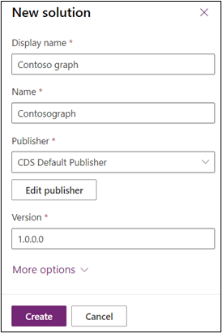](../media/new-solution.png#lightbox)

1.  Don't navigate away from this page after selecting **Create**.

## Task 2: Use Graph Explorer to test the API

In this task, you'll use Graph Explorer to perform an API action that you'll configure in the custom connector.

1.  In a new tab, go to [List used - Microsoft Graph v1.0 | Microsoft Docs](https://docs.microsoft.com/graph/api/insights-list-used?view=graph-rest-1.0&tabs=http) and review the **List Used** that you're going to build a connector for.

1.  In another new tab, go to [Graph Explorer - Microsoft Graph](https://developer.microsoft.com/graph/graph-explorer/?azure-portal=true).

1.  Select **Sign in to Graph Explorer**.

	> [!div class="mx-imgBorder"]
	> [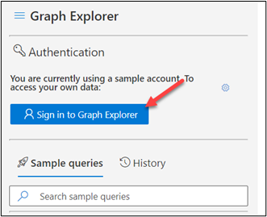](../media/graph-explorer-sign-in.png#lightbox)

1.  Sign in with your user information.

1.  Read the requested permissions and then continue if you agree.

1.  Make sure that **GET** is selected for the verb, add **/insights/used** to the **URL**, and then select **Run query**.

	> [!div class="mx-imgBorder"]
	> [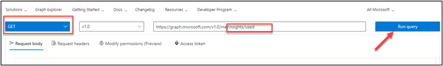](../media/run-query.png#lightbox)

1.  You should get a **403** error indicating that Graph Explorer lacks your permission to perform this action.

1.  Select the **Modify permissions** tab to grant Graph Explorer permission.

1.  Select **Sites.Read.All** and then select **Consent**.

1. Read the requested permissions and then continue if you agree.

1. Select **Run query** again.

   You should now get the **OK - 200** status.

	> [!div class="mx-imgBorder"]
	> [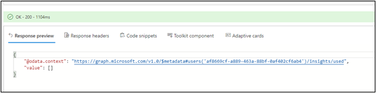](../media/response-preview.png#lightbox)

1. Start a new browser session tab.

1. Go to [OneDrive Personal Cloud Storage](https://onedrive.live.com/?azure-portal=true) and sign in.

1. Select **+ New** and select **Word document**. You're creating this document so that you have some content in your **Last Used** list.

	> [!div class="mx-imgBorder"]
	> [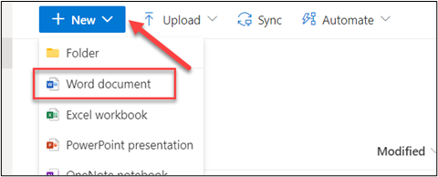](../media/new-word-document.png#lightbox)

1. Enter some test text in the Word file. The document will be saved automatically for you.

1. Go back to the Graph Explorer.

1. Run the same query again.

   You should now get a response with values.

1. Select the response JSON, right-click, select **Copy**, and then save it. 

	> [!div class="mx-imgBorder"]
	> [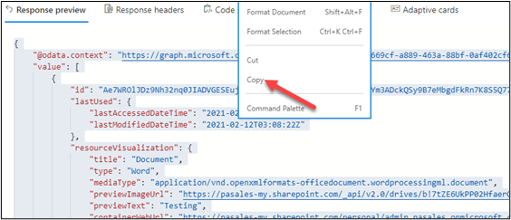](../media/copy-feature.png#lightbox)

   You'll need this response later in this exercise because you'll use it when you configure the response in the custom connector.

## Task 3: Register a new application and add permissions

In this task, you'll configure a new application that will be used to access the Graph API from the custom connector. You will also configure permissions for the specific graph API actions, similar to when you modified permissions in Graph Explorer.

1.  Go to [Microsoft Azure](https://portal.azure.com/?azure-portal=true) and sign in with your admin user credentials.

1.  Select **Show portal menu** and then select **Azure Active Directory**.

	> [!div class="mx-imgBorder"]
	> [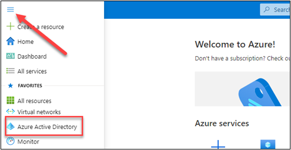](../media/azure-active-directory-portal.png#lightbox)

1.  Select **App registration > + New registration**.

	> [!div class="mx-imgBorder"]
	> [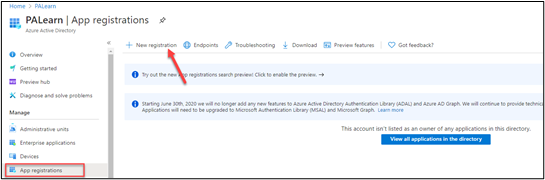](../media/new-registration.png#lightbox)

1.  Enter **Learn last used connector** for **Name**, enter `https://global.consent.azure-apim.net/redirect` for **Redirect URI**, and then select **Register**.

	> [!div class="mx-imgBorder"]
	> [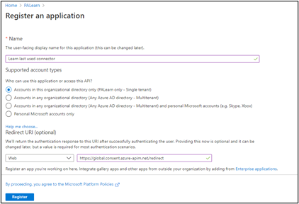](../media/register-application.png#lightbox)

1.  Select **API permissions** and then select **+ Add a permission**.

1.  Select **Microsoft Graph**.

1.  Select **Delegated permissions**.

1.  Search for sites and then expand **Sites**.

1.  Select **Sites.Read.All**, **Sites.ReadWrite.All**, and then select **Add permissions**.

	> [!div class="mx-imgBorder"]
	> [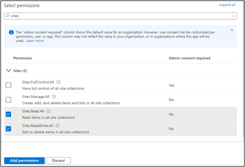](../media/select-permissions.png#lightbox)

1. You should now have three API permissions. Select **Certificates & secrets**.

	> [!div class="mx-imgBorder"]
	> [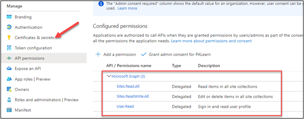](../media/certificates-secrets.png#lightbox)

1. Select **+ New client secret**.

	> [!div class="mx-imgBorder"]
	> [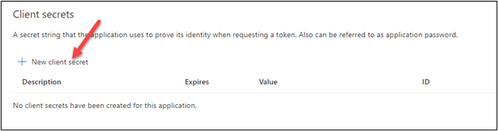](../media/new-client-secret.png#lightbox)

1. Enter **Last used connector action** for **Description**, select **In 1 year** for **Expires**, and then select **Add**.

1. Copy the **Value** and save it for later because it won't be shown again. You will use this user secret when creating the connector.

	> [!div class="mx-imgBorder"]
	> [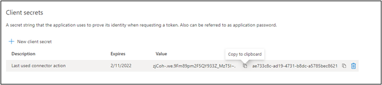](../media/client-secrets.png#lightbox)

1. Select **Overview**.

1. Copy the **Application (Client) ID** and save it on a notepad. You'll use this client ID when creating the connector.

	> [!div class="mx-imgBorder"]
	> [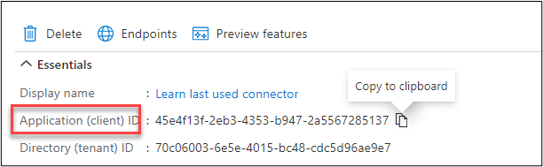](../media/application-client-id.png#lightbox)

## Task 4: Create a custom connector

Follow these steps to create a custom connector:

1.  Go to [Power Apps admin portal](https://make.powerapps.com/home/?azure-portal=true) and make sure that you are in the correct environment.

1.  Select **Solutions** and then select to open the **Contoso graph** solution that you created in **Task 1: Create a new solution**.

1.  Select **+ New > Other > Custom connector**.

	> [!div class="mx-imgBorder"]
	> [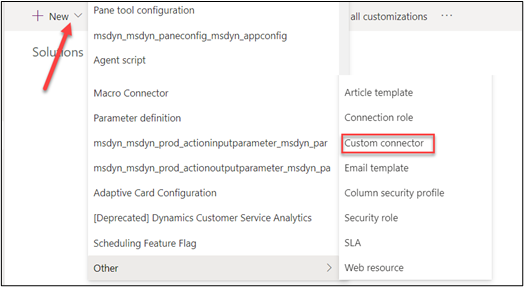](../media/custom-connector.png#lightbox)

1.  Enter **Contoso graph** for **Connector name**.

	> [!div class="mx-imgBorder"]
	> [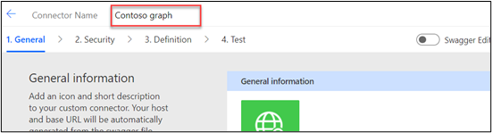](../media/contoso-graph.png#lightbox)

1.  Scroll down, enter **graph.microsoft.com** for **Host** and **/v1.0** for **Base URL**.

1.  Select **Security**.

	> [!div class="mx-imgBorder"]
	> [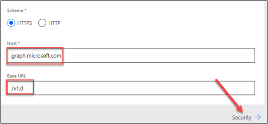](../media/security.png#lightbox)

1.  Select **OAuth 2.0** for **Authentication**.

1.  Select **Azure Active Directory** for **Identity Provider**.

1.  Paste the **ID** that you copied from Azure in the **Client id** field and then paste the **Value** that you copied from Azure in the **Client secret** field.

1. Enter `https://graph.microsoft.com` for **Resource URL** and then select **Create connector**.

	> [!div class="mx-imgBorder"]
	> [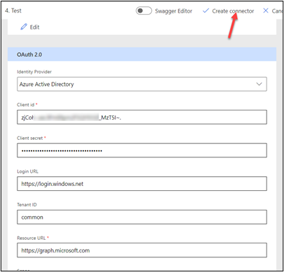](../media/create-connector.png#lightbox)

1. Don't navigate away from this page.

## Task 5: Add the action

In this task, you will configure the last used action tip called Graph API.

1.  Select **Definition > + New action**.

	> [!div class="mx-imgBorder"]
	> [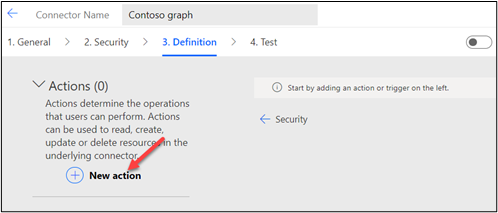](../media/new-action.png#lightbox)

1.  Enter **Last used** for **Summary** and **LastUsed** for **Operation ID**.

1.  Go to the **Request** section and select **+ Import from sample**.

	> [!div class="mx-imgBorder"]
	> [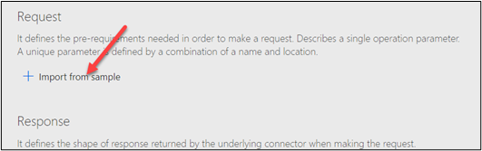](../media/import-sample.png#lightbox)

1.  Select **Get** for the verb, enter **/me/insights/used** for **URL**, and then select **Import**.

1.  Scroll down and select the default response.

	> [!div class="mx-imgBorder"]
	> [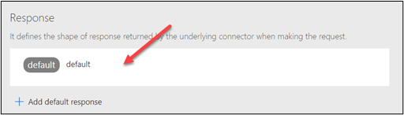](../media/default-response.png#lightbox)

1.  Select **+ Import from sample**.

	> [!div class="mx-imgBorder"]
	> [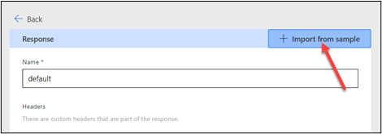](../media/import-button.png#lightbox)

1.  Paste the response that you copied from Graph Explorer in the **Body** field and then select **Import**.

	> [!div class="mx-imgBorder"]
	> [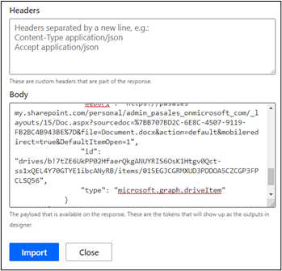](../media/response.png#lightbox)

1.  Select **Update connector**.

1.  Don't navigate away from this page.

## Task 6: Test the connector

Follow these steps to test the connector:

1.  Select the **Test** tab and then select **+ New connection**.

	> [!div class="mx-imgBorder"]
	> [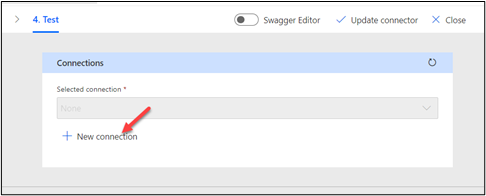](../media/new-connection.png#lightbox)

1.  Provide your credentials.

1.  Read the requested permissions and continue.

1.  Select **Refresh** connections.

1.  Select **Test operation**.

	> [!div class="mx-imgBorder"]
	> [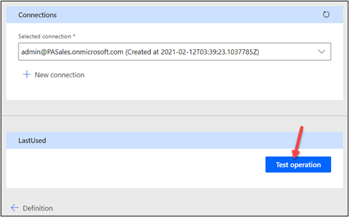](../media/test-operation.png#lightbox)

    You should see a **200** status, and the response should look like the following image.

	> [!div class="mx-imgBorder"]
	> [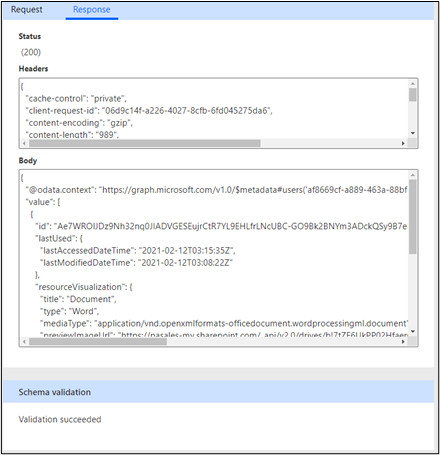](../media/response-status.png#lightbox)
