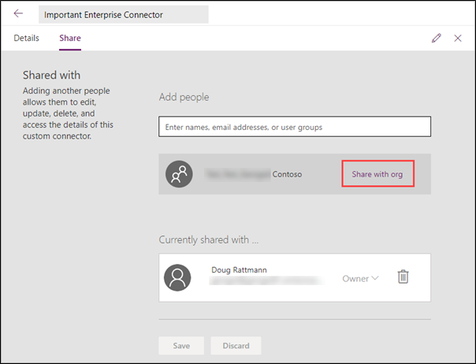
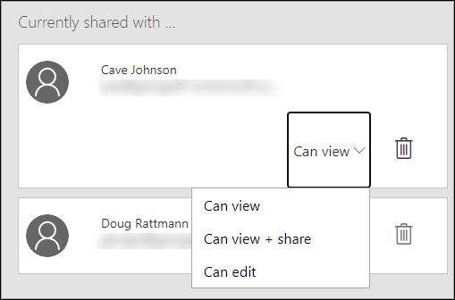
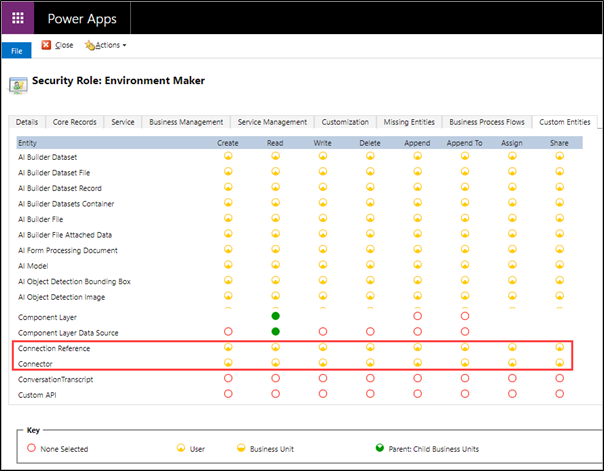

Public connectors are automatically available to all users. Custom connectors need to be [shared with others in your organization](https://docs.microsoft.com/connectors/custom-connectors/share/?azure-portal=true) before they can be used. After a maker configures a custom connector and has provided a more secure API, they have a choice of how to share the connector and connections to make them available to other users.

## Logic apps

Custom connectors in Logic Apps are visible and available to the connector's author and to users who have the same Azure Active Directory tenant and Azure subscription for Logic Apps in the region where those apps are deployed. No other steps are required for sharing.

## Standalone connectors

Custom connectors that are created outside of a solution can be shared explicitly within the same environment. To share the connector or to view the sharing status, open the connector from the list of custom connectors and then switch to the **Share** tab.

> [!div class="mx-imgBorder"]
> 

Custom connectors can be shared with individual users, user groups, or the entire organization. Organization sharing only allows use of the connector (**Can view** option). User and group sharing adds the ability to share the connector with others (**Can view + share** option) and to change the connector (**Can edit** option).

> [!div class="mx-imgBorder"]
> 

After a custom connector has become available, makers can start building assets like canvas apps or cloud flows that use the connector. When a maker creates a new connection, they'll need to provide their own set of credentials to be used. When the app or cloud flow that uses the connection is shared with other users, the maker has a choice of either sharing the existing connection or asking the users to provide their own set of credentials.

Individual connections can also be shared explicitly, which adds flexibility for the maker to select between securing the connection or delegating the permission management to the connector.

The other option to make a custom connector available to other users is to [share an app](https://docs.microsoft.com/powerapps/share-app/?azure-portal=true) or [share a cloud flow](https://docs.microsoft.com/power-automate/create-team-flows/?azure-portal=true) that uses the connector. Connectors that are shared through an app or a cloud flow can only be used within that app or flow.

> [!IMPORTANT]
> As a maker, you should be aware of the dependencies that are taken on your custom connector by other users. When a connector is shared, deleting the connector will delete all associated connections.

## Connectors in solutions

Custom connectors that are created as a solution asset can be moved between environments. This approach allows custom connectors to be included in the application life cycle like any other component.

Connections can't be within the solution. Instead, a connection reference can be created and included in the solution. A connection reference can also be created and included implicitly when an app or flow that uses the custom connector is added to the solution.

An included connection reference simply "points" to the connection outside the solution. When a solution that contains the connector reference is imported in the target environment, the user is prompted to provide a connection that will be used in that reference (and create a new one if necessary). Apps and flows that are included in the solution will now use that connection.

User access to the connectors and connection references that are included in solutions is no longer controlled by sharing. Standard Dataverse [role-based security](https://docs.microsoft.com/power-platform/admin/wp-security-cds#role-based-security/?azure-portal=true) is used instead, and access is controlled by the Connector and Connection Reference tables.

> [!div class="mx-imgBorder"]
> 

This approach provides greater flexibility, compared to simple sharing, and supports other scenarios. For example, by selecting appropriate scope for the privileges, you can restrict connectors to a specific business unit.

## Sharing outside the organization

A few options are available for sharing a custom connector outside of the organization where the connector was created:

-   [Certify the custom connector](https://docs.microsoft.com/connectors/custom-connectors/submit-certification/?azure-portal=true) to make it publicly available.

-   Make the custom connector configuration files open source.

-   Use a solution to transport the connector across.

-   Create a complete copy of the connector by downloading and sharing the configuration files.

Makers can distribute custom connectors and connections within the organization with simple sharing. However, for more flexibility and control, we recommend that you use solutions to share connectors between the environments or organizations.
