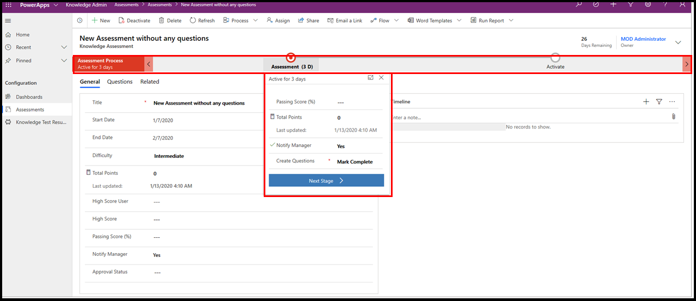
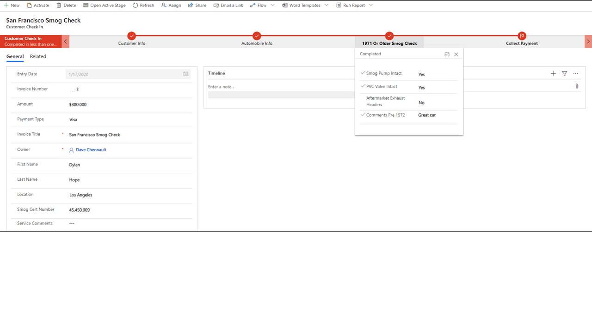

Business Process Flows are available in two different varieties -
embedded within a Model Driven app and as a stand-alone solution called
an immersive Business Process Flow. Let's examine the differences
between each before learning how to create an immersive Business Process
Flow.

Embedded Business Process Flows are a visual representation of a series
of work steps within an end-to-end process. They always appear along the
top of a model driven app in their own control as shown below.

An Immersive Business can exist on its own and it is built entirely
within the Power Automate editor. They always exist within the default
solution in an instance of Common Data Service and are only accessible
within Power Automate or the data tab associated with an entity in
Common Data Service. They are very easy to create and offer many of the
same advantages of an embedded Business Process Flow and offer the added
advantage of simplified creation and streamlined management.

We will show you how to build an immersive Business Process Flow in an
exercise at the end of this module. The screenshot below shows a simple
two step immersive Business Process Flow.

Taking a closer look, we see that immersive and embedded business
process flows look very similar. The "map" of the Business Process Flow
is shown along the top of the screen and a main form is shown under it.
Looking closer at the Business Process Flow, we see the name of the
Business Process Flow is shown on the left-hand side of the control
while each step (called a Stage) is shown as a red circle. A user
selects the red circle of the current Stage and fills out information in
a dropdown screen that includes various fields (called data steps).

The key difference between Immersive and embedded Business Process Flows
is an embedded Business Process Flow is a component within this larger
model driven app while the immersive Business Process Flow is a
stand-alone solution. Both embedded and immersive Business Process Flows
help users complete a process within the context of a larger solution. A
user always views and completes an embedded Business Process Flow within
a Model Driven App. An immersive Business Process Flow is a standalone
app and it is built solely for the purpose of completing the business
process. The immersive Business Process exists as the entire solution
rather than a component of a larger model-driven app.

It is important to understand many of the concepts and techniques
discussed and demonstrated within this learning path apply to both
embedded and immersive Business Process Flows. Immersive and embedded
are very similar. The main difference between them is how they are
launched, and the context they are viewed in.

The remainder of this module and learning path is focused on exploring
and building an immersive Business Process Flow. Let's get started.
