The following scenario and exercise will help you practice building an immersive business process flow 
with Power Automate and Common Data Service. Remember, all data
that is associated with any business process flow is always stored in one or
more entities within Common Data Service and business process flows.

> [!NOTE]
> To complete this exercise, you will need access to an account that has permission to create entities and fields in Common Data Service and you should have a Power Apps or Dynamics 365 license. Ask your Power Platform administrator for proper permissions or sign in and create a personal Power Apps and Power Automate development environment by using the Power Apps Community Plan (which is free). Sign up by accessing the [Power Apps Community Plan](https://powerapps.microsoft.com/communityplan/?azure-portal=true) page.

### Scenario

You work for SmogChecksRUs, a rapidly growing auto repair company 
that specializes in performing automotive smog checks and other
auto services. SmogChecksRUs has been using a Microsoft Excel spreadsheet to
collect customer and vehicle information, but now the marketing department has asked
for a better way to collect information so they can follow up with
customers and schedule checkups every two years, improve customer
retention, and increase sales.

Management believes that improved data collection and standardized processes
will improve customer satisfaction, improve customer loyalty, and
increase recurring business and overall sales revenue. You have decided
to create an immersive business flow by using Power Automate to meet
management goals. 

### Create an immersive business process flow

1. Go to [Power Automate](https://preview.flow.microsoft.com/?azure-portal=true) and sign
in to your local instance. 

1. Select the proper environment in the upper-right corner of the screen.

	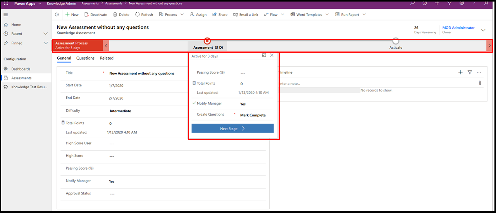

1. Select **My Flows** on the menu on the left side of the screen and then select the **Business process flows** tab.

	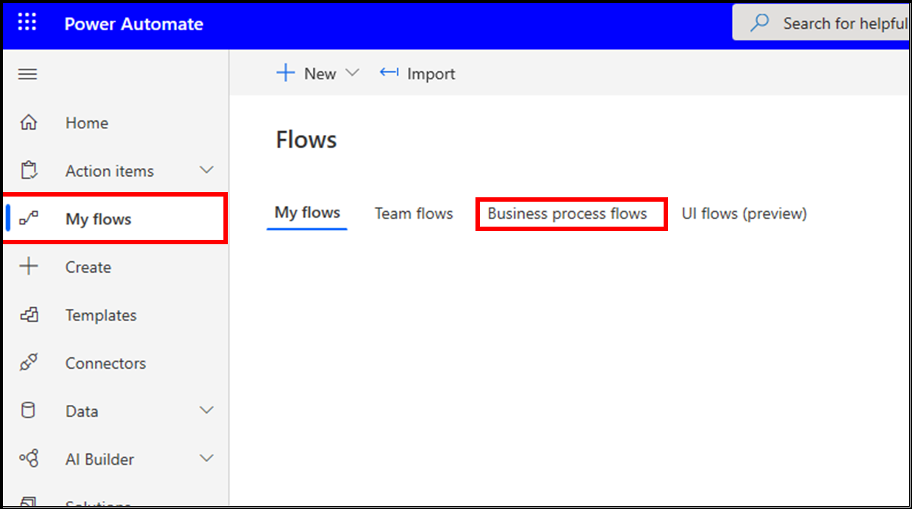

1. Select the **+ New** button on the upper-left corner of the screen.

	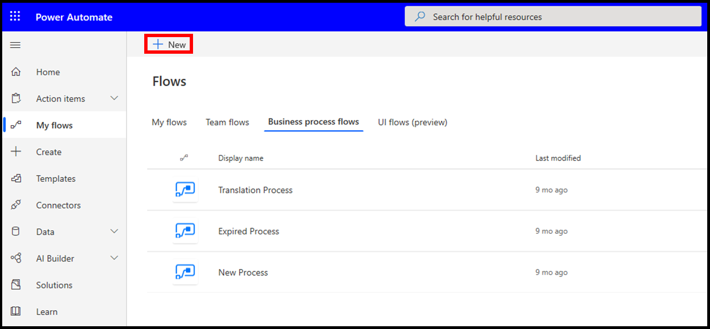

1. Enter **Customer Check In** as the **Flow name**, select **None (Immersive Business Process)** 
under the entity drop-down list, and then select the **Create** button, as shown in the following screenshot. Wait a minute for the 
entity to be created, and then the **Business process flow** editor will launch.

   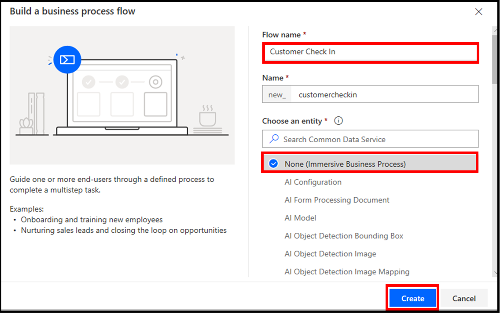

1. In the **Business process flow** editor, add fields to the 
new entity (customercheckin) that was automatically created in the previous step. 
Select **Customer Check In New Stage**, as shown in the following figure.

   

1. Select **New Stage** within the designer, rename the Stage to
**Collect Customer Info**, and then select the **Apply** button, as shown
in the following screenshot.

   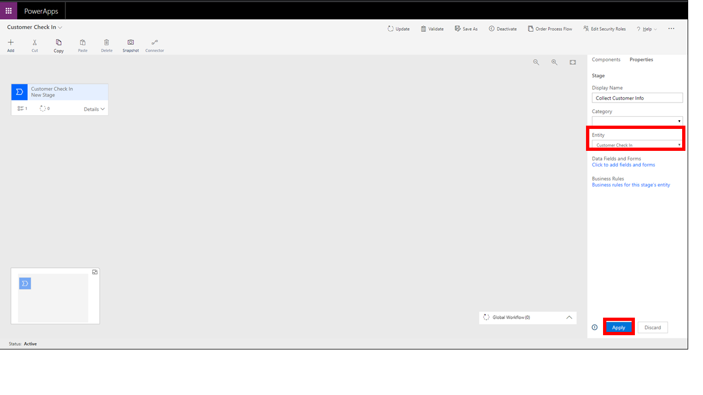

   Next, you will add fields to the new **CollectCustomerInfo** entity in Common Data Service so you can capture customer information.

1. Select the **Collect Customer Info** stage and then select the **Click to add fields and forms** hyperlink, as shown in the following figure.

	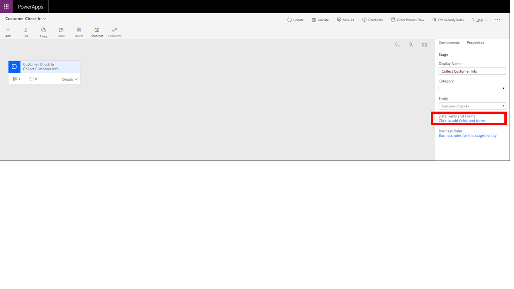

	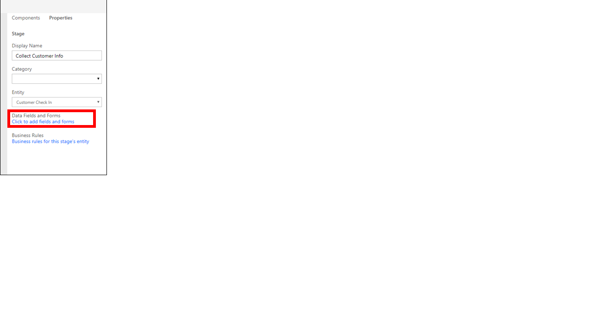

1. Add fields to the collectcustomerinfo entity by selecting the **Add Field** button, as shown in the following screenshot.

   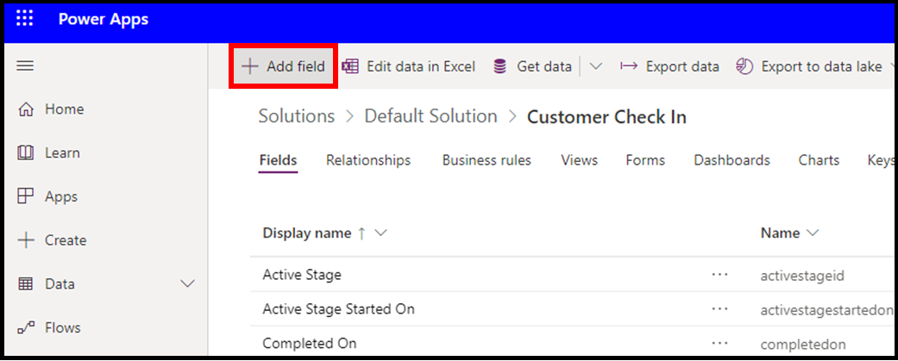

1. Add each of the fields from the following list. Enter the name and data type and
then select the **Done** button each time you add a new field, as shown in the following screen.

   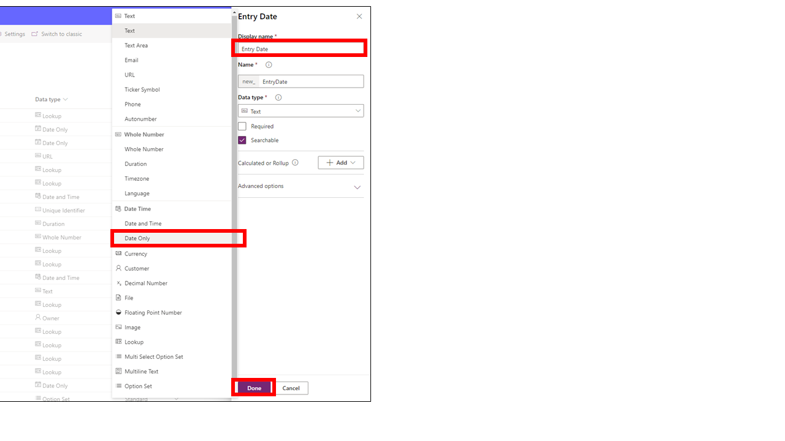

	- Entry Date - Date Only
	- First Name - Text
	- Last Name - Text
	- Phone Number - Phone
	- Address - Text
	- City - Text
	- State - Text
	- Postal Code - Text
	- Phone Number - Phone Number
	- Comments - Text Area

1. When you are finished, select the **Save Entity** button to save 
the new fields. Make sure that you select the **Save Entity** button or none
of the fields will be added.

   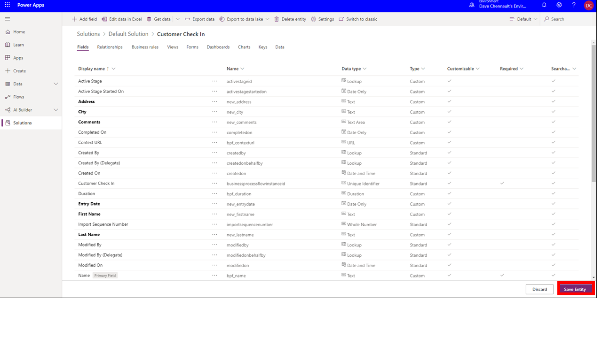

1. Close the current tab of the browser that is showing the entity fields, and then 
return to the business process flow designer screen.

### Add fields as steps and finish the flow

Now, you will add the fields as Steps in the first Stage in the **Customer Check In** business process flow. 

1. Refresh your browser and then select the **Customer Check In** Stage.

	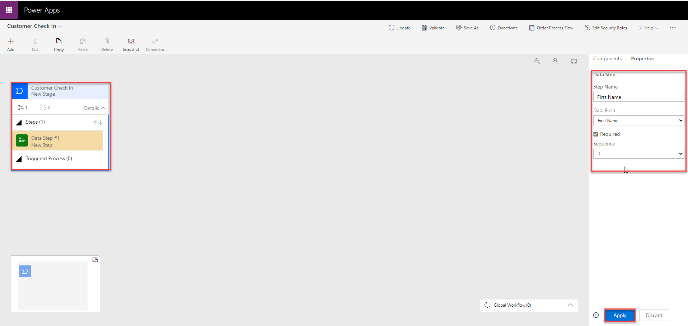

1. Select **Data Step # 1**, and then enter the following information:

	-   Step Name - Enter **First Name**.
		
	-   Data Field - Select **First Name** from the drop-down menu.
		
	-   Select the **Required** check box.
		
	-   Select the **Apply** button.
		
	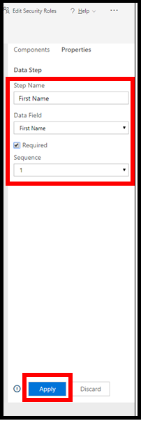

1. Select the **Components** tab and then drag a Data Step under **Data Step #1**, as shown in the following figure.

   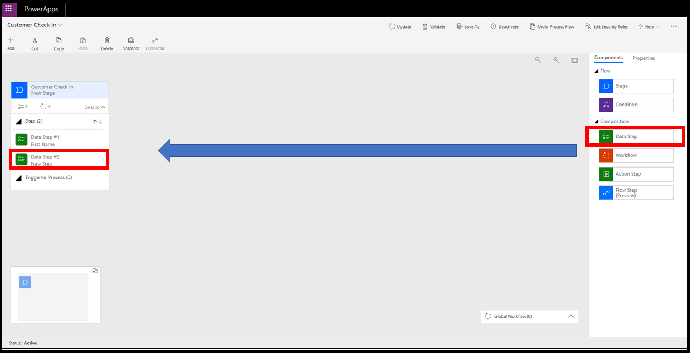

1. Select **Data Step #2** and enter the following information:

	-   Step Name - Enter **Last Name**.
	
	-   Data Field - Select **Last Name** from the drop-down menu.
	
	-   Select the **Required** check box.
	
	-   Select the **Apply** button.

	

1. Select the **Components** tab, and then drag additional data steps and add
fields that were added earlier under Stage One (Entry Date, Address, City, State, and so on).

1. When you are done, Stage 1 should appear as shown in the following figure. If all
appears correct, select the **Update** button in the ribbon.

   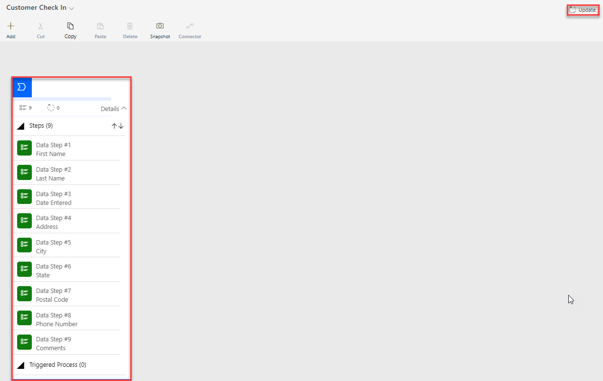

	> [!NOTE]
	> When the data process flow is used, data will be saved into the
	fields that you created in the customercheckin entity in Common Data Service.

	Now, you will collect information about the automobile being serviced, so you'll add a new stage and add fields about the automobile to the customercheckin entity.

1. Select the **Components** tab and drag a new stage to the right of
Stage 1. Make sure to drop the new stage into the plus (**+**) sign. The new stage should
resemble the following screenshot.

   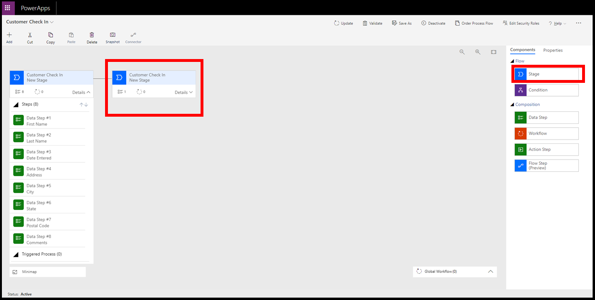

1. Repeat the steps that were covered for Stage 1, and then add the following fields and steps:

	-   Automobile Make - Text
	
	-   Automobile Model - Text
	
	-   Automobile Year - Number
	
	-   Automobile Mileage - Number
	
	-   Automobile Comments - Text Area

1. Make sure to save the entity after you add the new fields.

1. When you are done adding the data steps, select the **Update**
button in the ribbon. Your completed Stage 2 should look like the following screenshot.

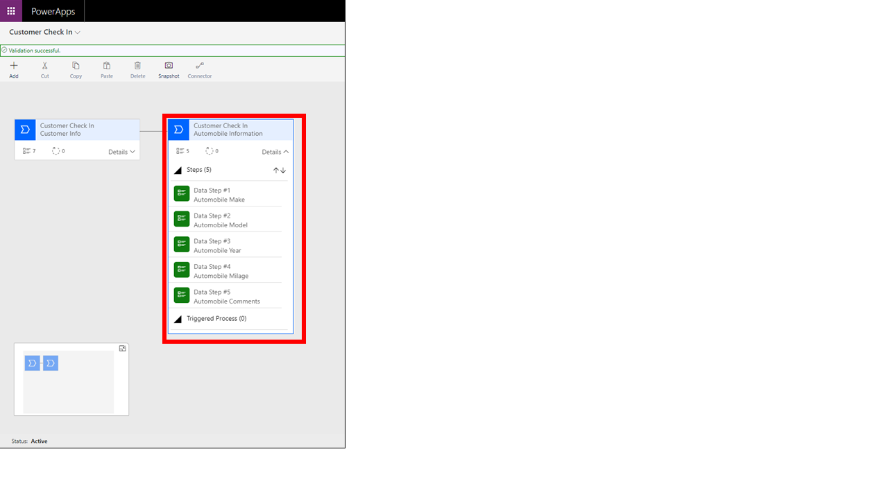
