Now that we have a new business process flow, lets try it out and take 
a look at the how the data is stored after it is executed.

1. Select the **Update** button in the top ribbon. 

1. Close the business process flow designer after you see the message that the process 
flow has updated successfully. 

1. Go back to **My Flows**, select **Business process flows** and you 
should see the new flow listed.

	> [!NOTE]
	> You can see all immersive business process flows that are in
	process or that have been run by going to the main Power Automate
	page and select the **My flows** icon in the left menu, and then 
	select the **Business process flow** tab.

1. Select the Run Arrow as shown in the screenshot below.

	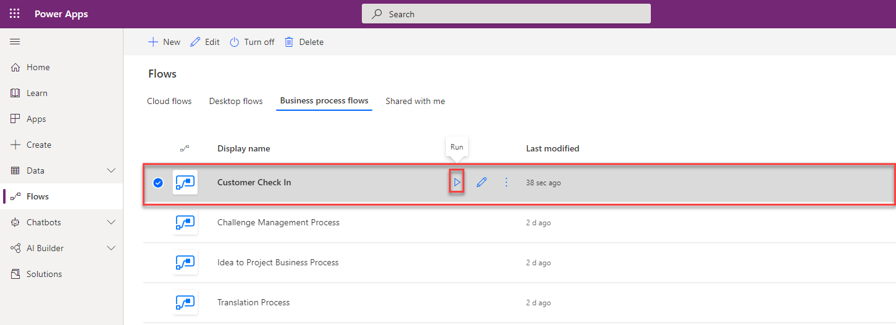
	
	This will launch a new instance of the flow we just created!
	
1. Go ahead and enter in a name in the **Name** field on the General Form (main	form) and then select **Save** as shown below.
	
	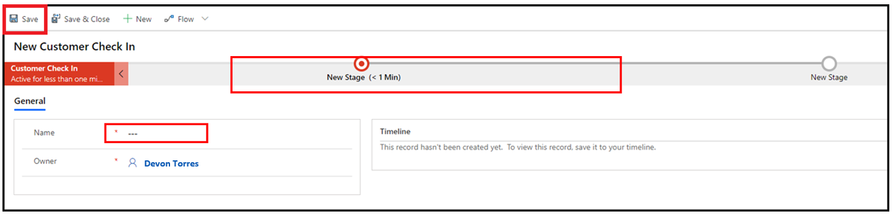
	
1. After you select the **Save** button, select the red circle for the first stage, fill out the information, and then select the **Next Stage** button.
	
	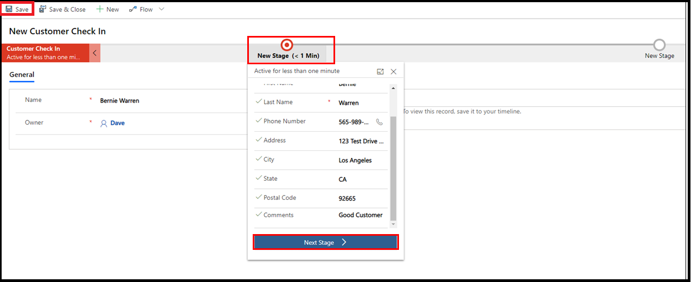
	
1. Select the second stage and fill out the vehicle information and select the **Finished** button.
	
	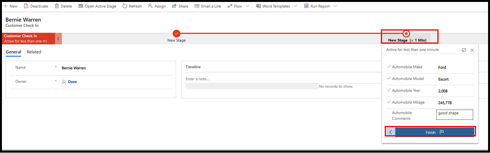
	
	After you select the **Finish** button, the button in Stage 2 should turn green and the data you entered is automatically saved.
	
	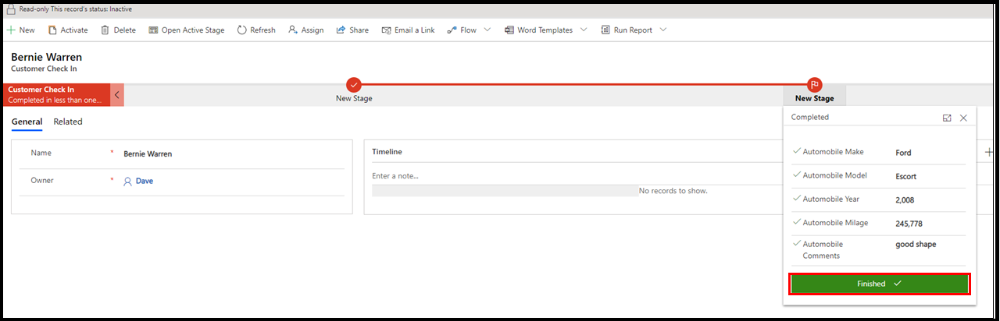
	
1. You can create additional records by launching Power Automate and selecting **My Flows** and Business process
flows, and selecting the arrow next to the **Customer Check In** business process flow as shown below.
	
   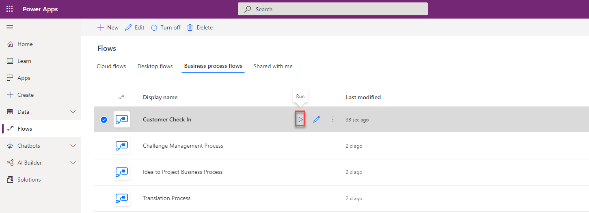

### View the data created

You can view the data you just created running the flow by following the steps below.

1. Go to [Power Apps](https://make.powerapps.com/?azure-portal=true) and log in.

1. Select the environment you used to create the Customer Check In business process flow as shown below.

	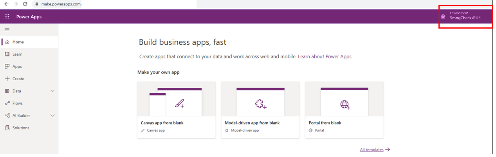
		
	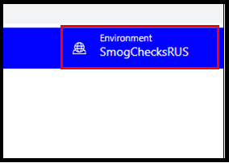

1. Select the **Solutions** menu on the left-hand side of the screen.

	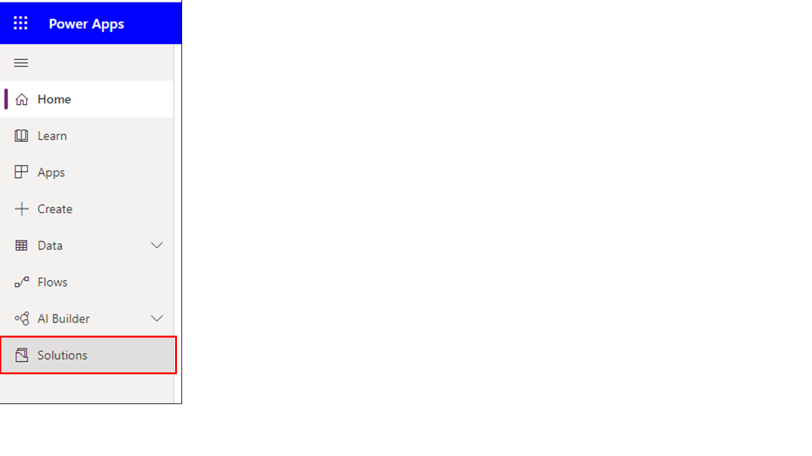

1. Double-click the **Common Data Services Default Solution** to open it as shown below.

	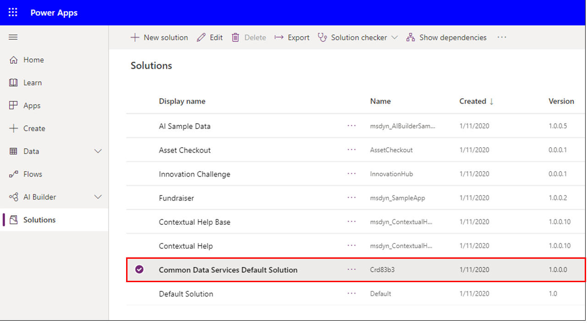

1. Select the **Customer Check In** entity.

	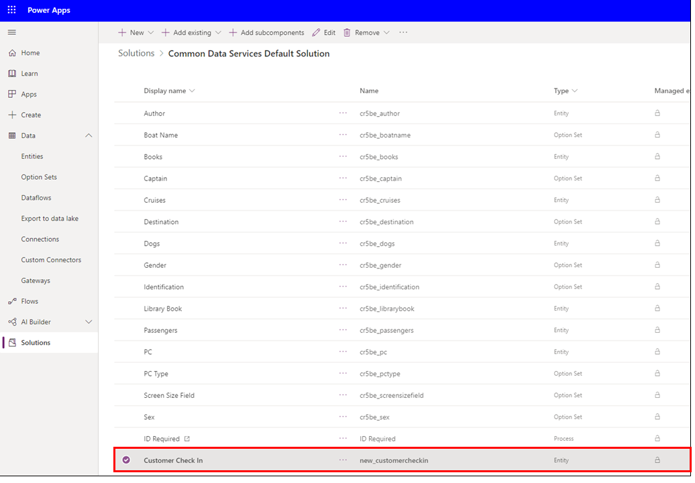

1. Select the **Data** tab then select the **All Data** view on the right-hand side of the screen as shown below.

	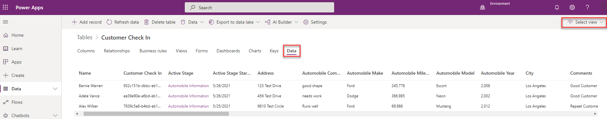
		
	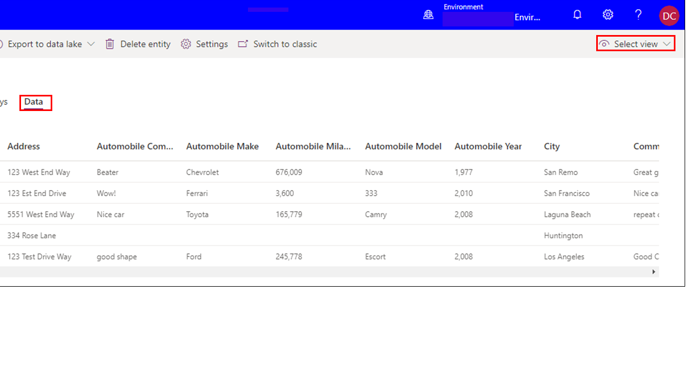

Now you can view the all the data you created with our new immersive business process flow!

In the next and final module of this learning path, we will improve our new immersive flow by
customizing the form associated with our flow, adding logical branching, and adding instant 
workflow notification to make your new immersive business process flow even more powerful.
