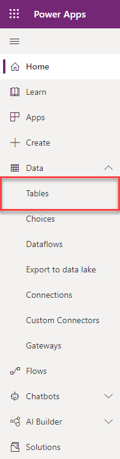
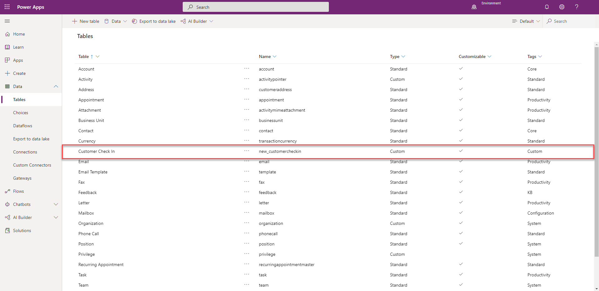
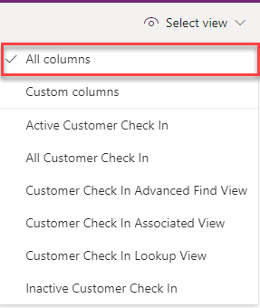
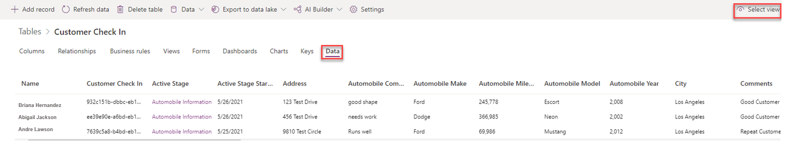

Now that you have a new business process flow, you can try it out and discover how the data is stored after it has been run.

1.  Select the **Update** button in the top ribbon.

1.  Close the business process flow designer after you see the message that the process flow has updated successfully.

1.  Go back to **My Flows**. Select **Business process flows**, where you should see the new flow listed.

	> [!NOTE]
	> You can see all of the immersive business process flows that are in process or that have been run by going to the main Power Automate page, selecting the **My flows** icon on the left menu, and then selecting the **Business process flows** tab.

1.  Select the **Run** arrow, as shown in the following screenshot.

	> [!div class="mx-imgBorder"]
	> 

    This selection will launch a new instance of the flow that you created.

1.  Enter a name in the **Name** field on the **General** form (main form) and then select **Save**, as shown in the following figure.

	> [!div class="mx-imgBorder"]
	> 

1.  After you select the **Save** button, select the red circle for the first stage, fill out the information, and then select the **Next Stage** button.

	> [!div class="mx-imgBorder"]
	>     

1.  Select the second stage, fill out the vehicle information, and then select the **Finish** button.

	> [!div class="mx-imgBorder"]
	> 

    After you select the **Finish** button, the button in Stage 2 should turn green and the data that you entered is automatically saved.

	> [!div class="mx-imgBorder"]
	> 

1.  You can create additional records by launching Power Automate, selecting **My Flows** and **Business process flows**, and then selecting the arrow next to the **Customer Check In** business process flow, as shown in the following screenshot.

	> [!div class="mx-imgBorder"]
	> 

## View the created data

You can view the data that you created for running the flow by following these steps:

1.  Go to [Power Apps](https://make.powerapps.com/?azure-portal=true) and sign in.

1.  Select the environment that you used to create the **Customer Check In** business process flow.

	> [!div class="mx-imgBorder"]
	>     

1.  Select the **Data** menu on the left side of the screen and Double-click the down arrow to expand. Select **Tables**

	> [!div class="mx-imgBorder"]
	> 

1.  Select the **Customer Check In** Table.

	> [!div class="mx-imgBorder"]
	>  

1.  Select the **Data** tab then click **Select view** on the right side of the screen, and then select the **All Data** view option.

	> [!div class="mx-imgBorder"]
	> 

	> [!div class="mx-imgBorder"]
	>     

Now, you can view the all the data that you created with your new immersive business process flow.

	> [!div class="mx-imgBorder"]
	> 

In the next and final module of this learning path, you will improve your new immersive flow by customizing the form that is associated with your flow, adding logical branching, and adding instant workflow notification to make your new immersive business process flow even more powerful.