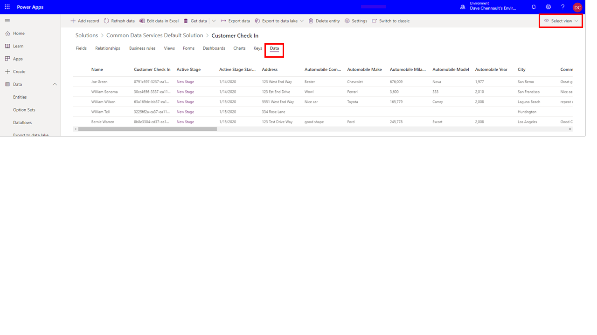

Great job creating a new Business Process Flow. Lets try out the new
Business Process Flow and take a look at the how the data is stored
after the Business Process Flow is executed.

1. Let's try our new immersive Business Process Flow. Select the
Update Button in the top ribbon and then close the Business Process Flow
Designer after you see a message the Process Flow has updated
successfully. Navigate back to My Flows> Business Processes and you
should see the new Business Process Flow listed.

	> [!NOTE]
	> You can see all immersive Business Process Flows that are in
	process or that have been run by going to flow.microsoft.com and click
	My Flows in the left lane, and then on the Business Process Flow tab.

1. Select the Run Arrow as shown in the screenshot below.

	
	
	This will launch a new instance of the Business Process Flow we just created!
	
1. Go ahead and enter in a Name in the Name Field on the General Form (main	form) and select Save as shown below.
	
	
	
1. After you select the Save button, select the Red Circle for the first stage and fill out the information and then select the Next Stage Button.
	
	
	
1. Then select the second stage and fill out the vehicle information and select the Finished button.
	
	
	
	After you Select the finish button, the button in Stage 2 will turn	green and the data you entered is automatically saved.
	
	
	
1. You can create many more records by Launching Power Automate and	selecting My Flows>Business Flows and the hitting the arrow next to the "Customer Check In" Business Process Flow as shown below.
	
	

1. You can view the data you just created following the steps below by
launching Power Apps and selecting the environment you built the
"Customer Check In" Business Process Flow in.

	1. Navigate to [PowerApps](https://Make.powerapps.com/?azure-portal=true) and log in.

	1. Select the environment you used to create the "Customer Check In" Business Process Flow as shown below.

		
		
		

	1. Select the Solutions menu on the left-hand side of the screen.

		

	1. Double-click the Common Data Services Default Solution to open it as shown below.

		

	1. Select the "Customer Check In" entity.

		

	1. Select the Data Tab then select the All Data view on the righthand side of the screen as shown below.

		
		
		

Now you can view the all the data you created with our new Immersive Business Process Flow!

Good job but don't stop now, we are just getting started. In the final
module, we will improve our new immersive Business Process Flow by
customizing the form associated with the Business Process Flow, adding
logical branching, and adding instant workflow notification to make your
new immersive Business Process flow even more powerful.
