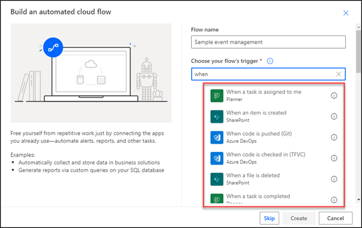
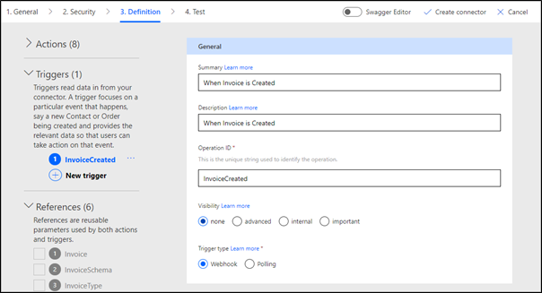

This module describes how you can expand the functionality of custom connectors with trigger definitions.

In this module, you will:

-   Learn about triggers in custom connectors.

-   Discover common scenarios where triggers can be used.

-   Identify different types of triggers.

-   Learn how to extend a custom connector definition to triggers that are defined by a service API.

Triggers allow you to extend connector functionality in Microsoft Power Automate and Microsoft Azure Logic Apps, where a system needs to respond to the changes in the underlying data or services. The most common scenario of trigger use is creating a cloud flow that starts when underlying data changes, such as "When a record is created," or when a certain event takes place in the service that is defined by the custom connector, such as "When alarm is raised."

## Triggers in Power Automate and Logic Apps

Power Automate and Logic Apps [define a trigger](/power-automate/triggers-introduction#what-is-a-trigger/?azure-portal=true) as an event that starts a cloud flow or a Logic Apps workflow. These events can be initiated by a user, scheduled, or generated by a connector, including a custom one. Trigger definitions extend custom connectors and allow these connectors to be used to initiate cloud flows and Logic Apps workflows.

> [!div class="mx-imgBorder"]
> 

Most connectors define a trigger summary as "When \<object\> is \<verb\>," and a typical connector implementation includes one trigger for one or more actions.

## Types of triggers

Consider a voicemail management system. A trigger in such a system could be a "new voicemail message received" event. Two ways that you can define a method to identify whether a new voicemail has been received are:

-   Periodically call the voice mailbox and check for new messages. This behavior describes a **polling** trigger, that is, the implementation where data is *polled* from the underlying service. A polling trigger is a timed activity that initiates a call to the service API on a regular, configurable interval to determine if new data is available. To support polling triggers, the API can filter the results based on a state. The state is commonly time-based, for example, "Return all voicemails received since yesterday."

-   Let your voicemail system send you an email when a new voice message is received. This approach defines a **webhook** trigger or implementation where the service pushes the data. The service that supports webhook triggers must be able to maintain a list of parties to call back and know how to call back. In the voicemail example, it would be a list of email addresses and the ability to send a notification email.

Fundamentally, these two types of triggers differ regarding which side is responsible for the operation management.

|     Polling                                                    |     Webhook                                                                                         |
|----------------------------------------------------------------|-----------------------------------------------------------------------------------------------------|
|     Starts by setting a state                                  |     Registered with the service                                                                     |
|     Periodically checks for updates                            |     Signals when event occurs                                                                       |
|     Requests all new data since the last   state update    |     Is torn down automatically                                                                      |
|     Service maintains the state                                |     Power Automate or Logic Apps manages the process   of registering and unregistering webhooks    |

> [!IMPORTANT]
> Availability of a REST API for a service doesn't imply that it is possible to define custom connector triggers. The underlying service needs to be able to return the data incrementally or provide a webhook implementation. If triggers are required but the service API has neither capability, a developer would need to extend the service to make it possible for users to define a trigger.

## Define a trigger

Much like the connector definition, both types of triggers are defined by an OpenAPI (Swagger) document that specifies the endpoints, parameters, conditions, and responses. However, the OpenAPI specification version that is used by Microsoft Power Platform doesn't differentiate actions and triggers. Microsoft Power Platform adds [custom OpenAPI extensions](/connectors/custom-connectors/openapi-extensions/?azure-portal=true) to extend the specifications to define triggers and their content.

A step-by-step wizard for triggers is available, and it follows the same general layout as the action wizard.

> [!div class="mx-imgBorder"]
> 

Like the custom connector actions, selecting a good trigger summary is important. The summary is used when a maker searches the connectors, and when a trigger is selected, its summary becomes the default step title in Power Automate and Logic Apps.

Unlike actions, most of which can be constructed entirely in the custom connector designer, triggers can be more complex and often require manual modifications. This module describes how to create trigger definitions in polling and webhook scenarios.
