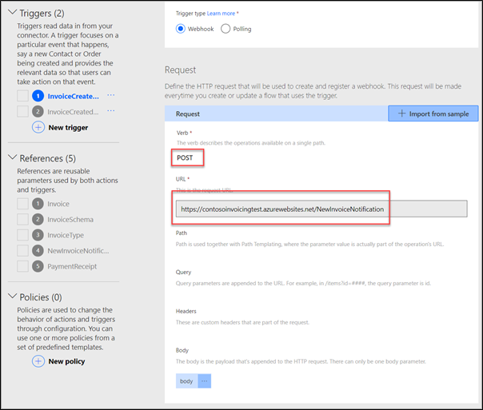
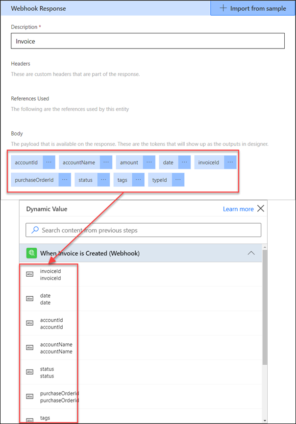

Webhooks is a popular HTTP-based implementation of a more generic publisher-subscriber notification pattern. They provide a way for notifications to be delivered to an external service (subscriber) whenever certain events occur within a system (publisher).

Power Automate and Azure Logic Apps both allow makers to use webhooks as triggers. They play the role of a subscriber registering and unregistering webhooks on maker's behalf. The registration occurs when a step in a cloud flow or Logic Apps workflow is created or updated. When the step is removed, the platform unregisters the webhook.

The interaction between subscriber and publisher looks like the following:

> [!div class="mx-imgBorder"]
> [](../media/subscriber-publisher-interaction.png#lightbox)

Responsibilities of the parties are as following:

|     Publisher (custom connector OpenAPI)                                                                                                                                                            |     Subscriber (Power Automate/Logic Apps)                                                                                      |
|-----------------------------------------------------------------------------------------------------------------------------------------------------------------------------------------------------|---------------------------------------------------------------------------------------------------------------------------------|
|     Provides the subscription registration endpoint.                                                                                                                                                |     Calls the subscription registration endpoint when a trigger is   created or updated in a flow.                              |
|     Specifies the notification contract, that is, what object will be   passed with each notification.     Must include Location HTTP header in the 201 response at   the time a webhook is created.    |     Provides the URL of the automatically generated endpoint that will   accept the notification messages.                      |
|     Maintains the register of subscribers and their notification   endpoints.                                                                                                                       |     Receives and stores location information that will be used to   deregister the webhook.                                     |
|     Issues a POST request to every registered endpoint and passes the   relevant data in the body of the message.                                                                                   |     Receives notifications, validates them against the schema defined   by the custom connector and triggers the automation.    |
|     Deregisters/removes the endpoints in response to DELETE message.                                                                                                                                |     Issues a DELETE message to deregister the webhook when the trigger   step is deleted.                                       |

Webhooks provide the notification mechanism only and they don't support manipulation of the data. Often a webhook implementation is complemented by one or more actions designed to support data or objects retrieval and manipulation.

## API requirements

To provide webhook support required by custom connectors, the API implementation must provide the following:

-   The endpoint that accepts the registration message and returns location information

-   The definition of the message body sent with the notification messages

-   The endpoint to accept DELETE message to remove webhook registration

Usually, the API implementation maintains an internal list of active subscribers where each subscriber is identified by a unique URL. To return this URL to the subscriber, the successful webhook creation is required to return HTTP 201 response and include a **Location** HTTP header. The value of this location will later be used by the subscriber to delete the webhook registration.

## Create a webhook trigger

Custom connectors use OpenAPI to describe the publisher API implementation as required by webhooks. To define a webhook trigger in custom connector, the OpenAPI definition must contain three essential parts:

-   POST message describing webhook registration.

-   Content definition for the webhook responses.

-   DELETE message describing webhook tear-down process.

### Registration message

The trigger definition must include a POST method that is used to register a webhook. It's defined similarly to actions.

> [!div class="mx-imgBorder"]
> [](../media/trigger-post-method.png#lightbox)

In fact, the OpenAPI specification version used by the Power Platform doesn't differentiate actions and triggers. The custom connector definition uses custom extension **x-ms-trigger** to declare a trigger.

```yaml
paths:
  /webhooks:
    post:
      operationId: OrderCreated
      x-ms-trigger: single
```

The presence of the **x-ms-trigger** extension indicates that the method is a trigger and not an action. When a trigger is created using the wizard this extension is added automatically. However, when a custom connector is created from the external OpenAPI definitions, the import process always creates actions. In this scenario, you need to re-create triggers using the wizard and remove the corresponding action definitions.

Possible values for **x-ms-trigger** extension are **single** or **batch** to differentiate between an object and array responses. Single object is included when a webhook raises a notification per change. This is the most common approach with the webhooks. When multiple changes are combined into a single notification, an array of objects is sent. This approach is typically used in polling triggers and discussed later in the module.

### Webhook response

Custom connector definitions can describe the content of the incoming webhook responses from your service when an event occurs. While it isn't mandatory, this definition identifies the dynamic values available to the maker at design time in the dynamic content list.

> [!NOTE]
> This is not the response of the request that creates and registers the webhook. This is the data sent by your service when an event occurs.

> [!div class="mx-imgBorder"]
> [](../media/webhook-response.png#lightbox)

The custom **x-ms-notification-content** property is another extension used in OpenAPI to define the webhook response schema.

```yaml
paths:
  /webhooks:
    x-ms-notification-content:
      description: Order
      schema:
        type: object
        properties:
          id: {type: integer, format: int32, description: id}
          order_key: {type: string, description: order_key}
          status: {type: string, description: status}
          currency: {type: string, description: currency}
          date_created: {type: string, description: date_created}
          total: {type: number, description: total, format: decimal}
```

> [!TIP]
> A webhook response definition doesn't need to contain the entire contents of the response, just the portions you want to expose to the flow makers at design time in the dynamic content list.

Data sent with the webhook response doesn't need to and may not contain all the properties you need from the underlying object. In these situations, you would want to create other actions in the custom connector for information retrieval. For example, a webstore may only send a new order identifier with the "When a new order created" notification. The custom connector then can define an action "Get Order Details" that accepts an order identifier and returns expanded information about the order.

The reverse is also true. Webhook responses may provide excessive information that isn't required or needed under normal circumstances. You only need to describe the data that you want to "surface" in the Power Automate or Logic Apps maker interface. If the maker needs access to the more data sent in the notification, they can use JSON functions to directly extract these properties from the received message.

### Delete message

As described above, for Power Automate or Logic Apps to delete a webhook, the API must include a **Location** HTTP header in the response at the time the webhook is created.

> [!IMPORTANT]
> You must define the path of the delete webhook request as an internal action. This action will send a DELETE request to the url specified in the location header.

If this action isn't defined or if the API doesn't include the location header, webhooks will be created but not deleted, potentially causing issues in the API implementation at runtime.

Webhooks implementation provides a flexible mechanism to provide trigger support in a custom connector. However, not every API supports webhook integrations. Polling implementation offers an alternative way to create triggers in the custom connectors.