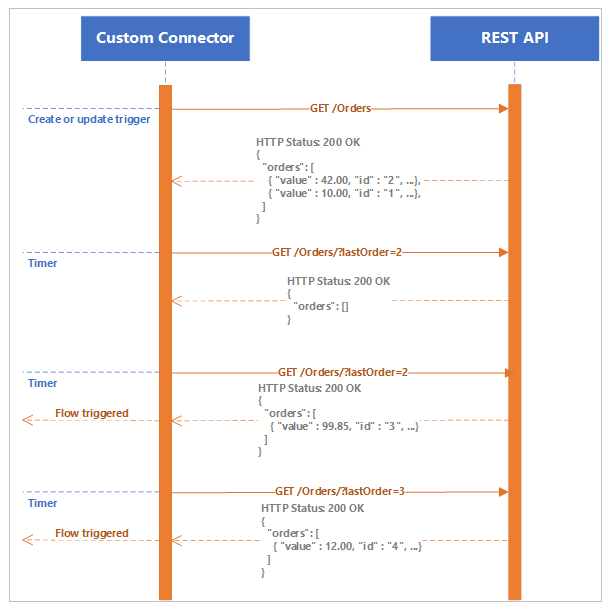
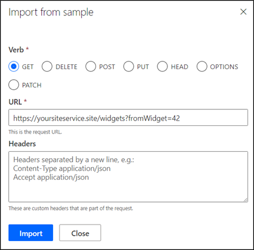
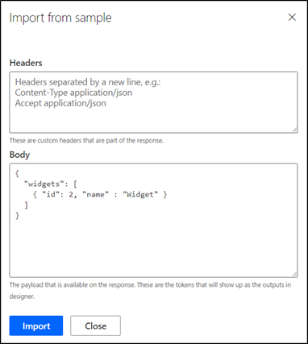
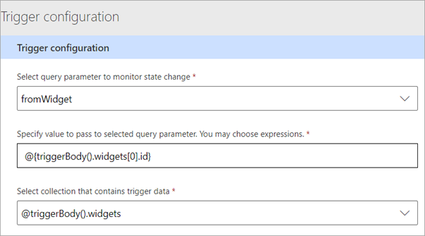
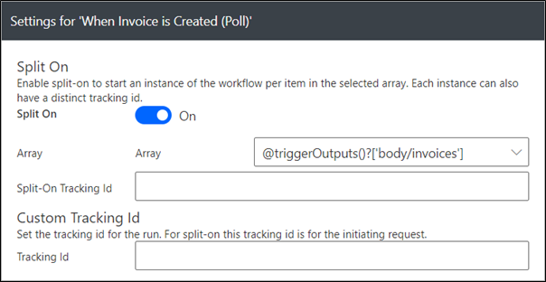

A polling trigger is an implementation that regularly calls your REST API service and checks for new data. After the platform has determined that new data is available, the trigger fires and passes the new collected data to a cloud flow or a Logic Apps workflow.

The following diagram shows a basic process flow of how a polling trigger acquires new data.

> [!div class="mx-imgBorder"]
> [](../media/polling-trigger-flow.png#lightbox)

A polling trigger starts by retrieving the data and setting a state. Then, it will periodically check for updates by requesting all data since the last state update. After the new data has been retrieved, the new state is set and the process will continue. The API needs to be able to return the data incrementally, based on a parameter value. Power Automate or Azure Logic Apps maintains the state so that the API doesn't have special state management requirements.

Unlike a webhook trigger, a polling trigger doesn't have setup or tear-down requirements, and the processing can be stopped at any time. The simplicity of the requirements is one main advantage of the polling trigger.

## API requirements

A polling trigger only requires an API to have a data retrieval method that can filter the data by using a query string parameter. A way to extract the next value of the parameter from the returned data must also exist. The implementation can be provided by either a dedicated or an existing action method.

For example, consider an online store implementation where orders have ever-increasing order numbers. The store API might include a method called *ListOrders* that returns orders that were created in the store.

-  *ListOrders* returns the orders that are sorted by order number in descending order. As a result, the highest order number belongs to the first order in the list.

-  *ListOrders* accepts a query string parameter to retrieve the orders where the order number is greater than the parameter value.

These two qualities allow the action to be used as a polling trigger. The platform can extract the highest order number from the returned data and pass it as a parameter into the next request. Effectively, the method will "select all orders that were created since the last one."

## Implementation

A polling trigger is created by using a wizard in Power Automate. The process includes the following steps:

1.  Define the HTTP request that will be used to retrieve the data.

	> [!div class="mx-imgBorder"]
	> [](../media/request-details.png#lightbox)

    The query string of the request includes the **fromWidget** parameter, which enables pre-generation of the parameter definition. This parameter ensures that the returned data is incremental, that it will "return all widgets that were created since the one specified by the parameter."

1.  Change parameter visibility to **Internal**, which will prevent users from making changes to this parameter, which is used only internally by the connector.

1.  Define the data that is returned by the service. This data should include the property to be used as the value for **fromWidget** in the consecutive requests. 

	> [!div class="mx-imgBorder"]
	> [](../media/data-value.png#lightbox)

    In this example, the property is called **ID**.

1.  Complete the **Trigger configuration**. Select the query parameter, define a value or expression that returns a value, and then select a collection that contains the trigger data.

	> [!div class="mx-imgBorder"]
	> [](../media/trigger-confirmation-complete.png#lightbox)

    This example includes the following parameters:

    -   **fromWidget** is selected as the query parameter that will receive the extracted value from the lab results.

    -   The **@{triggerBody().widgets[0].id}** expression extracts the current highest widget ID. Because the returned collection is sorted in descending ID value, extracting the value from the first element helps guarantee that it's the highest current ID.

    -   The **@triggerBody().widgets** expression defines the data collection.

Parameters need to be extracted and processed, and this transformation can only be implemented by using a connector policy. Consequently, the polling trigger configuration is stored as a policy template separate from the OpenAPI connector definition. One implication is that it's not possible to manually edit all polling trigger configurations in the Swagger editor.

A limitation that you need to be aware of is that the trigger body can't be an array. For example, consider a method called *ListOrders* that returns the following data:

```json
[
  {"value" : 42.00, "id" : "2", ... },
  {"value" : 10.00, "id" : "1", ... }
]
```

This trigger body won't be processed, and the trigger will generate an error in the Power Automate flow or Logic Apps workflow at run time.

Instead, the method needs to return a property that contains the array of records, for example:

```json
{
  "orders": [
    { "value" : 42.00, "id" : "2", ... },
    { "value" : 10.00, "id" : "1", ... }
  ]
}  
```

This data structure can be used as part of the polling trigger implementation.

## Batch processing

Similar to the webhook trigger, the polling trigger is defined by the **x-ms-trigger** extension to OpenAPI. The value that is defined by a polling trigger is a **batch**, indicating that the method will return an array rather than an individual object, as it does in a webhook response.

```yaml
  /trigger/ListInvoices:
    post:
      x-ms-trigger: batch
```
This process happens because it's possible to have multiple records that are returned from a single call to the service. When a polling trigger is used in Power Automate or Logic Apps, the trigger **Split On** setting allows you to configure the processing mode.

> [!div class="mx-imgBorder"]
> [](../media/settings-invoice-created.png#lightbox)

Splitting of the incoming array into the multiple parallel implementations is done for performance reasons. Each instance of the cloud flow in this scenario will receive a single object. If the **Split On** option isn't set, a single instance of the cloud flow will receive an array of values.

Polling triggers are easier to define than webhook triggers; however, they're less granular and often don't perform as well. The decision to build and use one type of trigger or another is driven by the features, structure, and functionality of the service API.
