In this exercise, you'll add a polling trigger to the custom connector for an existing Contoso Invoicing API.

> [!IMPORTANT]
> Use a test environment with Microsoft Dataverse provisioned. If you don't have one, you can sign up for the [community plan](https://powerapps.microsoft.com/communityplan/?azure-portal=true).

## Task 1: Import the solution with the custom connector

> [!NOTE]
> You can continue using the connector that you created and modified in **Unit 4: Implement a webhook trigger**. If you completed that exercise, you can skip ahead to **Task 2**.

> [!NOTE]
> Download the following file to your local computer to complete this exercise [Contoso Invoicing Triggers](https://github.com/MicrosoftDocs/mslearn-developer-tools-power-platform/blob/master/power-automate-connectors/polling/ContosoInvoicingTriggers_1_0_0_0.zip). Select the download button on the middle-right of the screen.

In this task, you will import an unmanaged solution that contains a prebuilt custom connector for Contoso Invoicing API.

1.  Go to [Power Apps maker portal](https://make.powerapps.com/?azure-portal=true) and make sure that you are in the correct environment.

1.  Select **Solutions > Import**.

1.  Select **Browse**.

1.  Select the **ContosoInvoicingTriggers_1_0_0_0.zip** solution and then select **Open**.

1.  Select **Next**.

1.  Select **Import** and then wait for the import to complete. You should get a success message after the import completes.

1.  Select **Publish all customizations** and then wait for the publish to complete.

1.  Open the **Contoso importing triggers** solution that you imported.

    You should see the **Contoso invoicing triggers** custom connector component.

	> [!div class="mx-imgBorder"]
	> [](../media/contoso-invoicing-trigger.png#lightbox)

1. Go to [Contoso Invoicing](https://contosoinvoicing.azurewebsites.net/?azure-portal=true).

1. Select the **API Key** link.

	> [!div class="mx-imgBorder"]
	> [](../media/api-key-link.png#lightbox)

1. Copy the **API Key** and then paste it on a notepad for future use.

1. Return to [Power Apps maker portal](https://make.powerapps.com/?azure-portal=true) and make sure that you are in the environment.

1. Select **Solutions** and then open the **Contoso invoicing triggers** solution.

1. Open the **Contoso invoicing triggers** custom connector.

1. Select **Edit**.

	> [!div class="mx-imgBorder"]
	> [](../media/edit.png#lightbox)

1. Enter **contosoinvoicing.azurewebsites.net** in **Host**.

1. Select **Update connector**.

1. Select **Test > + New Connector**.

	> [!div class="mx-imgBorder"]
	> [](../media/new-connection.png#lightbox)

1. Paste the **API Key** and then select **Create connection**.

	> [!div class="mx-imgBorder"]
	> [](../media/create-connection.png#lightbox)

1. Select **Refresh**. The connection that you created should be selected automatically.

1. Scroll down to the **Operations** section, select **ListInvoice**, and then select **Test operation**.

	> [!div class="mx-imgBorder"]
	> [](../media/test-operation.png#lightbox)

   You should see a list of invoices in the **Body** section.

	> [!div class="mx-imgBorder"]
	> [](../media/body-section.png#lightbox)

1. Don't navigate away from this page.

## Task 2: Add a polling trigger

If you skipped the prior task, go to your **Contoso invoicing triggers** custom connector and select **Edit**.

1.  Select **Definition**.

	> [!div class="mx-imgBorder"]
	> [](../media/definition.png#lightbox)

1.  Scroll down to the **Triggers** section and select **+ New trigger**.

1.  Provide the following values:

    -  **Summary** - When Invoice is Created (Poll)

    -  **Description** - When Invoice is Created (Poll)

    -  **Operation ID** - InvoiceCreatedPoll

    -  **Trigger type** - Polling

	> [!div class="mx-imgBorder"]
	> [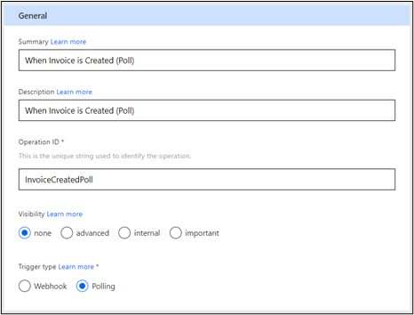](../media/polling-trigger-type.png#lightbox)

1.  Go to the **Request** section and select **+ Import from sample**.

	> [!div class="mx-imgBorder"]
	> [](../media/import-sample.png#lightbox)

1.  Enter the following values and then select **Import**.

    -  **Verb** - GET

    -  **URL** - `https://contosoinvoicing.azurewebsites.net/ListInvoices?fromDate=`

1.  Select the ellipsis (**...**) button next to **fromDate** and then select **Edit**.

	> [!div class="mx-imgBorder"]
	> [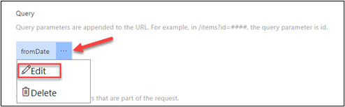](../media/query-edit.png#lightbox)

1.  Select **internal** for **Visibility** and then select the **Back** button.

	> [!div class="mx-imgBorder"]
	> [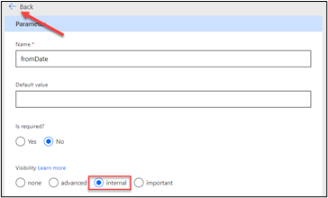](../media/internal-back.png#lightbox)

1.  Scroll down to the **Response** section and select **+ Add default response**.

1.  Paste the following JSON code in the **Body** field and then select **Import**.

	```json
	{
	  "invoices": [
	    {
	      "invoiceId": "1933",
	      "date": "2021-01-26T04:02:52.1490835Z",
	      "createDate": "2021-01-25T04:02:52.1490835Z",
	      "amount": 5000,
	      "accountId": "1001",
	      "accountName": "Wing Tips",
	      "status": "Invoiced",
	      "typeId": 1,
	      "purchaseOrderId": "3002",
	      "tags": "New Account;Special Pricing"
	    }
	  ]
	}
	```

	> [!div class="mx-imgBorder"]
	> [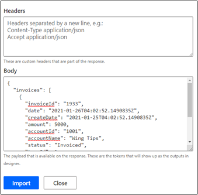](../media/headers-body.png#lightbox)

1. Go to the **Trigger configuration** section and provide the following values:

    -  **Select query parameter to monitor state change** - fromDate

    -  **Specify value to pass to selected query parameter. You may choose expressions** - @{triggerBody().invoices[0].createDate}

    -  **Select collection that contains trigger data** - @triggerBody().invoices

	> [!div class="mx-imgBorder"]
	> [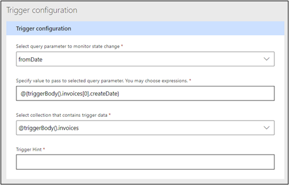](../media/trigger-configuration-section.png#lightbox)

1. Select the **Update connector** button located at the top of the screen, and then wait for the connector to be updated.

## Task 3: Test the trigger

If you have already completed **Unit 4: Implement a webhook trigger** and have created the **Create invoice** cloud flow, skip ahead to step 14.

1.  Go to [Power Apps maker portal](https://make.powerapps.com/?azure-portal=true) and make sure that you are in the environment.

1.  Select **Solutions** and then open the **Contoso invoicing triggers** solution.

1.  Select **+ New > Cloud flow**.

1.  Enter **Create invoice** for the name and then select **Manually trigger a flow** for the trigger.

	> [!div class="mx-imgBorder"]
	> [](../media/create-invoice-trigger.png#lightbox)

1.  Select **+ Add an input**.

1.  Select **Number** for the input type.

	> [!div class="mx-imgBorder"]
	> [](../media/number-input.png#lightbox)

1.  Enter **Amount** for the input name and then select **+ New step**.

	> [!div class="mx-imgBorder"]
	> [](../media/new-step.png#lightbox)

1.  Select the **Custom** tab and then select the **Contoso invoicing** custom connector.

	> [!div class="mx-imgBorder"]
	> [](../media/contoso-invoicing-connector.png#lightbox)

1.  Select the **Add Invoice** action.

1. Enter **Contoso Connection** in the **Connection Name** field, paste the **API Key** that you copied in **Task 1**, and then select **Create**.

	> [!div class="mx-imgBorder"]
	> [](../media/contoso-invoicing-triggers-details.png#lightbox)

1. Select the **amount** field and then select **Amount** from the **Dynamic content** pane.

	> [!div class="mx-imgBorder"]
	> [](../media/amount-field.png#lightbox)

1. Select **Save**.

1. Keep this browser tab or window open, switch to a solution browser tab or window, and then select **Done**.

	> [!div class="mx-imgBorder"]
	> [](../media/done.png#lightbox)

1. Select **+ New > Cloud flow** again.

1. Enter **Invoice notification poll** for the name, select the **Custom** tab, and then select the **Contoso invoicing** custom connector.

	> [!div class="mx-imgBorder"]
	> [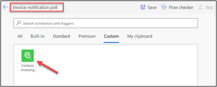](../media/invoice-notification-poll.png#lightbox)

1. Select the **When Invoice is Created (Poll)** trigger.

	> [!div class="mx-imgBorder"]
	> [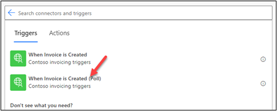](../media/poll-trigger.png#lightbox)

1. Select the **... Menu** button of the trigger and then make sure that **Connection references** is selected.

	> [!div class="mx-imgBorder"]
	> [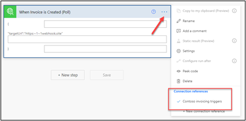](../media/connection-reference.png#lightbox)

1. Select **+ New step**.

1. Search for **compose** and then select the **Compose** action.

1. Select the **Inputs** field and then select **body** from the **Dynamic content** pane.

	> [!div class="mx-imgBorder"]
	> [](../media/body.png#lightbox)

1. Select **Save** and then wait for the flow to be saved.

1. Select **Test**.

1. Select **Manually > Save & Test**. The flow will start, and you should wait for notifications.

1. Switch to the **Create invoice** flow browser tab or window.

1. Select **Test**.

1. Select **Manually > Save & Test**.

1. Enter **6500** for **Amount** and then select **Run flow**.

1. Select **Done**.

1. The flow should run successfully. Select **Edit**.

	> [!div class="mx-imgBorder"]
	> [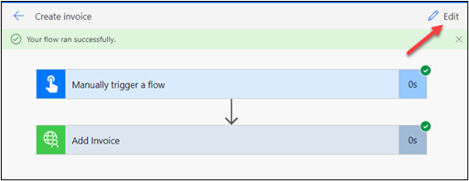](../media/edit-icon.png#lightbox)

1. Select **Test** again.

1. Select **Manually > Save & Test**.

1. Enter **8800** for **Amount** and then select **Run flow**.

1. Select **Done**. The flow should run successfully again.

1. Switch to the **Invoice notification poll** flow. This flow should run successfully.

	> [!NOTE]
	> Unlike a webhook trigger, it might take about a minute to find out if the flow ran successfully or not.

1. Select to expand the **Compose** action step.

	> [!div class="mx-imgBorder"]
	> [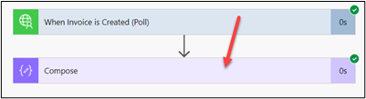](../media/compose-step.png#lightbox)

1. Review the **Outputs** and then select the button.

	> [!div class="mx-imgBorder"]
	> [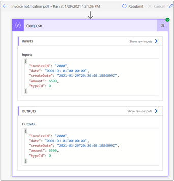](../media/outputs-review.png#lightbox)

   You should see two run results for the two invoices that you created.

	> [!div class="mx-imgBorder"]
	> [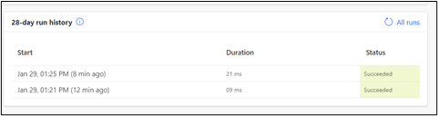](../media/run-history.png#lightbox)
