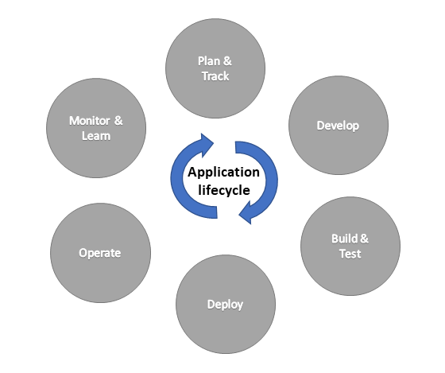

The use case for your custom connector will determine how you want to manage the life cycle as it evolves. The primary scenarios and a high-level overview are:

-   **Single environment usage** - This scenario is commonly used for productivity apps that are built and used in the same environment. In this scenario, you are not concerned with moving the app between different environments or sharing it with other people outside your company. You would still have some concern for breaking changes and should follow some versioning update guidance. Using solutions will help your future transportability if you want to move the app to other environments in the future. Typically, for this scenario, a formal application lifecycle management (ALM) process is not implemented.

-   **Multiple environments usage** - This scenario covers usage when you want to install the connector privately in multiple environments and are not interested in creating an open source or certifying the connector. The connector should be created and managed in the context of a solution, which is the primary mechanism for copying custom connectors between the environments. Your connector will benefit from all life cycle management aspects of the solution framework. To track changes in the connector, you could use version control of the solution components.

-   **Open source/certifying** - This scenario covers when you are creating an open source or certifying your connector to make it available publicly for others to install or use. In this scenario, you will manage the individual files that make up the definition of the connector and use Microsoft Power Platform command-line tool for importing and exporting. Because publishing these connectors requires the individual definition files and more metadata to be captured, it is more common to use source control for the exported files and not a solution.

This module provides an in-depth explanation of how to manage these different scenarios by using the tools and capabilities of the platform.

## Application lifecycle management

Application lifecycle management (ALM) is the life cycle management of application components that make up a complete application, which includes governance, development, and maintenance. Moreover, it includes the following disciplines: 

- Requirements management 
- Architecture
- Development
- Testing
- Maintenance
- Change management
- Continuous integration
- Project management
- Deployment
- Release management

The application life cycle is the cyclical development process that involves these areas: plan and track, develop, build and test, deploy, operate, monitor and learn from discovery.

> [!div class="mx-imgBorder"]
> 

When you create an open source and/or certify your custom connector, the deploy phase is more than simply moving it to another environment. You need to follow a specific set of procedures, which you can learn more about by going to [Instructions on submitting your connector to Microsoft](https://docs.microsoft.com/connectors/custom-connectors/certification-submission/?azure-portal=true).

## ALM in Microsoft Power Platform

Microsoft Power Platform provides ALM tools to support a healthy life cycle management process. These tools rely on Microsoft Dataverse and solutions. Solutions are the mechanisms for implementing ALM in Microsoft Power Apps and Microsoft Power Automate. Custom connectors can be created in and transported between environments by using solutions.

A key aspect of ALM in Microsoft Power Platform is using environments for specific purposes during different phases of the life cycle. For example, in a basic ALM setup, you would have development, test, and production environments. For more information, see [Environment strategy for ALM](https://docs.microsoft.com/power-platform/alm/environment-strategy-alm/?azure-portal=true).

Another key aspect of ALM is applying source control to track changes that are made over each release of the custom connector or other components. By using Microsoft Power Platform build tools, you can automate the process of taking a snapshot of a solution that contains your connector and using version control to track what changed with each revision.

You will learn more about using solutions and the build tools later in this module.

## Open source/certifying ALM

When creating an open source and/or certifying your custom connector, you are primarily working with a predefined ALM process that involves the [Microsoft Power Platform Connector GitHub repository](https://github.com/Microsoft/PowerPlatformConnectors/?azure-portal=true). While you could create an open source for any public location, such as your own public GitHub repository or download location, specific benefits like visibility and ease of import help make Microsoft Power Platform Connector GitHub repository the recommended approach.

While it is possible to also use the ALM in Microsoft Power Platform approaches and tools, in addition to command-line interface (CLI) and GitHub, it does not simplify or add significant value if your goal is creating an open source and/or certification.
