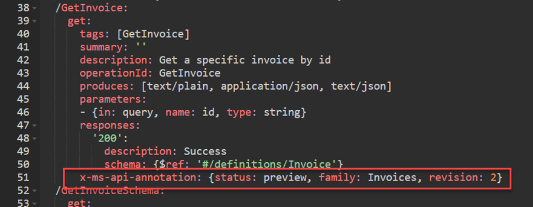
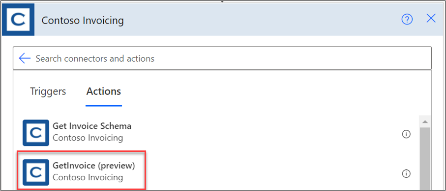
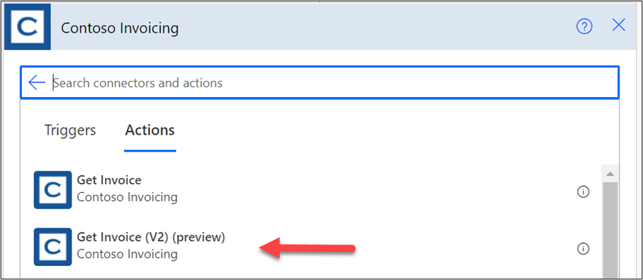
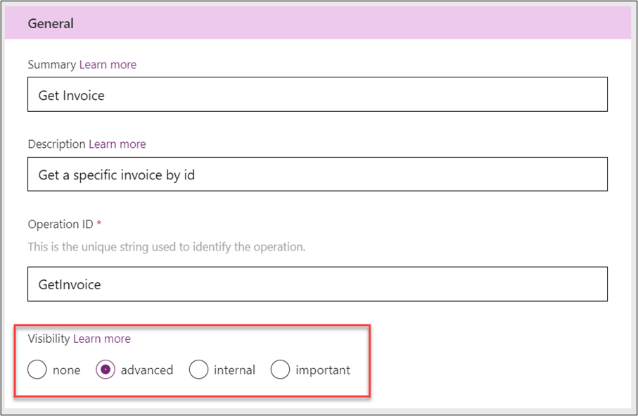
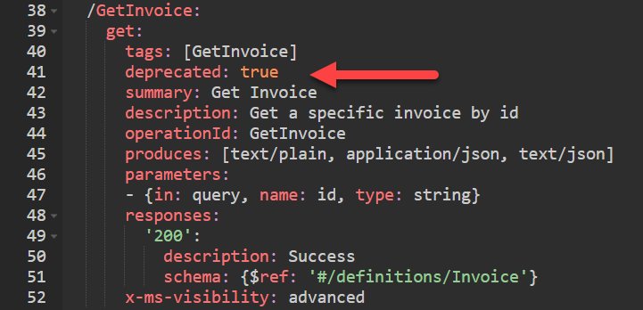

Custom connectors that are in use by apps can still be updated. The update process is almost identical to the initial version release. The main difference is that you must consider the impact on existing users of your connector as you plan your updates. Breaking changes to your connector definition, even if small, can impact existing users.

A connector's triggers and actions can grow and change over time as features are added or expanded in the underlying API. Some changes are merely additive and don't necessarily break the contract that exists between apps and flows that use your connector. Adding new parameters, returning more data, or allowing more flexible inputs might fall into this category. However, some of the changes might break the contract that is described in the custom connector definition by using the OpenAPI specification. 

Examples of breaking changes include:

-   Removing parameters

-   No longer supporting certain inputs

-   Changing the meaning and behavior of an input, output, or the operation

The API that your custom connector describes must avoid these breaking changes as well. In cases where different groups maintain the connector definition and the API, coordination must happen to keep them in sync.

To evolve a custom connector and API safely, you need to follow a pattern that can be navigated by the users of the connector. It is the connector and, therefore, the API's responsibility to maintain backward compatibility, communicate intention, and delineate versioning attributes. The tool designer allows use of the connector to either show or hide operations that are deprecated, expired, or that might have newer versions available. In this way, operations can grow and develop over time without causing undue fragility on applications that rely on them.

## Annotate connector actions

By using OpenAPI configuration, you can annotate the actions on your connector so that when it's presented in the design surface, it will convey the intended use. For example, by adding the **x-ms-api-annotation** OpenAPI extension to the GetInvoice action, you have indicated that its status is preview.

> [!div class="mx-imgBorder"]
> 

As a result, when this action is presented in the Power Automate cloud flow designer, it shows (preview) after the action name.

> [!div class="mx-imgBorder"]
> 

## New versions of an action

At some point in an action's lifetime, you might realize that you need to introduce a breaking change. The best approach is to create a new version of the action. Existing users of the original action will not be impacted, but new users can take advantage of the new version. A common practice is to indicate the version as part of the summary. The following screenshot shows what this approach would look like.

> [!div class="mx-imgBorder"]
> 

## Deprecation of an action

At some point after introducing your new action, you might want to deprecate the old action so that it's no longer used in new apps and flows. A good first step would be to mark the old action as **advanced**. If you have actions that are marked as **important**, you should consider if the new V2 action should also be marked **important**. Both visibility changes will encourage the use of the new action by placing it higher in the list of actions.

> [!div class="mx-imgBorder"]
> 

In the summary or description areas, you can also indicate a hint of upcoming deprecation. For example, you could change Get Invoice to Get Invoice (deprecated). This change can soft announce the deprecation without hiding it from users. The goal is to help navigate the connector users through changes that you make.

To truly hide the action from new users but not break existing users, you can mark the action as **deprecated** in the OpenAPI configuration. You can make this change by directly editing the OpenAPI definition by using the Swagger editor. To indicate that an action is deprecated, add the following logic to the operation configuration:

deprecated: true

> [!div class="mx-imgBorder"]
> 

After the action has been published, this approach will hide the action from users' ability to select it in new flows.

Many reasons exist for adhering to action versioning. Primarily, doing so ensures that clients such as Microsoft Azure Logic Apps and Power Automate continue to work correctly when users integrate connector actions into their flows. Actions should be versioned by using the preceding methods whenever one of the following is true:

-   A new revision of an action is added

-   An existing action adds or removes parameters

-   An existing operation changes input or output significantly

Situations might occur where you can avoid versioning, but you should be careful when doing so and conduct plenty of testing to ensure that you have not overlooked edge cases where users' apps and flows might be broken unexpectedly. 

A cautious short list of when you can bypass versioning includes:

-   A new action is added.

-   A new optional parameter is added to an existing action.

-   An existing action changes behavior subtly.

We recommend that you are cautious and create a revision when you make non-trivial changes in the connector definition or underlying API.
