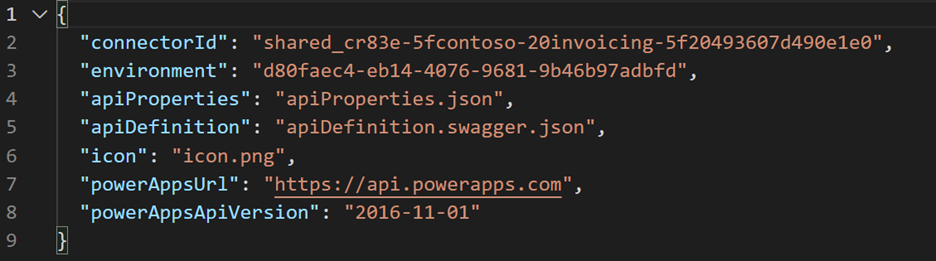
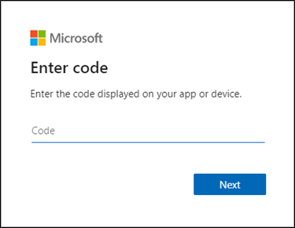
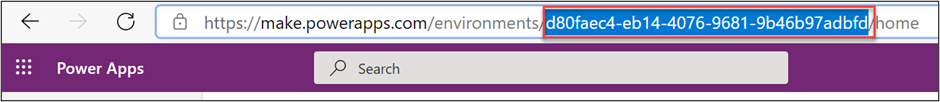
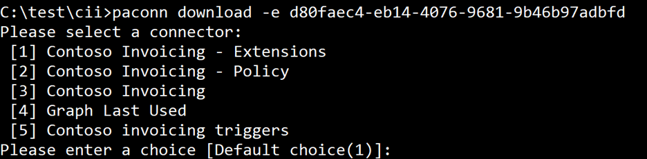
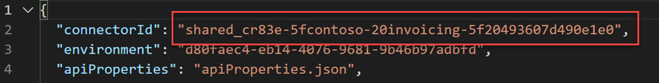

Not every task in a custom connector life cycle can be performed by using a custom connector user interface in the maker portal. The **paconn** command-line tool should be used as part of your custom connector life cycle for the following tasks:

-   Downloading a custom connector for editing and source control after you have created or edited it by using the maker portal. For example, to add any custom connection properties, you must download and edit the files.

-   Creating a new custom connector in an environment from the individual downloaded definition files. The connector that was created is not contained within a solution. For example, this connector could be used to create the same connector with a different unique ID in the same environment if you wanted a copy while keeping the original intact.

-   Updating an existing connector. This step can be used to update a standalone custom connector or one that is contained in a solution. For example, you can update a connector after you have edited connection properties.

-   Validating your connector. This step is required for certification, but many of the errors that are detected can improve the quality of any custom connector.

Use care to ensure that someone is not editing your custom connector by using the portal and the downloaded files simultaneously to avoid losing changes. When you upload by using the command-line tool, it does not check for conflicts and only replaces the existing definition without merging.

## Install the command-line tool

The **paconn** command-line tool requires Python 3.5 or above. Python should be installed first, followed by the **pip install paconn** command to install the tool. Detailed [installation instructions](/connectors/custom-connectors/paconn-cli/?azure-portal=true) are available.

## Settings file or parameters

You can configure the tool options by using command-line parameters when you are running a command or by using a settings.json file. Specify a settings file by using the **-settings** or **-s parameter**. When the settings file is used, the rest of the command-line parameters are ignored.

Using the settings file can make it easier for you to run commands multiple times. When you download a custom connector, a settings.json file is created as part of the download. The following screenshot shows an example of a settings.json file.

> [!div class="mx-imgBorder"]
> [](../media/settings-json.png#lightbox)

You can review the [detailed list of settings](/connectors/custom-connectors/paconn-cli?azure-portal=true#settings-file) for more specifics on values for each setting.

## Authenticate

To use any of the paconn commands, you must authenticate first by using the **paconn login** command. This command will give you a code and direct you to [https://microsoft.com/devicelogin](https://login.microsoftonline.com/common/oauth2/deviceauth), where you will sign in with your account and provide that code.

> [!div class="mx-imgBorder"]
> [](../media/enter-code.png#lightbox)

Completion of the interactive sign-in will establish a session to be used by other **paconn** commands. The session will expire after some time, and you will need to reestablish it to continue using the tool. You can force an end of the session at any time by using the **paconn logout** command.

Because an interactive user sign-in is required to authenticate, the command-line tool can be used with attended automation scripts, but it would not work in unattended scenarios like a build pipeline.

## Download

Use the **paconn download** command to download an existing connector. If you don't provide parameters, you will be prompted to pick from an environment list and then from a list of connectors in the selected environment.

Use the **-e parameter** to preselect a specific environment and skip the environment list. The easiest way to get an environment identifier is from the maker portal URL.

> [!div class="mx-imgBorder"]
> [](../media/maker-portal-url.png#lightbox)

Using this option would present a choice of only the connectors in that environment.

> [!div class="mx-imgBorder"]
> [](../media/environment-connectors.png#lightbox)

Instead of selecting a connector interactively, you can specify a particular connector by passing a connector identifier in the **-c parameter**. The easiest way to get the connector identifier is to download the connector once and then copy the value from the settings file.

> [!div class="mx-imgBorder"]
> [](../media/connector-identifier.png#lightbox)

As a result, your command would be similar to the following example:

```
paconn download -e d80faec4-eb14-4076-9681-9b46b97adbfd -c shared_cr83e-5fcontoso-20invoicing-5f20493607d490e1e0
```

This command would download your connector files without prompts.

The other advantage of using identifiers is that, unlike the order numbers in the selection lists, the identifiers don't change as environments and connectors are created or deleted.

The downloaded files are placed in a folder named **using the connector ID**. If the directory already exists, the command will fail and you must manually remove the folder. The downloaded files consist of the following four files:

-   **apiDefinition.swagger.json** - This API definition file describes the API for the custom connector by using the OpenAPI specification.

-   **apiProperties.json** - The API properties file contains properties for the custom connector and policy templates.

-   **Icon.png** - The icon file is a small image that represents the custom connector icon.

-   **settings.json** - You can use this preconfigured settings file instead of providing parameters to each command.

## Create

The **paconn create** command would create a custom connector in the target environment by using the specified definition files. The API definition, API properties, and icon must be specified by parameters or a settings file. The create command will prompt for any other parameters, such as environment ID, if parameters are not provided. The following example shows the create command:

```
paconn create ^
  -e [Microsoft Power Platform Environment GUID] ^
  --api-prop [Path to apiProperties.json] ^
  --api-def [Path to apiDefinition.swagger.json] ^
  --icon [Path to icon.png] ^
  --secret [The OAuth2 client secret for the connector]
```

If your connector uses OAuth2, then you can use the **-secret parameter** to specify the client secret value.

## Update

The **paconn update** command updates an existing custom connector in the target environment by using the specified definition files. The API definition, API properties, and icon must be specified by parameters or a settings file. The update command will prompt for any other parameters, such as environment ID, if parameters are not provided. The following example shows the update command:

```
paconn update ^
  -e [Microsoft Power Platform Environment GUID] ^
  -c [Connector ID] ^
  --api-prop [Path to apiProperties.json] ^
  --api-def [Path to apiDefinition.swagger.json] ^
  --icon [Path to icon.png] ^
  --secret [The OAuth2 client secret for the connector]
```

> [!IMPORTANT]
> Update will replace the definition in the target environment, even if it has been modified since you downloaded your copy. It is important to coordinate with anyone else who is making updates to the connector.

Microsoft Power Platform Connectors CLI is an essential tool when you are building custom connectors. Use it as part of your life cycle to help make changes to the connectors and to download copies of the connector definition files for source control.
