In this exercise, you will export a solution that contains a custom connector into GitHub by using GitHub Actions for Microsoft Power Platform.

> [!IMPORTANT]
> Use a test environment with Microsoft Dataverse provisioned. If you don't have one, you can sign up for the [Community Plan](https://powerapps.microsoft.com/communityplan/?azure-portal=true). A GitHub account is also required to complete the exercise. You can sign up for one for free at [GitHub.com](https://GitHub.com/?azure-portal=true).

> [!NOTE]
> Download the following file to your local computer to complete this exercise: [Contoso Invoicing Triggers](https://github.com/MicrosoftDocs/mslearn-developer-tools-power-platform/tree/master/power-automate-connectors/lifecycle). Select the download button on the middle-right of the screen.

## Task 1: Import solution

In this task, you will import an unmanaged solution that contains a Contoso Invoicing custom connector. You will use this connector to complete the tasks in this exercise.

1.  Go to [Power Apps maker portal](https://make.powerapps.com/?azure-portal=true) and make sure that you are in the correct environment.

1.  Select **Solutions** and then select **Import**.

1.  Select **Browse**.

1.  Select the **ContosoInvoicingALM_1_0_0_0.zip** solution and then select **Open**.

1.  Select **Next**.

1.  Select **Import** and then wait for the import to complete. You should get a success message after the import completes.

1.  Select **Publish all customizations** and then wait for the publish to complete.

1.  Select to open the **Contoso Invoicing - ALM** solution that you imported.

    You should see the **Contoso Invoicing - ALM** custom connector component.

1. In the upper-right corner of the screen, select the **Settings** icon and then select **Session details**.

	> [!div class="mx-imgBorder"]
	> [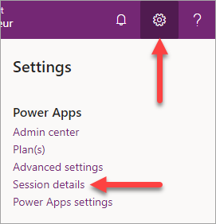](../media/exercise-1.png#lightbox)

1. In the Power Apps session details dialog box, select the **Instance url** value and copy it for use later in the exercise.

	> [!div class="mx-imgBorder"]
	> [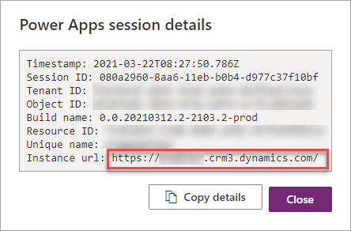](../media/exercise-2.png#lightbox)

## Task 2: Create a GitHub repository

To create a GitHub repository, follow these steps:

1.  Go to [GitHub](https://GitHub.com/?azure-portal=true) and select **Create repository**.

1.  Enter **ContosoInvoiceALM** for the repository name.

1.  Select **Add a README file**.

1.  Select **Create repository**.

1.  In the new repository, select the **Settings** icon.

1.  Select **Secrets**. Secrets are environment variables that are encrypted. Anyone with collaborator access to this repository can use these secrets for GitHub Actions. You will create three secrets that will ensure that the action that you create doesn't have sensitive information in it.

1.  Select **New repository secret**.

1.  Enter **environment** in the **Name** field.

1.  Paste the environment URL that you copied in the previous task in the **Value** field.

	> [!div class="mx-imgBorder"]
	> [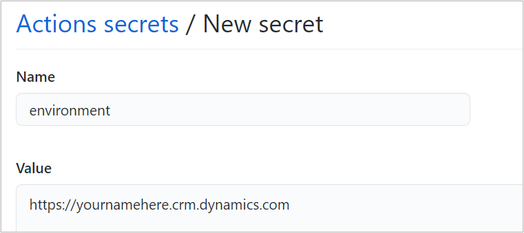](../media/exercise-3.png#lightbox)

1. Select **Add Secret**.

1. Add another secret with a name of **user** with the value containing the **email** of the account that you use to access the environment.

1. Add another secret with a name of **password** with the value containing the **password** of the account that you use to access the environment.

1. After you have added the secrets, your list of values should look like the following screenshot.

	> [!div class="mx-imgBorder"]
	> 

## Task 3: Create a GitHub Action

To create a GitHub Action, follow these steps:

1.  In the repository navigation, select the **Action** menu item.

	> [!div class="mx-imgBorder"]
	> [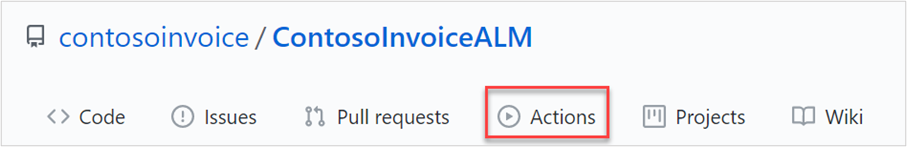](../media/exercise-5.png#lightbox)

1.  Select the **setup a workflow yourself** option.

	> [!div class="mx-imgBorder"]
	> [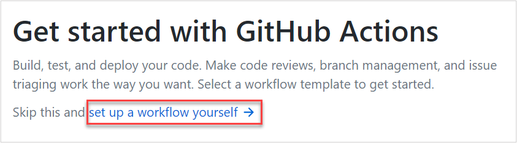](../media/exercise-6.png#lightbox)

1.  In the **Edit new file** area, clear out the YAML that was provided.

	> [!div class="mx-imgBorder"]
	> [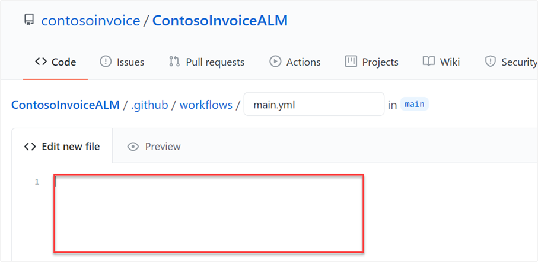](../media/exercise-7.png#lightbox)

1.  Open the provided export-and-branch-solution.yml file and paste the contents into the **Edit new file** area.

	> [!div class="mx-imgBorder"]
	> [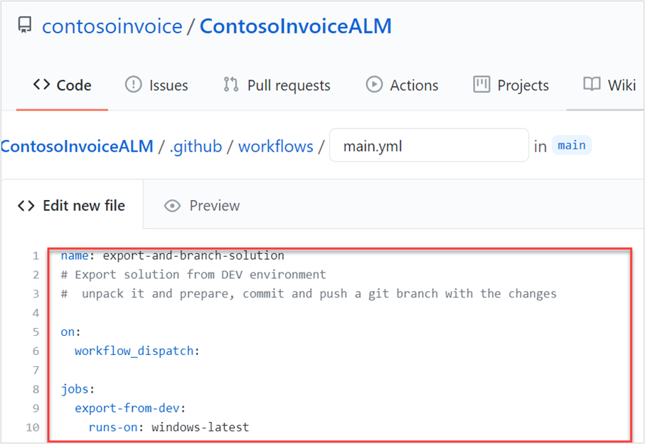](../media/exercise-8.png#lightbox)

1.  You have added the following four steps: 1) Who-am-I action to test connection, 2) Export solution, 3) Unpack the solution, and 4) Create a branch and check in the solution files.

	> [!div class="mx-imgBorder"]
	> [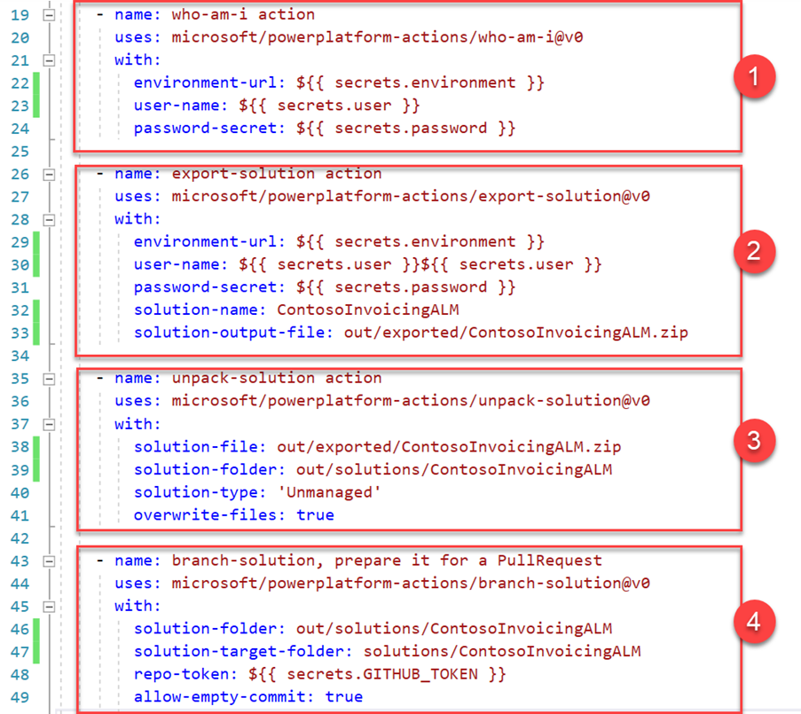](../media/exercise-9.png#lightbox)

1.  Select **Start commit** on the right side and then select **Commit new file**. This step will save the action that you built.

	> [!div class="mx-imgBorder"]
	> [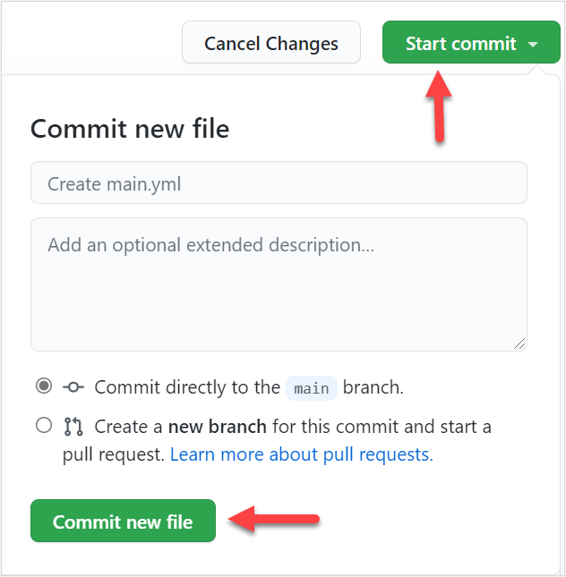](../media/exercise-10.png#lightbox)

Your action has been saved and is ready to run.

## Task 4: Run the export action

To run the export action, follow these steps:

1.  Go to the **Actions** repository.

	> [!div class="mx-imgBorder"]
	> 

1.  Select the **export-and-branch-solution** action and then select **Run workflow**.

	> [!div class="mx-imgBorder"]
	> [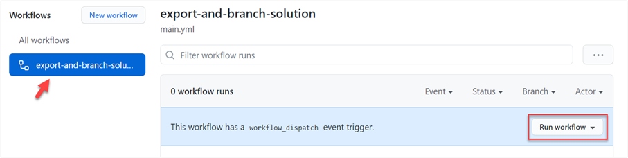](../media/exercise-12.png#lightbox)

1.  In the **Use workflow from** section, select the **main** branch and then select **Run workflow**.

	> [!div class="mx-imgBorder"]
	> [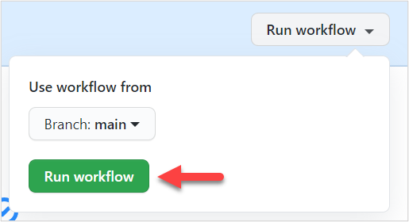](../media/exercise-13.png#lightbox)

1.  Monitor the workflow progress until it has completed successfully.

	> [!div class="mx-imgBorder"]
	> [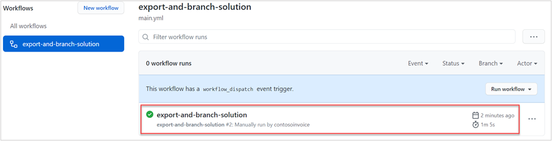](../media/exercise-14.png#lightbox)

1.  Select **Code** in the navigation and then select **branches**.

	> [!div class="mx-imgBorder"]
	> [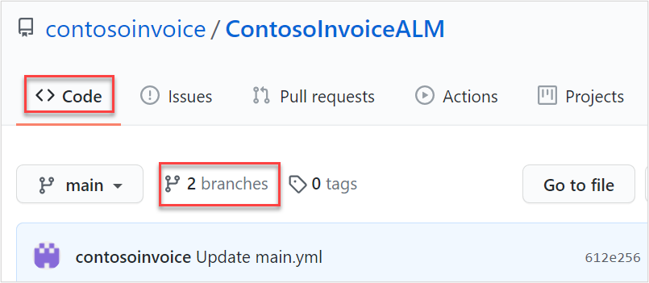](../media/exercise-15.png#lightbox)

1.  You should see the branch that was created by the GitHub Action implementation. Currently, this branch is not merged with your main branch. Select **New pull request** to start the merge process.

	> [!div class="mx-imgBorder"]
	> [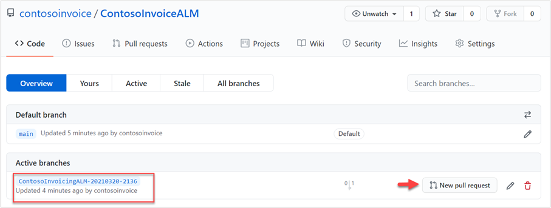](../media/exercise-16.png#lightbox)

1.  In the comments area, enter **Initial version of connector**.

1.  Select the **Create pull request** option.

1.  At this point, someone would typically review and merge, but because only you are doing the exercise, you should approve the pull request yourself.

1. Expand **Merge pull request** and then select **Squash and merge**.

	> [!div class="mx-imgBorder"]
	> [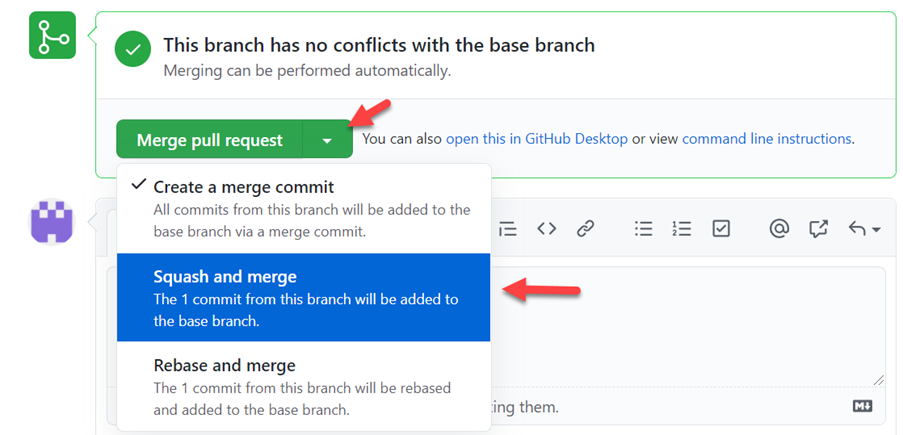](../media/exercise-17.png#lightbox)

1. Select **Squash and merge** and then select **Confirm squash and merge**.

   Your branch with your changes has now been merged.

1. Select **Code** and then select **solutions/ContosoInvoiciningALM**. This folder contains the solution files that were created. You can browse the content of this folder to determine what was extracted from the solution and stored as individual files.

	> [!div class="mx-imgBorder"]
	> [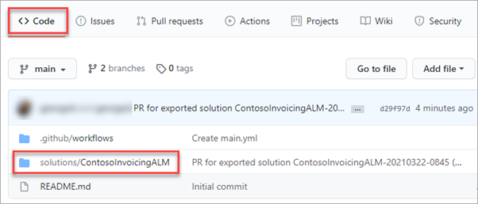](../media/exercise-18.png#lightbox)

## Task 5: Change and record connector definitions

To change and record connector definitions, follow these steps:

1.  Go to [Power Apps maker portal](https://make.powerapps.com/?azure-portal=true) and make sure that you are in the correct environment.

1.  Select **Solutions** and then select the **Contoso Invoicing - ALM** solution.

1.  Select the ellipsis (**...**) next to the custom connector component and then select **Edit**.

	> [!div class="mx-imgBorder"]
	> [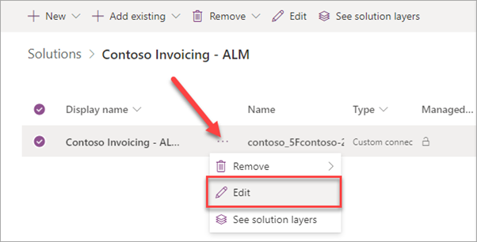](../media/exercise-19.png#lightbox)

1.  Change **Icon background color** to **#0066ff** and then select **Update connector**.

	> [!div class="mx-imgBorder"]
	> [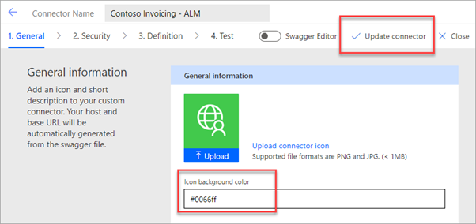](../media/exercise-20.png#lightbox)

1.  Repeat steps 1-12 of **Task 4** to run the workflow, create a new pull request, and merge the code into the main branch.

1.  Select **Code** in the navigation then select the pull request name to open the details.

	> [!div class="mx-imgBorder"]
	> [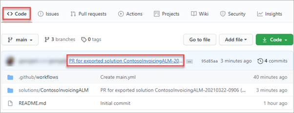](../media/exercise-21.png#lightbox)

1.  Verify the recorded change in icon color from #007ee5 to #0066ff.

	> [!div class="mx-imgBorder"]
	> [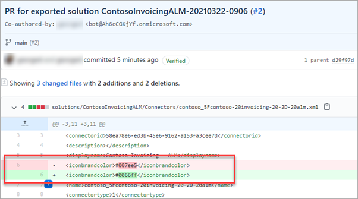](../media/exercise-22.png#lightbox)

> [!NOTE]
> Other automatic changes could be applied when you save the connector, for example, icon format might change from JPEG to PNG.

You now have an automated process to export and record your custom connector changes in a source control system.
