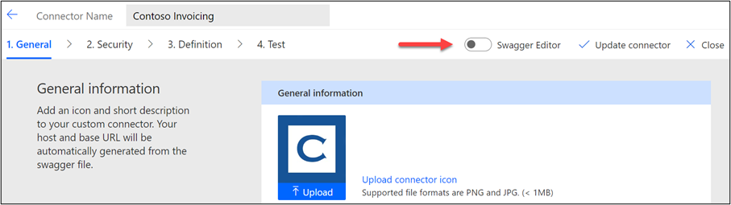
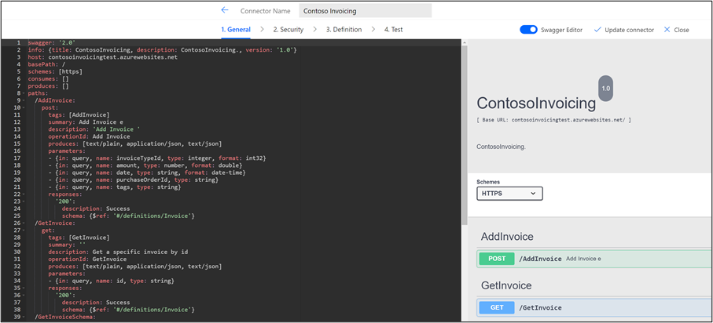
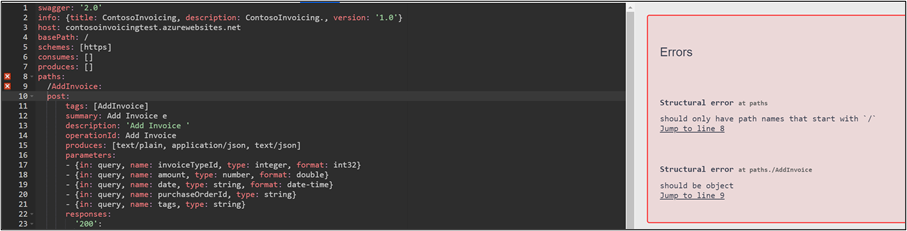

Microsoft Power Platform custom connectors use OpenAPI (also known as Swagger) definitions to describe authentication, actions, triggers, and their parameters. The OpenAPI specification allows you to define extensions that augment the core definition to handle specific scenarios. Microsoft has defined several extensions to the OpenAPI definition to allow you to configure specific features that are supported by custom connectors.

You can identify each extension by looking for **x-ms-\<name\>** in the OpenAPI definitions. You've likely already used some of these definitions when you configured a custom connector with the designer, such as when entering a summary on an action's parameter that uses the **x-ms-summary** extension to store the value in the definition. Several extensions can only be edited either directly through the designer's Swagger editor or by exporting the connector's definitions and then editing and importing them back. You can find a [complete list of custom connector supported extensions](https://docs.microsoft.com/connectors/custom-connectors/openapi-extensions/?azure-portal=true). 

This module explains the following extensions and their uses:

-   **x-ms-capabilities** - Used on the connector and operation level definition to indicate features that are offered.

-   **x-ms-encoding** - Specifies encoding for a path parameter.

-   **x-ms-dynamic-values** and **x-ms-dynamic-list** - Provide a list of options for the user to select input parameters for an operation.

-   **x-ms-dynamic-schema** - Allows you to make parameters and response dynamic based on results of schema that is retrieved from an operation on the API.

The primary use case for configuring these extensions is to make the connector easier to use. For example, without dynamic values, makers would have to know internal unfriendly schema values or strings for type/lookup parameters. By configuring dynamic values, you are helping to provide a user-friendly drop-down list for makers to select from.

Keep in mind that some extensions also require support from the API. For example, dynamic schema requires the API to support an operation to retrieve the schema. In cases where you don't control the API, it might not be possible to configure these types of extensions.

## Configure extensions

While some OpenAPI extensions are configured as you work with definitions by using the designer, the extensions that are covered in this module aren't. To configure these extensions, you must use one of the following approaches:

-   **Import OpenAPI** - When you import an OpenAPI file, it can contain Microsoft OpenAPI extensions.

-   **Microsoft Power Platform Connectors CLI** - By using the command-line tool paconn, you can download the API definition file and edit it by using your favorite JSON editor. When you have finished editing, you can use paconn to upload the amended definitions back to your environment. This approach is best when you need to make other changes to the **API Properties** file for connection parameters, for example.

-   **Built-in Swagger editor** - The custom connector designer has a built-in OpenAPI editor, which is the quickest way to add OpenAPI extensions.

## Use the Swagger editor

You can make the Swagger editor visible by turning on the **Swagger Editor** toggle switch from any of the steps in the custom designer.

> [!div class="mx-imgBorder"]
> 

When the editor is engaged, the OpenAPI definition in YAML Ain't Markup Language (YAML) will display on the left, and validation messages (if any) and an operation list will display on the right.

> [!div class="mx-imgBorder"]
> 

If you aren't familiar with [YAML](https://yaml.org/?azure-portal=true), it's a human-friendly data serialization standard that helps you make changes to the YAML content, save it, and have it consumed by the connector runtime.

Most changes that you'll make will have an example to start from. A good place to look for changes in YAML is in other connectors that are located in the [Microsoft Power Platform Connector GitHub repository](https://github.com/microsoft/PowerPlatformConnectors/?azure-portal=true). For example, if you want to implement an **x-ms-capability** extension, you could search the repository and see how other connectors have configured it.

When using the editor, it's best to make small, focused changes. The editor checks your syntax as you type and tells you, in real time, if a mistake has been made and where the mistake is located.

> [!div class="mx-imgBorder"]
> 

Tips for working with YAML in the swagger editor:

-   **Indentation matters** - Indentation is part of YAML specifications; therefore, observe how indentation is used to further provide configuration specifics.

-   **Open and closed braces {}** - If you have an open brace **{**, you need to have a closed brace **}**.

-   **Open and closed brackets []** - If you have an open bracket, you need to have a closed bracket.

-   **Ctrl+F** for **Find** - This keyboard shortcut allows you to search within the YAML.

-   **Ctrl+Z** for **Undo** - If you notice that you made a mistake, using the **Ctrl+Z** keyboard shortcut will undo your last change.

In the rest of this module, you'll explore how to use some of the Microsoft OpenAPI extensions to make your custom connectors easier to use.
