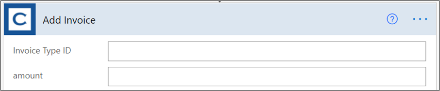
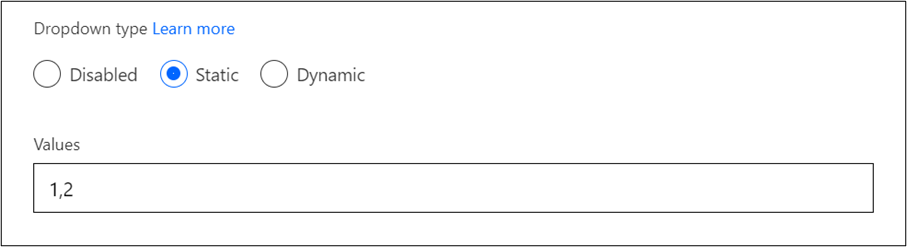
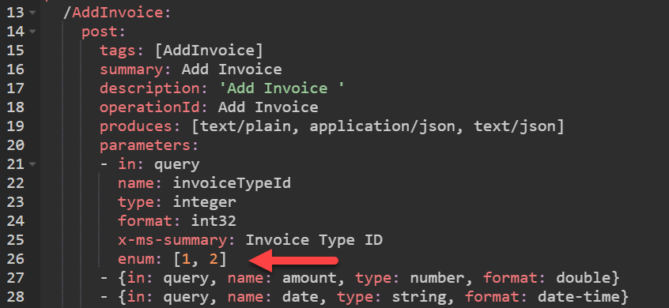
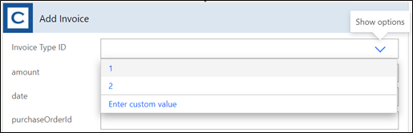
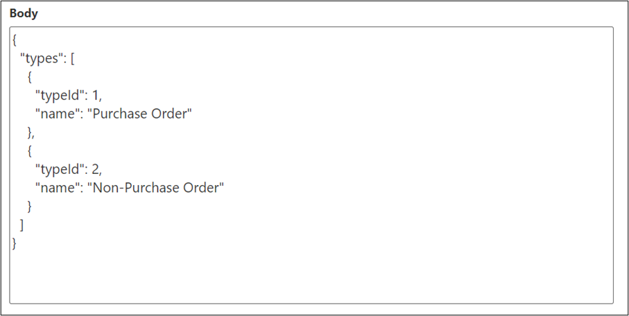
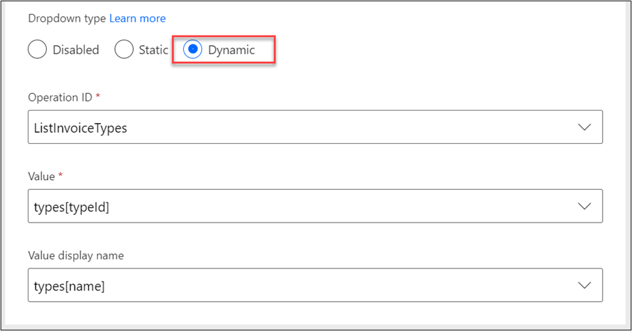
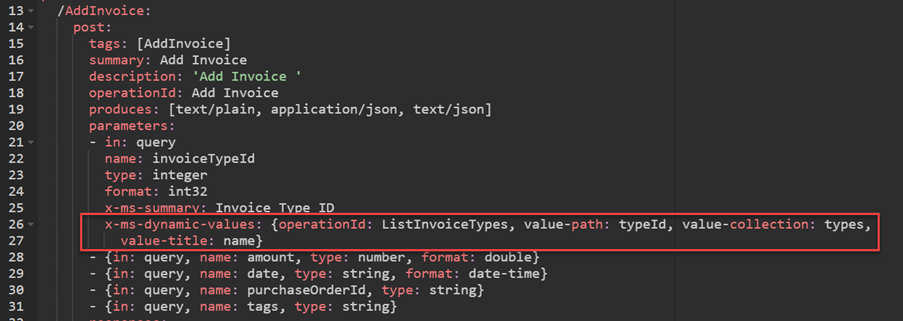
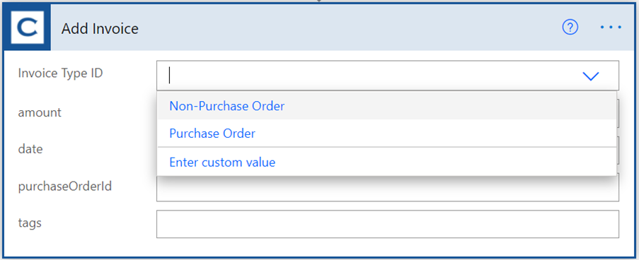
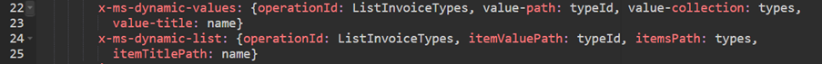

When you configure a parameter for an action on a custom connector, the default maker's experience to enter the parameter value is a simple text box. If you had a parameter on an **Add Invoice** action named **Invoice Type ID**, the maker experience would look similar to the following image.

> [!div class="mx-imgBorder"]
> 

The maker would need to know the correct values for the **Invoice Type ID** field which, for this example, are the following values.

|     Value    |     Label                  |
|--------------|----------------------------|
|     1        |     Purchase Order         |
|     2        |     Non-Purchase Order     |

A maker would need to enter **1** to indicate that the invoice is of type **Purchase Order**. To make this an easier OpenAPI definition, you should support the enum keyword. You can define an enum with a list of values that the maker can choose from.

You can configure an enum by using the custom connector designer by editing the parameter configuration. On the configuration, if you select **Static** in the **Dropdown type** area, it will let you provide a comma-separated list of values. The following screenshot shows what the **Invoice Type ID** configuration would look like.

> [!div class="mx-imgBorder"]
> 

You can also use the Swagger editor and add the enum, as shown in the following image.

> [!div class="mx-imgBorder"]
> 

Additionally, if you looked at the maker experience in Power Automate, it would now resemble the following image.

> [!div class="mx-imgBorder"]
> 

While the experience is improved, it still requires the maker to know what the value of **1** or **2** means. You could describe the meaning of those values in the parameter description to help simplify the process for makers. Using enums is best for self-describing data, such as if you had a parameter for **Days Due** and used an enum for **30,60,90** that would be simple to understand and use. Another limitation on using enum is if the API adds new allowable values, you must edit the custom connector enum definition and publish the updated version of the connector. To improve the experience further, Microsoft added the OpenAPI extension **x-ms-dynamic-values**.

## Configure dynamic values

You can configure the **x-ms-dynamic-values** extension on a parameter to have the list of values retrieved from the underlying API. 

The benefits of this approach are:

-   You can configure a label that the user sees in addition to the value.

-   The returned values always represent the correct values from the API.

-   The API can trim the list of values based on security or other needs on a per-user or per-connection basis.

-   Other parameter values can be passed to the API to allow filtering of the returned list.

-   Output of one field can be used as an input parameter for another API call, making it possible to build dependent options, such as country and state lists.

The API that you're working with must provide an operation that returns an array of valid values and, optionally, their descriptions. To support the previous example of **Invoice Type ID**, the API provided a ListInvoiceTypes operation that returned the following data.

> [!div class="mx-imgBorder"]
> 

In the custom connector designer for the **Invoice Type ID** parameter, you can configure the **x-ms-dynamic-values** extension by selecting **Dynamic** and then specifying an **Operation ID** and the **Value** and **Value display name** properties. The following screenshot shows the configuration for **Invoice Type ID**.

> [!div class="mx-imgBorder"]
> 

You can also configure the **x-ms-dynamic-values** extension by using the Swagger editor.

> [!div class="mx-imgBorder"]
> 

Using the Swagger editor or downloading and editing the JSON file is required if you're configuring parameters on the extension.

Now with the extension configured, the maker is presented with a more user-friendly experience when they use the action.

> [!div class="mx-imgBorder"]
> 

In addition to the **x-ms-dynamic-values** extension, Microsoft has also implemented a newer extension called **x-ms-dynamic-list**. In concept, both accomplish the same goal of making the action's parameter a drop-down list that the user can select from. Consider the **x-ms-dynamic-values** extension as version 1 and the **x-ms-dynamic-list** extension as version 2. If you're supporting older existing flows, we recommend that you implement both in your definition. If you're only supporting newly created flows, then use only **x-ms-dynamic-list**. The **x-ms-dynamic-list** extension improves the schema for the action parameters, making it possible to resolve some ambiguous references. For example, if a request has a path parameter ID and a parameter ID as part of the request body, **x-ms-dynamic-list** specification allows you to differentiate the two parameters while **x-ms-dynamic-values** wouldn't be able to support this API.

To configure the **x-ms-dynamic-list** extension, you must directly change the OpenAPI definition because the custom connector designer only configures **x-ms-dynamic-values**. The following image shows the **x-ms-dynamic-values** configuration that has also added an **x-ms-dynamic-list** configuration.

> [!div class="mx-imgBorder"]
> 

Configuring dynamic values on parameters for a custom connector can make the custom connector more user-friendly for makers.
