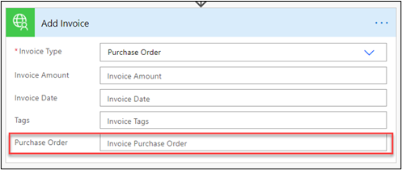
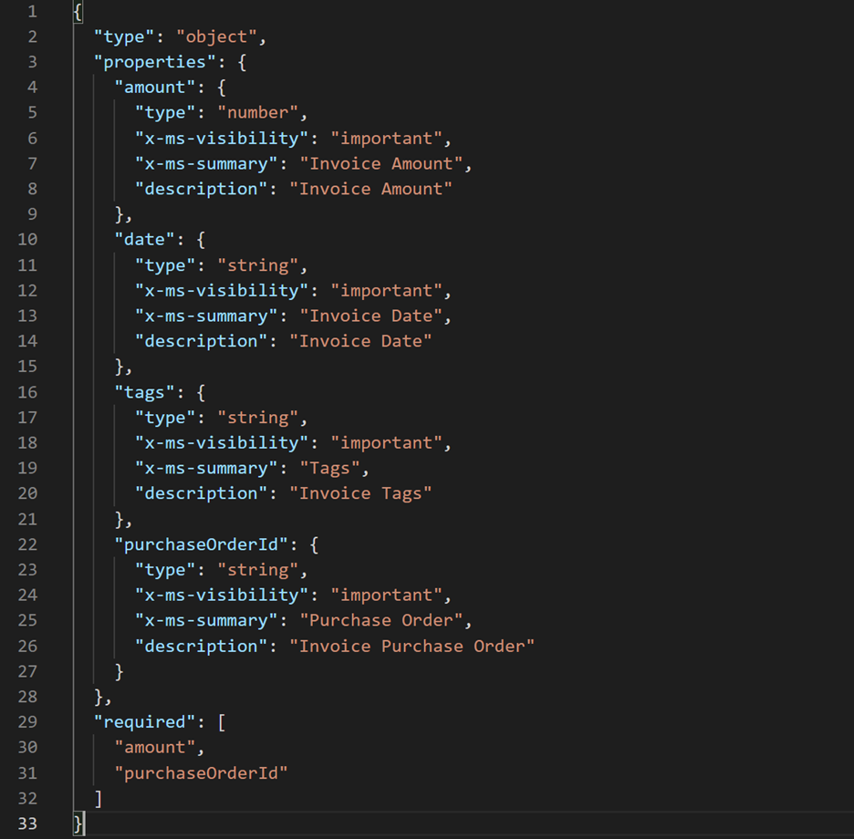

When you configure an action on a custom connector, you can also configure parameters. These parameters are configured by importing either an OpenAPI definition or a sample request. Regardless of the approach used, the list of parameters is fixed. When that action is used, the maker will be presented with the static list of parameters as defined by the connector. For many scenarios, this approach is appropriate because the list parameters are fixed and don't vary. In some cases, the parameters that should be presented for input are variable. 

The most common use cases are:

-   List of parameters vary based on a type, such as a category or a type of invoice.

-   The state of the record could determine which parameters can be changed. For example, a shipped order could have different available parameters than a non-shipped order.

-   The parameter list could be trimmed by security.

-   A common action implementation across a few different data types. For example, API might implement a **Create** action that applies to accounts, contacts, orders, or invoices. Input parameters will be defined by the object type that the maker selects.

Custom connectors support these scenarios by allowing you to configure dynamic schema OpenAPI extensions. When the dynamic schema OpenAPI extensions are configured, the custom connector runtime will call an operation to retrieve the schema that defines which parameters should be visible for that given action. The schema data can include other options such as the display name and description for the parameter.

In the Contoso Invoicing API example, after the OpenAPI definition was imported, the action resembled the following image when it was used in a Power Automate flow.

> [!div class="mx-imgBorder"]
> 

The preceding image shows parameters that aren't relevant for adding a purchase order invoice versus a non-purchase order invoice. Also, not all invoice fields are valid input for the invoice creation. For example, **createDate** is a field that is set by the API and shouldn't be part of user input. After you have implemented dynamic values for the invoice type ID and dynamic schema for the other parameters, the action will look like the following image.

> [!div class="mx-imgBorder"]
> 

As the maker changes the invoice type from purchase order to non-purchase order, the **Purchase Order** parameter is hidden or shown as appropriate.

The custom connector runtime supports two different extensions that can be used to configure dynamic schema. Both accomplish the same goal, where the **x-ms-dynamic-schema** extension is version 1 and **x-ms-dynamic-properties** is version 2. If you need to support older flows by using your action, you can configure both versions on your custom connector. If you only support new flows, you can configure the **x-ms-dynamic-properties** extension only.

## API support

For you to configure dynamic schema, the underlying API must provide support by defining the operation that returns the schema. If API doesn't already have a suitable action, and you don't have the ability to modify the API or request the changes, you might not be able to implement dynamic schema.

The operation that returns the schema can take one or more parameters that are passed from the custom connector runtime. These parameters can be constants or can represent other data that is collected on the action card. That data can be used by the API to filter the list of parameters that are returned as part of the schema. In the previous example, **Invoice Type** is passed as a parameter to the operation to get the dynamic schema.

The response from the operation that is used for dynamic schema must be a valid JSON schema. The following example shows what Contoso API GetInvoiceSchema returns.

> [!div class="mx-imgBorder"]
> 

Notice the following key points about the content:

-   Type must be provided and is used to identify the parameter data type.

-   Summary and description are used in the Power Automate designer to identify the parameters to the maker.

-   The **x-ms-visibility** extension property can be provided to indicate where you think this parameter should always be shown (value "important") or if a user action is required to reveal it to the maker, such as **select Advanced link on a flow card (value "advanced")**. Because this information is retrieved dynamically, it can vary depending on the context information that is available.

-   The required array provides the list of required parameters.

## Configure the dynamic schema extension

To configure the **x-ms-dynamic-schema** or the **x-ms-dynamic-properties** extensions, you must directly edit the custom connector's OpenAPI definition. Currently, custom connector designer support is not available for editing these values.

The following image shows how the AddInvoice parameter configuration looked after the OpenAPI definition that was provided by the API was imported.

> [!div class="mx-imgBorder"]
> 

The preceding example shows that AddInvoice takes a CreateInvoiceRequest object as input. The properties are defined by a referenced #/definitions/Invoice, which is a shared definition of all invoice properties.

To implement the call to the dynamic schema extension, you can replace the properties with the configured extension.

> [!div class="mx-imgBorder"]
> 

Instead of having a hard-coded list of properties, the GetInvoiceSchema operation will be called to get the list based on the typeId parameter.

By implementing dynamic schema on your custom connector, you can clarify for the maker which parameters need to be used for the action.
