In this exercise, you'll be configuring OpenAPI extensions on the Contoso Invoicing custom connector. You'll implement the following extensions:

-   **Test connection:** to validate the API key entered is valid.

-   **Dynamic Values:** to make input of Invoice Type ID a dropdown list of values from the API.

-   **Dynamic Schema:** to only show the parameters that are valid for the invoice type selected.

> [!IMPORTANT]
> Use a test environment with Microsoft Dataverse provisioned. If you do not have one you can sign up for the [community plan](https://powerapps.microsoft.com/communityplan/?azure-portal=true).

## Task 1: Import solution

In this task, you'll import an unmanaged solution that contains a Contoso Invoicing custom connector and test the connector. You'll use this connector to complete the tasks in this exercise.

1.  Navigate to [Power Apps maker portal](https://make.powerapps.com/?azure-portal=true) and make sure you are in the correct environment.

1.  Select **Solutions** and select **Import**.

1.  Select **Browse**.

1.  Select the **ContosoInvoicingExtensions_1_0_0_0.zip** solution and select **Open**.

1.  Select **Next**.

1.  Select **Import** and wait for the import to complete. You should get a success message after the import completes.

1.  Select **Publish all customizations** and wait for the publish to complete.

1.  Select to open the **Contoso Invoicing - Extensions** solution you imported.

1.  You should see **Contoso Invoicing - Extensions** custom connector component.

1. Select the **Contoso Invoicing - Extensions** connector and select **Edit**.

    > [!div class="mx-imgBorder"]
    > [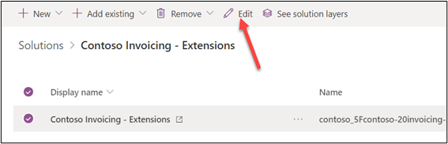](../media/edit.png#lightbox)

1. Start a new browser window and navigate to [Contoso Invoicing](https://contosoinvoicingtest.azurewebsites.net/?azure-portal=true) .

1. Select the **API Key** link.

1. Copy the **API Key**.

1. Save this key on a notepad. You'll need this key in future tasks.

1. Go back to the connector, select the **Test** tab, and select **+ New connection**.

    > [!div class="mx-imgBorder"]
    > [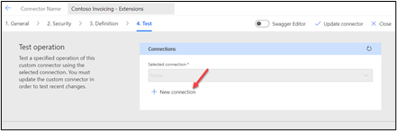](../media/new-connection.png#lightbox)

1. Paste the key you copied in the **API Key** field and select **Create connection**.

1. Select **Refresh** connections.

1. Scroll down to the **Operations** section, select **ListInvoiceTypes**, and select Test operation.

    > [!div class="mx-imgBorder"]
    > 

1. You should get a response containing invoice types. Later you'll use this operation to implement the Dynamic Values extension for the Invoice Type parameter.

    > [!div class="mx-imgBorder"]
    > [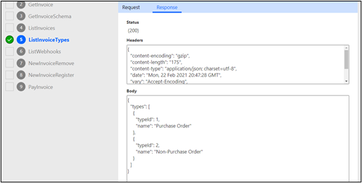](../media/invoice-types-response.png#lightbox)

1. Don't navigate away from this page.

## Task 2: Add the test connection extension

1.  Turn on the **Swagger editor**.

    > [!div class="mx-imgBorder"]
    > [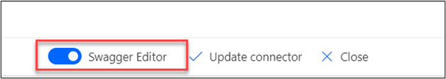](../media/swagger-editor-on.png#lightbox)

1.  Add the fragment below after the **produces: []** line 7 and select Update connector. Make sure the text indentation matches image below.

    x-ms-capabilities:
    
    testConnection:
    
    operationId: ListInvoices
    
    parameters: {}

    > [!div class="mx-imgBorder"]
    > [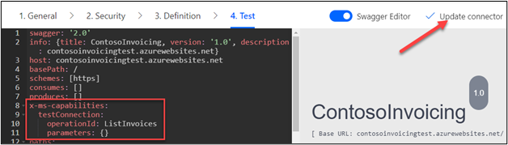](../media/update-connector.png#lightbox)

1.  Select + New connection again.

    > [!div class="mx-imgBorder"]
    > [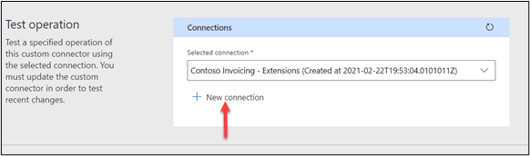](../media/new-connection-again.png#lightbox)

1.  Type your name or any other random value for **API Key** and select **Create connection**.

1.  The connection creation should fail.

    > [!div class="mx-imgBorder"]
    > 

1.  Provide the Key you copied task 1 as the **API Key** in and select **Create connection**.

1.  The connection creation should now succeed.

1.  Don't navigate away from this page.

## Task 3: Configure dynamic values for invoice type ID

1.  Select the **Definition tab**.

1.  Select **AddInvoice** from the **Actions** section.

1.  Scroll down, select the **...** button of the **typeId** and select **Edit**.

    > [!div class="mx-imgBorder"]
    > [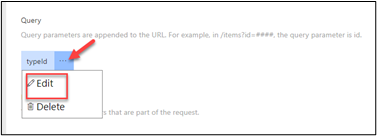](../media/type-id-edit.png#lightbox)

1.  Enter **Invoice Type** for **Summary**, **1** for **Default value**, and select **Yes** for **Is required**.

    > [!div class="mx-imgBorder"]
    > [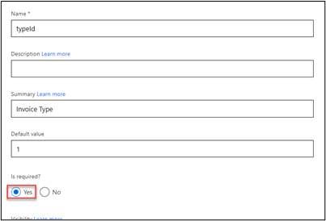](../media/required.png#lightbox)

1.  Scroll down and select **Dynamic** for **Dropdown type**.

1.  Select **ListInvoiceTypes** for **Operation ID**, **typeId** for **value**, and **name** for **Value display name**.

    > [!div class="mx-imgBorder"]
    > 

1.  Select **Update connector**.

1.  Turn on **Swagger editor**.

1.  If you get Hash key errors, close the connector browser tab and reopen it in edit mode.

1. Locate AddInvoice and see if x-ms-dynamic-values was added.

    > [!div class="mx-imgBorder"]
    > [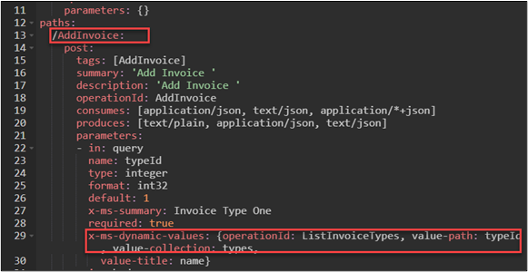](../media/dynamic-values-added.png#lightbox)

1. Don't navigate away from this page.

## Task 4: Configure the dynamic schema extension

1.  Select the **Test** tab.

1.  Select the **GetInvoiceShema** operation and select **Test operation**.

    > [!div class="mx-imgBorder"]
    > [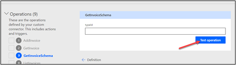](../media/test-operation-again.png#lightbox)

1.  Review the response. This is what an API needs to return to allow Dynamic Schema to be configured.

    > [!div class="mx-imgBorder"]
    > [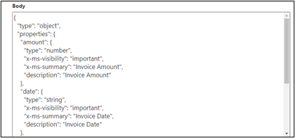](../media/returned-response.png#lightbox)

1.  Turn on Swagger editor.

1.  Locate the **CreateInvoiceRequest** line and replace the **invoice** line with swagger text below.

    Invoice:
    
    x-ms-dynamic-properties:
    
    operationId: GetInvoiceSchema
    
    parameters:
    
    typeId: {parameterReference: typeId}

    **Before:**

    > [!div class="mx-imgBorder"]
    > 

    **After:**

    Make sure the indentations match the image below.

    > [!div class="mx-imgBorder"]
    > [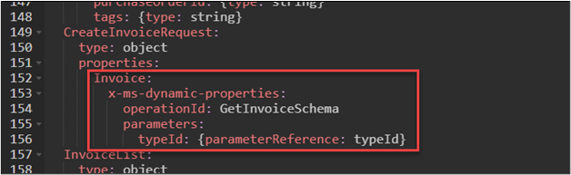](../media/after.png#lightbox)

1.  Turn off the **Swagger editor**.

1.  Select the **Definition** tab.

1.  Select the **GetInvoiceScheme** action and select **Internal** for **Visibility**.

    > [!div class="mx-imgBorder"]
    > [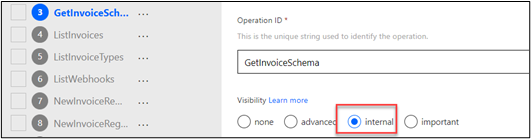](../media/internal-visibility.png#lightbox)

1.  Select **Update connector**.

## Task 5: Test connector

1.  Navigate to [Power Automate](https://flow.microsoft.com/?azure-portal=true) and make sure you are in the correct environment.

1.  Select **Solutions** and select to open the **Contoso Invoicing - Extensions** solution.

1.  Select **+ New** and select **Cloud flow**.

    > [!div class="mx-imgBorder"]
    > [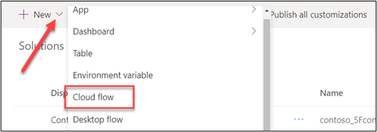](../media/cloud-flow.png#lightbox)

1.  Select **Manually triggered a flow** for trigger.

1.  Select **+ New step**.

1.  Select the **Custom** tab and select **Contoso Invoicing -- Extensions**.

    > [!div class="mx-imgBorder"]
    > [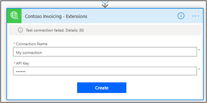](../media/create.png#lightbox)

1.  Select **AddInvoice** for action.

1.  Enter **My connection** for name, enter your name for **API Key**, and select **Create**.

1.  The connection test should fail.

    > [!div class="mx-imgBorder"]
    > [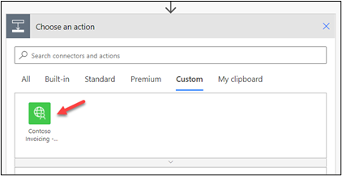](../media/contoso-invoicing-extensions.png#lightbox)

1. Provide the Key you copied in task 1 for **API Key** and select **Create** again.

1. The connection should get created successfully.

1. Notice the dropdown for the **Invoice type**. **Select Purchase** order for **Invoice type**.

    > [!div class="mx-imgBorder"]
    > [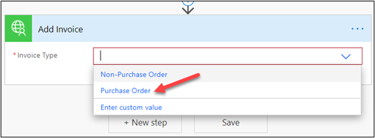](../media/purchase-order.png#lightbox)

1. The **Purchase order** field should now be visible.

    > [!div class="mx-imgBorder"]
    > 

1. Change the **Invoice type** to **Non - Purchase order**.

1. The **Purchase order** field should no longer be visible.

    > [!div class="mx-imgBorder"]
    > [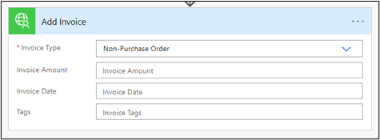](../media/field-removed.png#lightbox)

1. Name the flow **Dynamic metadata** and save it.