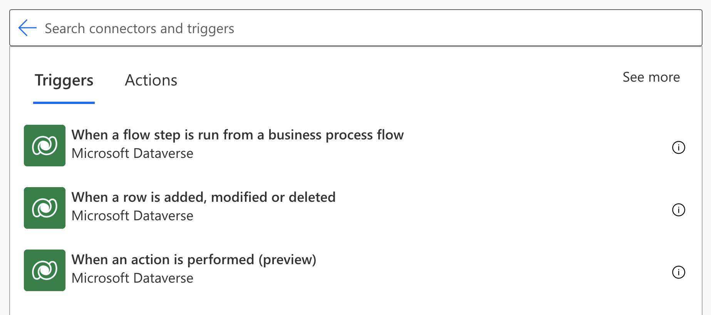

Power Automate allows you to build automated workflows through a series of triggers and actions. Triggers act as a catalyst to begin a series of actions. They *trigger* your flow to begin. Dataverse acts as a scalable database but also offers rich metadata and built-in logic processes. In any case, the triggers in Power Automate are built on the data that is stored inside Dataverse.

> [!div class="mx-imgBorder"]
> 

The triggers in Dataverse are:

- **When a flow step is run from a business process flow** - This trigger allows you to start a flow when the Run Flow button in a business process flow step is clicked.

- **When a row is added, modified, or deleted** - This trigger allows you to start a flow when a row is added, modified, or deleted in a Microsoft Dataverse table, such that it matches the selected options.

- **When an action is performed (preview)** - Triggers when a Microsoft Dataverse action has completed.

Now that you've learned about the various triggers that we offer in Power Automate for Microsoft Dataverse, you can learn how to use those triggers.
