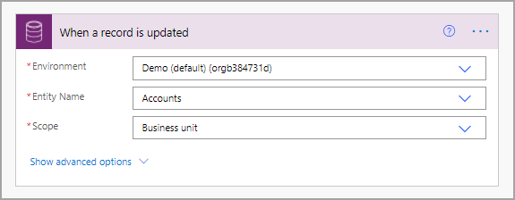
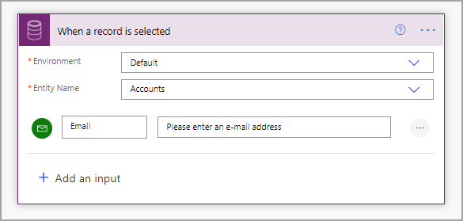

All triggers in Power Automate produce information, which is called dynamic content. Occasionally, this information only references who began the flow by selecting a button, but all Dataverse triggers give, at minimum, a row of data from a table.

When using a Dataverse trigger, you need to specify the following parameters:

- **Environment** - Environments are like containers in which you can organize tables, flows, apps, and more. Some organizations only use a single environment, but many have multiple environments for various priorities and developments.

- **Entity Name** - Entity is simply another word for table. It allows you to specify the exact table where your data is held, which should trigger your flow. If you select **User** in this drop-down menu, only actions on a record that you own will trigger the flow.

- **Scope** – This parameter allows you to specify when the flow runs according to the user who triggered it. Various scopes that you can choose from are:

  - **Business unit** – Actions that are taken on a record that your business unit owns will trigger the flow. 
  - **Parent: Child business unit** – A trigger with this scope will be initiated on actions that are taken on a record that your business unit or any child business units owns. 
  - **Organization** – The flow will be triggered for actions that are taken on the record, regardless of owner.

> [!div class="mx-imgBorder"]
> 

One trigger allows you to request more inputs. When a user creates, updates, or deletes a record, you don't have the opportunity to ask for more information because the user could be performing those actions from multiple places. However, with the **When a record is selected** trigger, the user can trigger the flow from a button on the table inside Dataverse. Because Power Automate knows where the user is performing the action, you can request additional input for use later in the app. 

Select **Add an input**, specify the type of input that you want, and then enter a short message to the user. For example, the following screenshot shows a request for an email address. The scope has not been requested because any user who has access to the table in Dataverse would be able to select the button on any record that they have access to.

> [!div class="mx-imgBorder"]
> 

Now that you have learned about the mechanics of triggers and how to use them, you can learn about the actions that you can perform within your flows.
