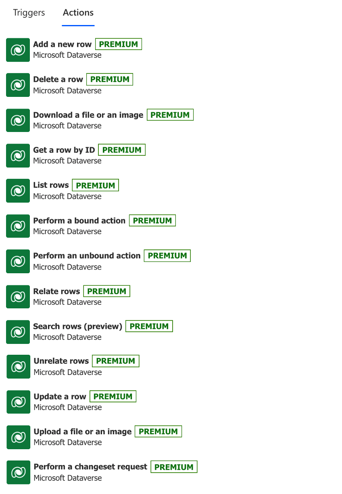

While triggers start a flow in Power Automate, actions are exactly what they sound like: actions that the flow will perform when triggered.

> [!div class="mx-imgBorder"]
> 

The Dataverse actions are:

- **Create a new record** - Allows you to enter a new row of data into a table. You don't need to have a Dataverse trigger to use Dataverse actions, so you could create a record after other actions such as holding an information log when specific emails are sent.

- **Get record** - Allows you to find a specific record. If you had a child item (such as lines in a purchase order), this action would allow you to fetch the parent item (the main information in the purchase order).

- **List records** - Allows you to fetch multiple records such as all child items that are associated with a parent item (for example, line items that are associated with a purchase order). Then, you can perform further actions on those items.

- **Update a record** - Allows you to make changes to a specific record such as updating a status after an approval process has been completed.

- **Delete a record** - Allows you to delete a row of information. In the example that was used for the triggers, you could create a flow that is triggered by the deletion of the main purchase order information, use the **List records** action to find all line items (or child items) that are associated with that purchase order, and then use this action to delete those items.

Dataverse actions in Power Automate allow you to create robust processes that surround your data.
