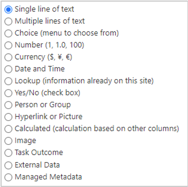
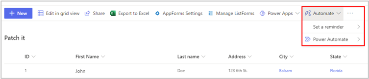
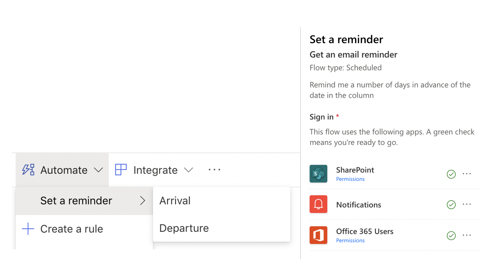

Data is the core of every workflow that is built by using Microsoft Power Automate. The most common data sources are tables, which you can use to retrieve and store information, and you can connect to the data source in a more secured manner by using a connector. 

A SharePoint connector gives you the flexibility to communicate with online and on-premises lists or libraries to do a create, read, update, and delete (CRUD) operation.

## Key features and capabilities

SharePoint Online is a popular connector for Power Automate because of its user-friendly features that allow you to create the tables (or lists) to store data and the libraries to store documents. The following screenshot shows the types of columns that you can create in Microsoft Lists or a SharePoint library.

> [!div class="mx-imgBorder"]
> 

The **Automate** feature allows you to create flows and it is built into all Microsoft Lists and SharePoint libraries.

> [!div class="mx-imgBorder"]
> 

The **Set a reminder** feature already comes with the **Arrival** and **Departure** options. These flows are used to remind you, in a specified number of days in advance, of the date in the column.

> [!div class="mx-imgBorder"]
> 
