Microsoft 365 Outlook (previously known as Office 365 Outlook) has a standard connector that allows you to show, send, delete, and reply to email messages, among other tasks.

## Basic concept of Microsoft 365 Outlook connector

Microsoft 365 Outlook can be used as actions and triggers in a Power Automate flow. 

### Actions and triggers

The following table describes the actions and triggers in Outlook.

| **Action** | **Trigger** |
|------------|-------------|
| Create contact (V2) | When a new email arrives (V3) |
| Create event (V4) | When an email is flagged (V3) |
| Send an email (V2) | When a new email arrives in a shared mailbox (V2) |
| Delete contact (V2) | When a new email mentioning me arrives (V3) |
| Delete email (V2) | When a new event is created (V3) |
| Delete event (V2) | When an event is added, updated, or deleted (V3) |
| Export email (V2) | When an event is modified (V3) |
| Find meeting times (V2) | When an upcoming event is starting soon (V3) |
| Flag email (V2) |  |
| Forward an email (V2) |  |
| Get attachment (V2) |  |
| Get calendar view of events (V3) |  |
| Get calendars (V2) |  |
| Get contact (V2) |  |
| Get contact folders (V2) |  |
| Get contacts (V2) |  |
| Get email (V2) |  |
| Get emails (V3) |  |
| Get event (V3) |  |
| Get events (V4) |  |
| Get mail tips from a mailbox (V2) |  |
| Get room lists (V2) |  |
| Get rooms (V2) |  |
| Get rooms in room list (V2) |  |
| Mark as read or unread (V3) |  |
| Move email (V2) |  |
| Reply to email (V3) |  |
| Respond to an event invite (V2) |  |
| Send an email from a shared mailbox (V2) |  |
| Send email with options |  |
| Set up automatic replies (V2) |  |
| Update contact (V2) |  |
| Update event (V4) |  |
| Update my contact's photo |  |

For full descriptions of actions and triggers, see the link in the Summary unit at the end of this module.

## Send an email action with dynamic content from SharePoint

The SharePoint connector has a trigger for new items in Power Automate flows. The example for this module will start a workflow process when a new item for a travel reimbursement request has been submitted. Email notifications are sent by using Microsoft Outlook.

The following screenshot shows the list in Microsoft Lists with the column types for travel reimbursement. SharePoint automatically adds the **Created**, **Created By**, **Modified**, and **Modified By** columns.

> [!div class="mx-imgBorder"]
> [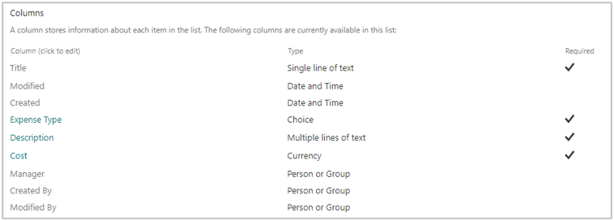](../media/3-1-columns.png#lightbox)

The following screenshot shows the **Choice (menu to choose from)** column.

> [!div class="mx-imgBorder"]
> [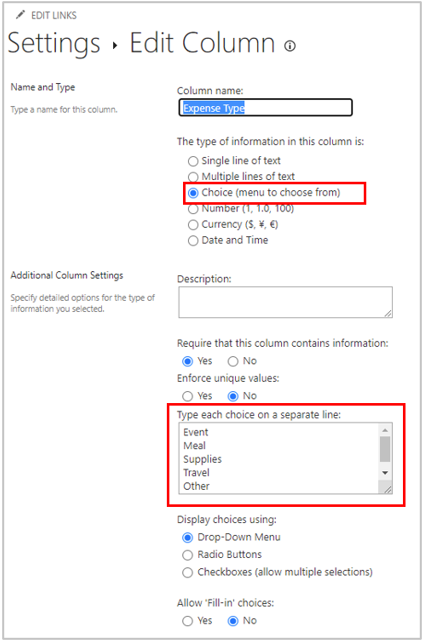](../media/3-2-edit-column.png#lightbox)

Return to the **Travel Reimbursement** list and, from the ribbon, select **Integrate > Power Automate > Create a flow**.

> [!div class="mx-imgBorder"]
> [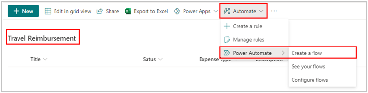](../media/3-3-create-flow.png#lightbox)

On the right, in **Create a flow**, select the **Start approval when a new item is added** option.

> [!div class="mx-imgBorder"]
> [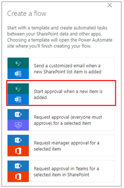](../media/3-4-start-approval.png#lightbox)

Confirm the connection and then select **Continue**.

> [!div class="mx-imgBorder"]
> [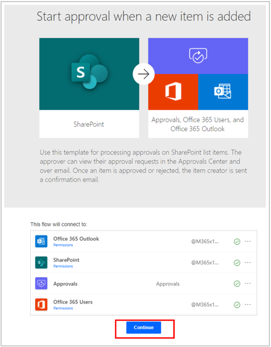](../media/3-5-continue.png#lightbox)

Change the flow title and **List Name** to **Travel Reimbursement**.

> [!div class="mx-imgBorder"]
> [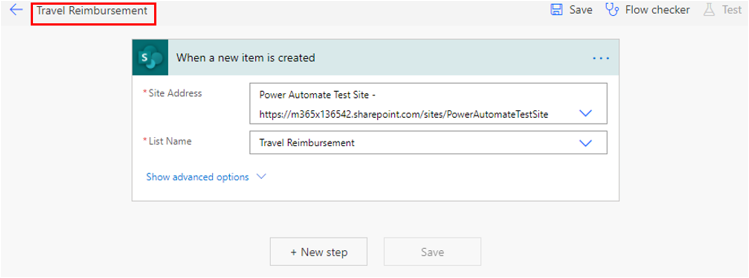](../media/3-6-travel-reimbursement.png#lightbox)

Modify this template to get the manager information. To do so, drag the **Get my profile (V2)** action and then drop it below the trigger.

The following screenshot shows what the template looked like before you modified it.

> [!div class="mx-imgBorder"]
> [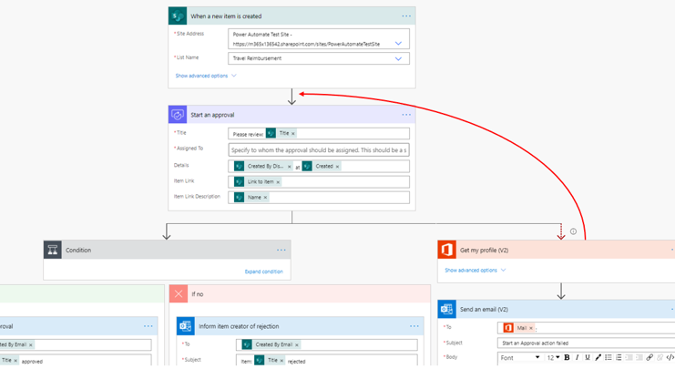](../media/3-7-before.png#lightbox)

The following screenshot shows what the template looked like after you modified it.

> [!div class="mx-imgBorder"]
> [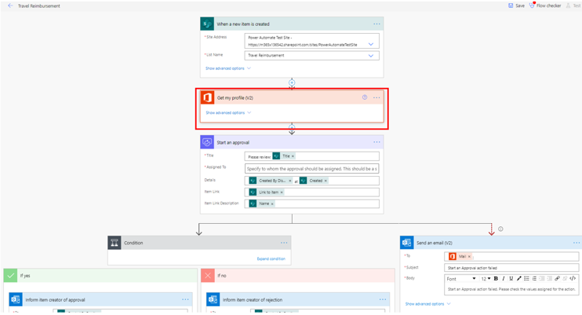](../media/3-8-after.png#lightbox)

Select the plus sign (**+**) and then select **Add an action**.

> [!div class="mx-imgBorder"]
> [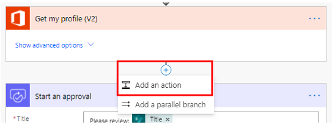](../media/3-9-add-action.png#lightbox)

Search for **get manager** and then select **Get manager (V2)**.

> [!div class="mx-imgBorder"]
> 

In **Get manager (V2)**, select **User Principal Name**.

> [!div class="mx-imgBorder"]
> [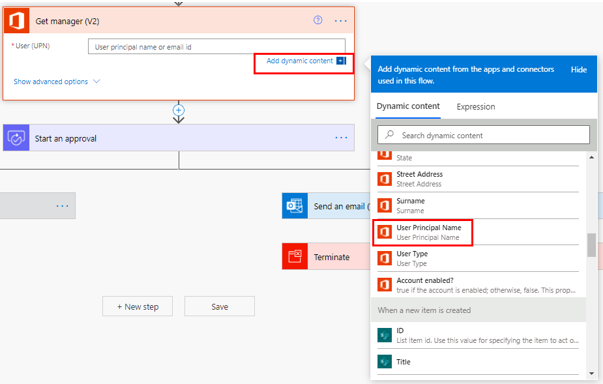](../media/3-92-user-principal-name.png#lightbox)

In the **Start an approval** action, for **Assigned To**, select **Add dynamic content** and then select **Mail** in **Get manager (V2)**.

> [!div class="mx-imgBorder"]
> [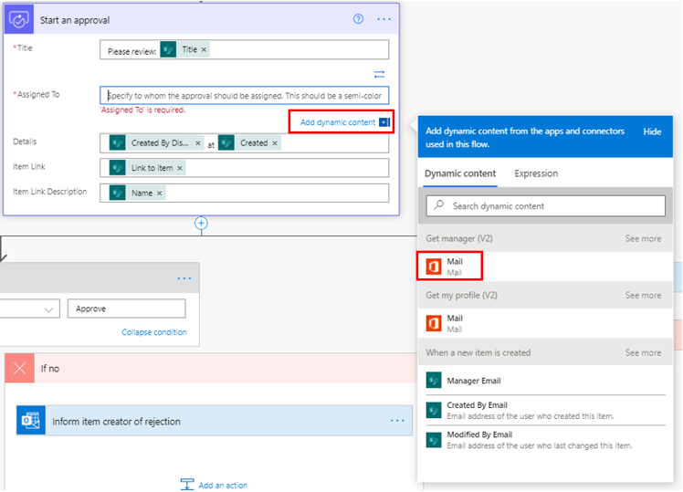](../media/3-93-start-approval.png#lightbox)

Select **Flow checker** to confirm that no errors have occurred and then select **Save**.

You've successfully created an email action by using Microsoft Outlook with dynamic content from SharePoint.
