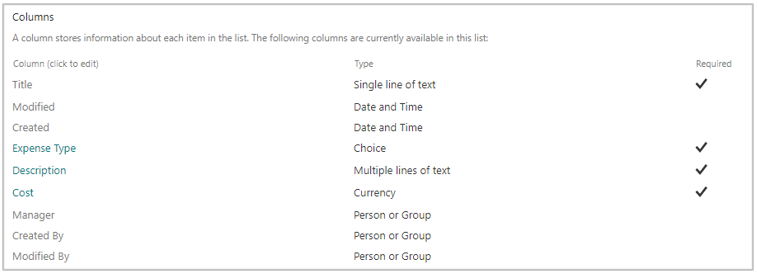
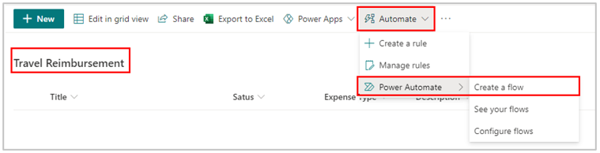
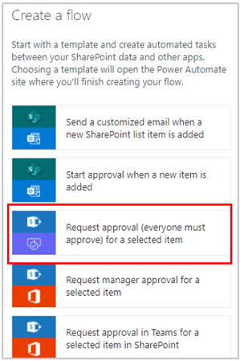
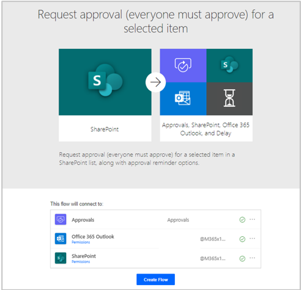
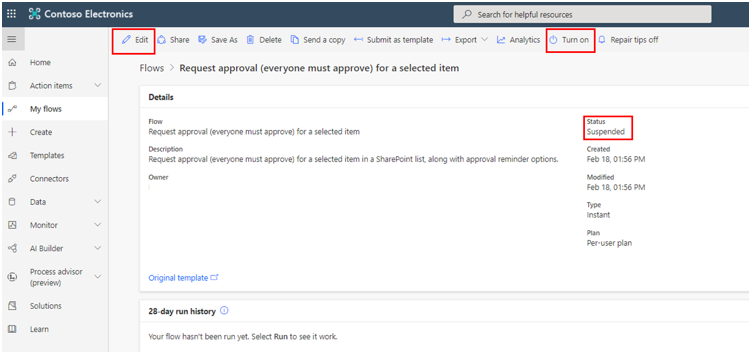
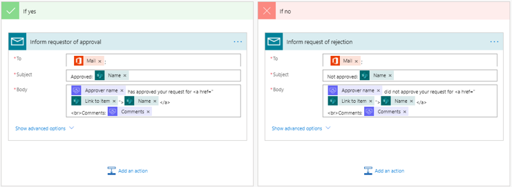

Mail Connection Provider lets you send email notifications, and it can be used with Microsoft Power Apps and Microsoft Power Automate.

## Basic concept of the Mail connector

No triggers are available for mail on actions. The following action is the only one that is available.

| **Action** | **Description** |
|------------|-----------------|
| Send an email notification (V3) | Send an email notification to the specified email addresses. |

## Send an email action with dynamic content from SharePoint

The SharePoint connector has a trigger for new items in Power Automate flows. This example shows a workflow process being started when a new item for a travel reimbursement request has been submitted. Email notifications are sent by using the Mail connector.

The following table provides an overview of the column types for the list in Microsoft Lists called **Travel Reimbursement**.

| **Column** | **Type** | **Required** | **Additional information** |
|------------|----------|--------------|----------------------------|
| Title | Single line of text | Yes | |
| Expense Type | Choice | Yes | The following choices are added: Event, Meal, Supplies, Travel, Other |
| Description | Multiple lines of text | Yes | 10 lines of plain text |
| Cost | Currency | Yes | |
| Manager | Person or Group | No | Person |

The following screenshot shows the list in Microsoft Lists. Lists automatically adds the **Created**, **Created By**, **Modified**, and **Modified By** columns.

> [!div class="mx-imgBorder"]
> 

Return to the **Travel Reimbursement** list and, from the ribbon, select **Integrate > Power Automate > Create a flow**.

> [!div class="mx-imgBorder"]
> 

Select the **Request approval (everyone must approve) for a selected item** template.

> [!div class="mx-imgBorder"]
> 

Select **Create Flow**.

> [!div class="mx-imgBorder"]
> 

You need to **Turn on** the flow because it's suspended by default. Select **Edit** to view the flow design.

> [!div class="mx-imgBorder"]
> 

The flow contains the Mail action.

> [!div class="mx-imgBorder"]
> 

You've successfully created an email action flow by using Mail with dynamic content from SharePoint.
