Microsoft Power Automate provides tools to help you build flows that monitor incoming emails and then save its metadata to Microsoft Lists and its attachment to a document library.

## Save metadata from emails to Microsoft Lists

Microsoft Outlook has a trigger called **When a new email arrives**, which will be used for this unit's example to monitor incoming emails and save the following metadata to a list: **To**, **From**, **Subject**, **Body Preview**, and **CC**. 

The data will only be captured if the subject contains the words "Monthly Report."

The following table provides an overview of the column types for the list in Microsoft Lists called **Incoming Emails**.

| **Column** | **Type** | **Required** | **Additional information** |
|------------|----------|--------------|----------------------------|
| Title | Single line of text | Yes |
| From | Single line of text | No |
| To | Single line of text | No |
| Importance | Single line of text | No |
| CC | Single line of text | No |
| Body Preview | Multiple lines of text | No | Enhanced rich text |
| Received time | Date and Time | No | Date and time format |
| Has Attachment | Single line of text | No |

The following screenshot shows the list in Microsoft Lists. Lists automatically adds the **Created**, **Created By**, **Modified**, and **Modified By** columns.

> [!div class="mx-imgBorder"]
> [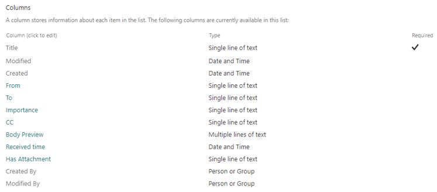](../media/5-01-columns.png#lightbox)

Go to [https://flow.microsoft.com](https://flow.microsoft.com/?azure-portal=true). Select **Templates** and then enter **incoming emails** in the search box. Then, select the **Activity record for incoming emails in SharePoint with specific subject** template.

> [!div class="mx-imgBorder"]
> [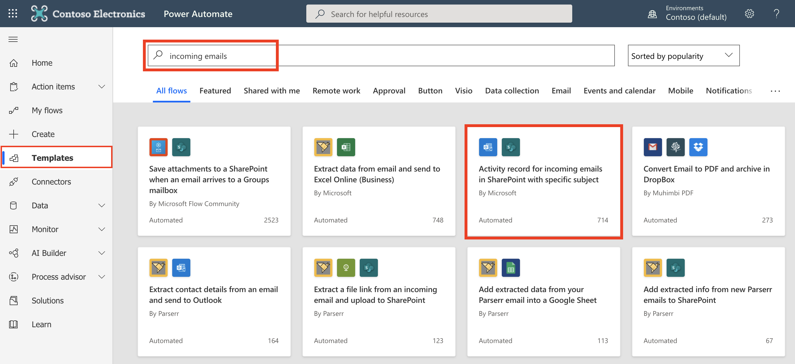](../media/5-02-incoming.png#lightbox)

Select **Continue**.

> [!div class="mx-imgBorder"]
> [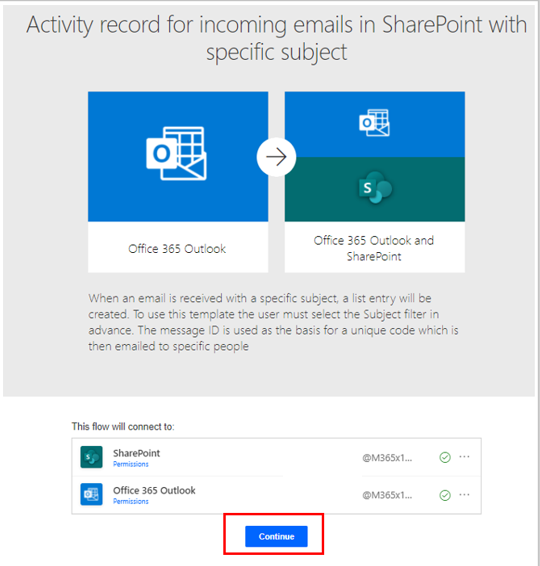](../media/5-03-activity.png#lightbox)

Select **Expand condition**.

> [!div class="mx-imgBorder"]
> [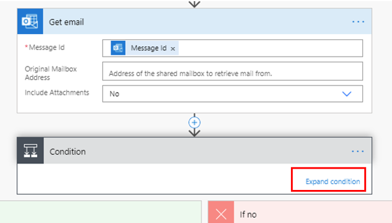](../media/5-04-expand.png#lightbox)

Change the text from **test** to **Monthly Report**.

> [!div class="mx-imgBorder"]
> [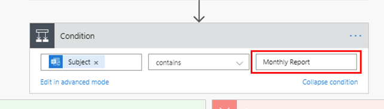](../media/5-05-monthly.png#lightbox)

In **Create item**, add the **Site Address** and **List Name** and then populate the fields by using **Dynamic content**. The fields are from **Get email**.

> [!div class="mx-imgBorder"]
> [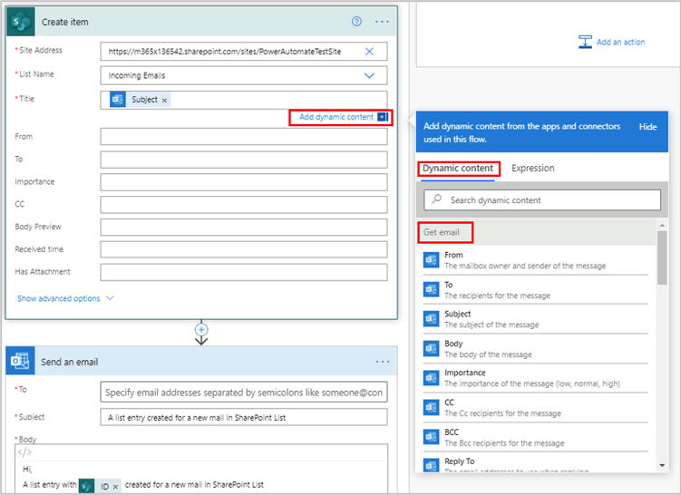](../media/5-06-create.png#lightbox)

The following screenshot shows what it looks like when all fields are populated.

> [!div class="mx-imgBorder"]
> [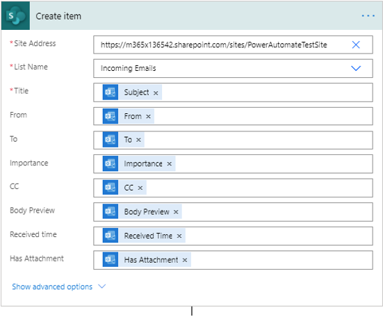](../media/5-07-create-filled.png#lightbox)

You can delete the **Send an email** action.

> [!div class="mx-imgBorder"]
> [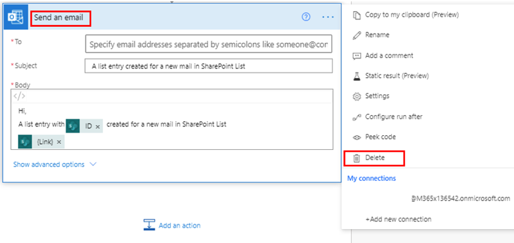](../media/5-08-delete.png#lightbox)

The flow will monitor the incoming emails to your inbox. If any emails contain the words "Monthly Report" in the **Subject** field, the metadata is captured and saved to the **Incoming Emails** list.

> [!div class="mx-imgBorder"]
> [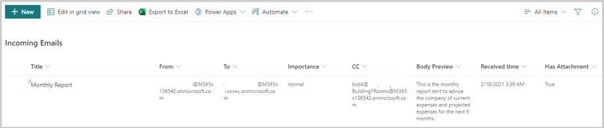](../media/5-09-incoming-list.png#lightbox)

## Save attachments from emails to SharePoint libraries

Microsoft Outlook has a trigger called **When a new email arrives**, which will be used for this unit's example to monitor incoming emails and save the attachments to a SharePoint document library. The trigger is watching to determine if the email has attachments and if it has been sent from a specific person with the words "Monthly Report" in the **Subject** field.

To create a new document library, select the **settings** gear icon and then select **Site contents**.

> [!div class="mx-imgBorder"]
> [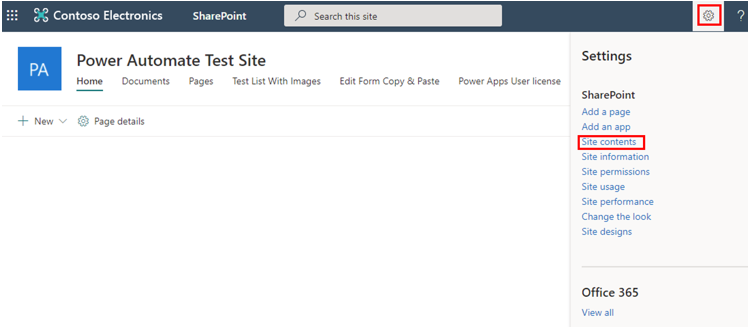](../media/5-10-test-site.png#lightbox)

Select **+ New** and then select **Document library**.

> [!div class="mx-imgBorder"]
> [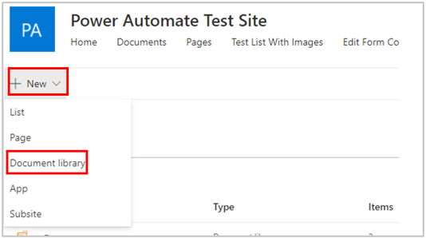](../media/5-11-new.png#lightbox)

In the **Create document library** dialog box, enter **Incoming Emails** in the **Name** field, and then select **Create**.

> [!div class="mx-imgBorder"]
> [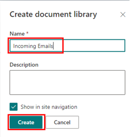](../media/5-12-create-library.png#lightbox)

The following table provides an overview of the column types that you need to add for the library.

| **Column** | **Type** | **Required** | **Additional information** |
|------------|----------|--------------|----------------------------|
| From Name | Single line of text | No | |
| From Email | Single line of text | No | |

While you are in **Settings**, scroll to the bottom and select **All Documents** in the **Views** area.

> [!div class="mx-imgBorder"]
> [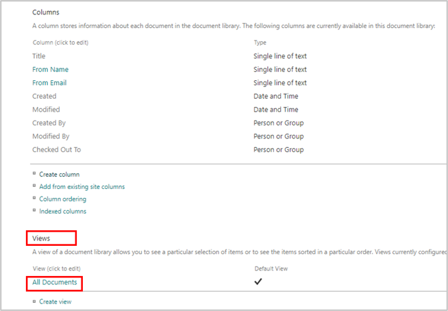](../media/5-13-views.png#lightbox)

Select **File Size**, which is a built-in column that comes with document libraries. Select **OK**.

> [!div class="mx-imgBorder"]
> [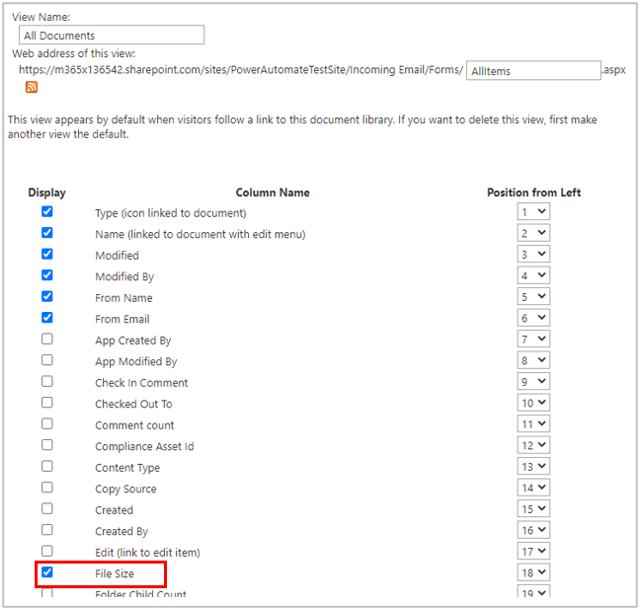](../media/5-14-view-all.png#lightbox)

You now have a document library created. Next, go to [https://flow.microsoft.com](https://flow.microsoft.com/?azure-portal=true), select **+ Create**, and then select **Automated cloud flow**.

> [!div class="mx-imgBorder"]
> [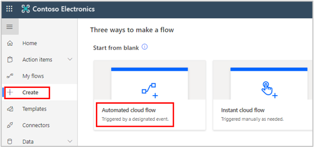](../media/5-15-create-automated.png#lightbox)

Select **Skip**.

> [!div class="mx-imgBorder"]
> [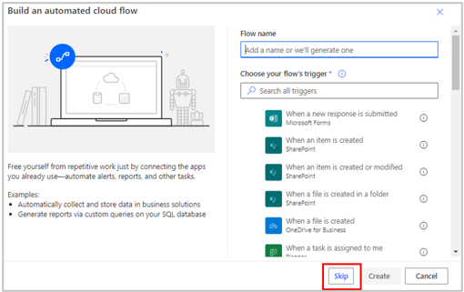](../media/5-16-build.png#lightbox)

Name the flow **Incoming Emails**. In the search box, look for **outlook** and then select **When a new email arrives (V3)**.

> [!div class="mx-imgBorder"]
> [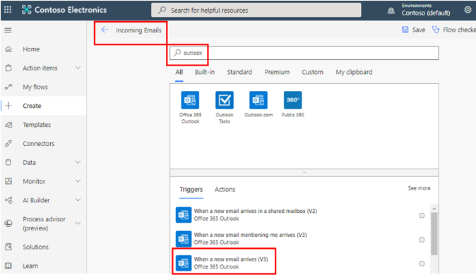](../media/5-17-incoming-outlook.png#lightbox)

Select **Show advanced options**.

> [!div class="mx-imgBorder"]
> [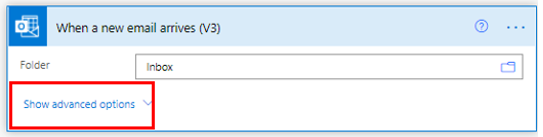](../media/5-18-advanced.png#lightbox)

Add the options to help monitor the incoming emails closely and only capture the attachments from those who match your criteria. This example is monitoring the **To**, **From**, **Include Attachments**, and **Subject Filter** fields.

> [!div class="mx-imgBorder"]
> [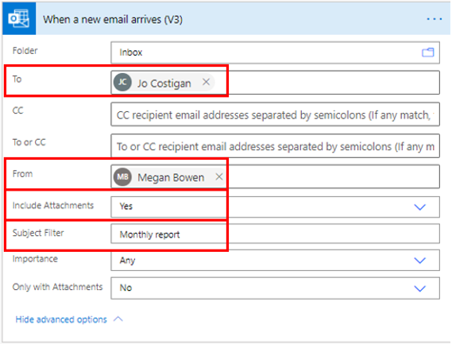](../media/5-19-new-email-options.png#lightbox)

Select **+ Next** step. Search for **sharepoint** and then select **Create file**.

> [!div class="mx-imgBorder"]
> [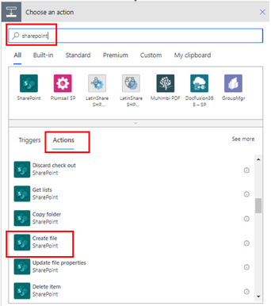](../media/5-20-choose-action.png#lightbox)

Add the **Site Address** and **Folder Path**.

> [!div class="mx-imgBorder"]
> [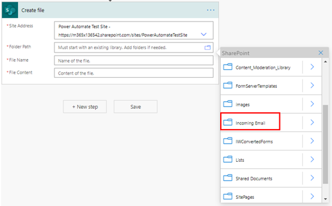](../media/5-21-folder-path.png#lightbox)

For **File Name**, select **Attachments Name**, and for **File Content**, select **Attachments Content**.

> [!div class="mx-imgBorder"]
> [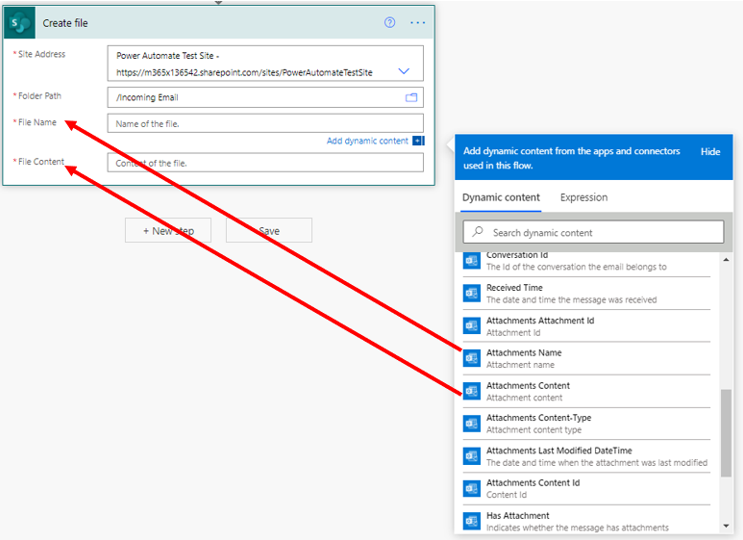](../media/5-22-name-content.png#lightbox)

After you have completed the previous step, the **Create file** action will be added to **Apply to each** automatically. This result is optimal because it will make sure that all attachments from the email are uploaded to the SharePoint library.

> [!div class="mx-imgBorder"]
> 

Select **Add an action** again, search for **sharepoint**, and then select **Update file properties**.

In the **Update file properties** dialog box, add the information that is shown in the following screenshot.

> [!div class="mx-imgBorder"]
> [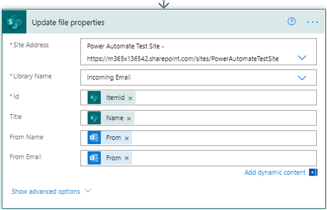](../media/5-24-update.png#lightbox)

Your task is complete. Make sure that you select **Flow checker** and then **Save**.

When Jo Costigan receives an email from Megan Bowen, it has an attachment. If the **Subject** field contains the words "monthly report," the attachments will be picked up by the flow automatically and then saved in the SharePoint library.

> [!div class="mx-imgBorder"]
> [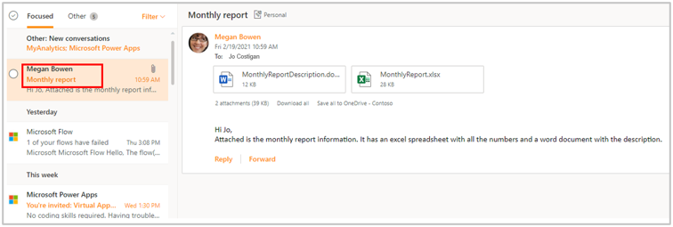](../media/5-25-monthly.png#lightbox)

The following screenshot shows what the SharePoint library looks like.

> [!div class="mx-imgBorder"]
> [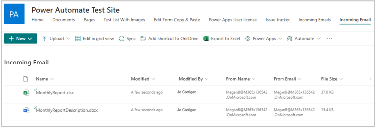](../media/5-26-library.png#lightbox)
