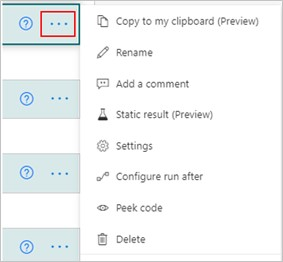
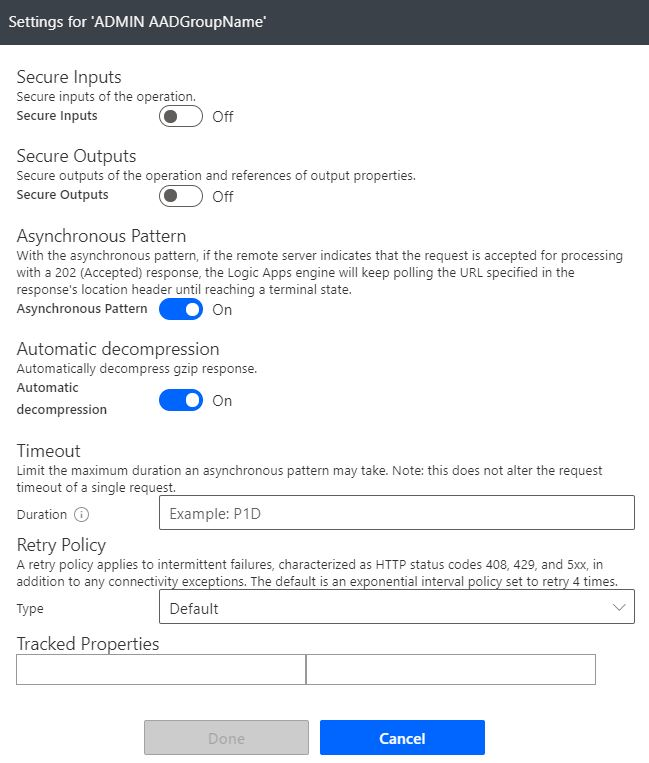
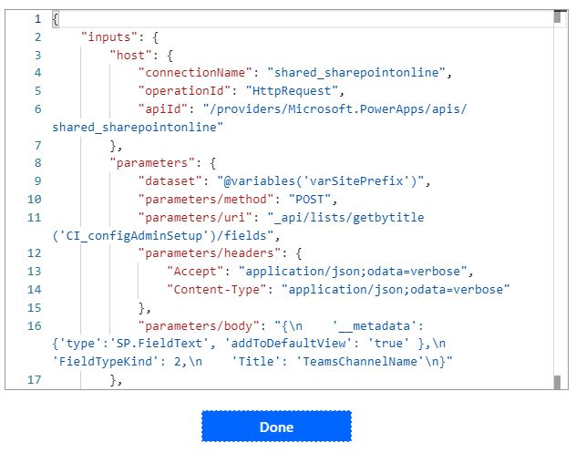

Automated workflow processes play an important role in the success of our businesses and if a workflow were to fail, it is important that we get notified immediately. Consider, an inventory system that has a workflow running that is automatically updating the backend data as items are added and removed. If this workflow fails, your asset information in the database is incorrect and could disrupt your daily business transactions.

The SharePoint actions in Power Automate have settings that are used to improve the workflow process and for error handling.

## Basic concepts

SharePoint and the Approval connectors are the most commonly used Connectors with Power Automate. SharePoint can be used with all three ways to make a flow. That includes:

- start from blank

- start from a template

- start from a connector

**Start from a blank** lets you create a custom flow to meet your requirements and you can use triggers like:

- Automate cloud flow

- Instant cloud flow

- Scheduled cloud flow

- Desktop flow

- Business process flow

**Start from a template** gives you the flexibility to use an existing flow that is similar to your requirement. Changes usually include text or user information.

**Start from connector**. Connectors are the services you use every day and you can link them together to automate tasks.

## Key features and capabilities

Every SharePoint action in Power Automate has an ellipsis (...), to access the menu. Selecting it provides you the key features and capabilities.

> [!div class="mx-imgBorder"]
> 

**Copy to my clipboard (Preview)** - This allows you to duplicate an action inside of your flow by copying and pasting it.

**Rename** - The actions and conditions come with default names, this setting gives you the option to rename them.

**Add a comment** - This feature allows you to add a comment. Comments are used to help the flow makers remember the reason why this action or condition was added.

> [!div class="mx-imgBorder"]
> 

**Static result (Preview)** - By setting up static results for an action in your flow, you can mock output data from that action. Enabling static results on an action doesn't run the action but returns the mock data instead.

> [!div class="mx-imgBorder"]
> 

**Settings** - Other settings include Secure Inputs, Secure Outputs, Asynchronous Pattern, Automatic decompression, Timeout, Retry Policy, and Traced Properties.

> [!div class="mx-imgBorder"]
> 

**Configure run after** - From time to time, things do not work out exactly as you expected in your flow - that's where **Configure run after** helps. You can define any number of steps to run after the failure of an action.

> [!div class="mx-imgBorder"]
> 

**Peek code** - Peek code gives you the flexibility to view the actions from a code perspective. Through this view you can see details such as IDs, authentication types, and the links used to make API calls.

> [!div class="mx-imgBorder"]
> 

**Delete step** - You can delete the current step you are in. A dialogue box will appear confirming if you want to delete the step.

> [!div class="mx-imgBorder"]
> 
