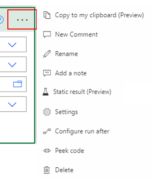
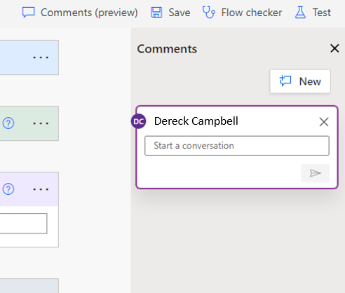
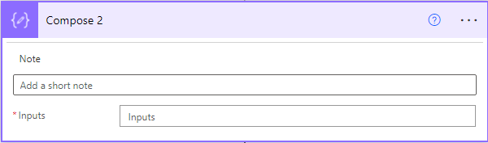
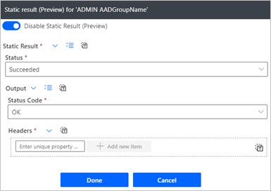
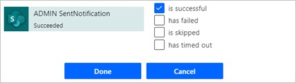
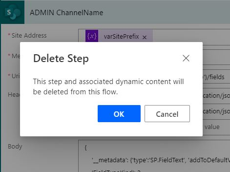

Automated workflow processes have an important role in the success of your businesses, and if a workflow were to fail, it is important that you are notified immediately. Consider an inventory system that has a workflow running that automatically updates the network data as items are added and removed. If this workflow fails, your asset information in the database is incorrect and could disrupt your daily business transactions.

The SharePoint actions in Microsoft Power Automate have settings that you can use to improve the workflow process and error handling.

## Basic concepts

SharePoint and the approval connectors are the most commonly used connectors in Power Automate. With SharePoint, you can choose from one of three ways to make a flow:

- Start from blank

- Start from a template

- Start from a connector

**Start from blank** lets you create a custom flow to meet your requirements, and you can use triggers such as:

| Flow type  |Description|
|------------|:-------------|
| Automate | Create an automation that is triggered by an event  |
| Instant | Start an automation with a click of a button|
| Scheduled |Schedule an automation such as daily data upload|
| Desktop | Flows are used to automate tasks on the Web or the desktop|
| Business process | Flows provide a guide for people to get work done |

**Start from a template** gives you the flexibility to use an existing flow that is similar to your requirement. Changes usually include text or user information.

Connectors are the services that you use every day, and with the **Start from a connector** method, you can link them together to automate tasks.

## Key features and capabilities

Every SharePoint action in Power Automate has an ellipsis (**...**) button that you can select to access the menu. Selecting the ellipsis will provide you with key features and capabilities.

> [!div class="mx-imgBorder"]
> 

The following sections describe SharePoint actions in Power Automate:

- **Copy to my clipboard (Preview)** - This action allows you to duplicate an action inside of your flow by copying and pasting it.

- **New Comment** - This action allows you to leave comments or suggestions for flow makers.

> [!div class="mx-imgBorder"]
> 

- **Rename** - The actions and conditions come with default names, and this setting gives you the option to rename them.

- **Add a note** - This feature allows you to add a note. Notes are used to help the flow makers remember the reason why this action or condition was added.

   > [!div class="mx-imgBorder"]
   > 

- **Static result (Preview)** - By setting up static results for an action in your flow, you can simulate output data from that action. Enabling static results on an action doesn't run the action but returns the mock data instead.

   > [!div class="mx-imgBorder"]
   > 

- **Settings** - Other settings include **Secure Inputs**, **Secure Outputs**, **Asynchronous Pattern**, **Automatic decompression**, **Timeout**, **Retry Policy**, and **Tracked Properties**.

- **Configure run after** - Occasionally, certain situations don't result exactly as you expected in your flow, which is where the **Configure run after** option helps. You can define any number of steps to run after the failure of an action.

   > [!div class="mx-imgBorder"]
   > 

- **Peek code** - Peek code gives you the flexibility to view the actions from a code perspective. Through this view, you can see details such as IDs, authentication types, and the links that are used to make API calls.

- **Delete Step** - You can delete the current step that you are in. A dialog box will appear, confirming if you want to delete the step.

   > [!div class="mx-imgBorder"]
   > 
